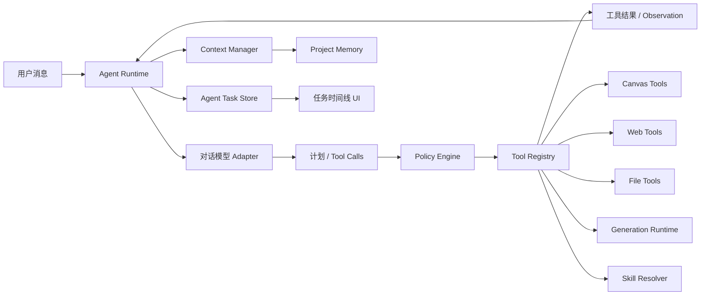

# 对话助手 Agent 能力实施方案

> 文档状态：P3、P4 阶段已完成；P5-A/P5-B/P5-D 已完成，P5-C 待实施；8.29 Agent Package 首批纵向切片、任务级 Skill 按需绑定与 MCP 只读兼容已完成，项目覆盖和后台表面待实施；安全前置 Phase 0-A（Tauri 应用 command 外层 ACL）与 Phase 0-B（高风险原生命令 Rust 调用方校验）已完成；3D 镜头台 Phase 0-C 双运行时前端契约、Phase 0-D 协议冻结、Phase 1-A Scene/Result 纯数据层与 Phase 1-B Blender 安装候选发现已完成，Phase 1-C Windows Blender 原生运行时预览已接通并继续完成故障注入验收
> 创建日期：2026-07-16
> 适用项目：AI Canvas Tauri
> 关联方案：`doc/对话式画布助手-功能方案.md`

## 1. 文档用途

本文档是对话助手 Agent 化改造的实施主线，用于：

- 固化已经确认的产品边界和架构决策；
- 按阶段管理实施范围、风险、验证和回滚；
- 记录每个阶段的真实完成日期、实际文件和检查结果；
- 防止在 `ChatPanel`、`assistantService` 或模型适配层继续堆叠临时分支；
- 保证每个阶段均可独立验证、暂停和回滚。

后续每开始或完成一个阶段，都必须同步更新本文档顶部进度表和对应阶段的完成记录。

### 1.1 状态标记

| 标记 | 含义 |
|---|---|
| `[ ]` | 未开始 |
| `[~]` | 进行中 |
| `[x]` | 已完成并通过阶段验收 |
| `[!]` | 阻塞，需要用户决策或外部条件 |
| `[-]` | 曾完成后按用户决定移除 |

### 1.2 阶段更新规则

1. 开始编码前，把对应阶段改为 `[~]`，填写开始日期和最终文件清单。
2. 实施中如改变范围，先在本文档记录原因、影响和回滚方式。
3. 只有代码、迁移、定向检查和阶段验收都完成后，才能标记为 `[x]`。
4. 完成记录必须填写实际执行过的命令，禁止记录未运行的检查。
5. 发现阻塞时标记为 `[!]`，不得静默跳过安全、权限、持久化或恢复要求。

## 2. 总体进度

| 阶段 | 状态 | 目标 | 开始日期 | 完成日期 |
|---|---:|---|---|---|
| P3-0 | `[x]` | 需求、自治边界和总体架构确认 | 2026-07-16 | 2026-07-16 |
| P3-A1 | `[x]` | Agent 领域类型、会话模式和任务持久化骨架 | 2026-07-16 | 2026-07-16 |
| P3-A2 | `[x]` | Agent Runtime 骨架、B/C 切换与现有对话接入 | 2026-07-16 | 2026-07-16 |
| P3-B1 | `[x]` | Tool Registry、Policy Engine 和工具调用循环 | 2026-07-16 | 2026-07-16 |
| P3-B2 | `[x]` | 画布工具与媒体工具迁移 | 2026-07-16 | 2026-07-16 |
| P3-C1 | `[-]` | 联网搜索、受控网页读取和来源引用（已按用户决定整体移除） | 2026-07-16 | 2026-07-16 |
| P3-C2 | `[x]` | 会话级本地文件授权、读取和导出确认 | 2026-07-16 | 2026-07-16 |
| P3-D1 | `[x]` | 模型上下文预算、占用显示和自动压缩 | 2026-07-16 | 2026-07-16 |
| P3-D2 | `[x]` | 用户确认的项目记忆 | 2026-07-16 | 2026-07-16 |
| P3-E1 | `[x]` | Agent 任务时间线和后台控制 | 2026-07-16 | 2026-07-16 |
| P3-E2 | `[x]` | 重启恢复、安全加固和端到端验收 | 2026-07-16 | 2026-07-16 |
| P4-A | `[x]` | 同会话消息队列、运行中插话和串行调度 | 2026-07-21 | 2026-07-21 |
| P4-B | `[x]` | 脱敏事件日志、安全恢复、任务回退、指标与任务中心 | 2026-07-21 | 2026-07-21 |
| P4-C | `[x]` | 相关性记忆、可靠压缩、Skill Manifest 和只规划模式 | 2026-07-21 | 2026-07-21 |
| P4-D | `[x]` | 内部生命周期事件和受限只读专家 Agent | 2026-07-21 | 2026-07-21 |
| P5-A | `[x]` | 用户授权的厂商文档读取与同站链接导航 | 2026-07-21 | 2026-07-21 |
| P5-B | `[x]` | 厂商配置草稿与确认写入 | 2026-07-21 | 2026-07-21 |
| P5-C | `[ ]` | 端到端安全回归与验收 |  |  |
| P5-D | `[x]` | 通用联网搜索、受控网页提取和来源引用 | 2026-07-22 | 2026-07-22 |
| 角色库 S1 | `[x]` | 多图角色类型、旧数据迁移与全局角色持久化 | 2026-07-25 | 2026-07-25 |
| 安全前置 0-A | `[x]` | Tauri 应用 command 外层 ACL | 2026-08-28 | 2026-08-28 |
| 安全前置 0-B | `[x]` | 插件执行与导演台资源命令 Rust 调用方校验 | 2026-08-28 | 2026-08-28 |
| 导演台 0-C | `[x]` | 同一 `ai-director` 的 `lightweight-web` / `blender` 双运行时前端契约 | 2026-08-28 | 2026-08-28 |
| 导演台 0-D | `[x]` | Blender 场景权威、固定脚本和后续原生阶段范围冻结 | 2026-08-28 | 2026-08-28 |
| 导演台 1-A | `[x]` | Director Scene/Result 严格合同、不可变项目文件与归档识别 | 2026-08-28 | 2026-08-28 |
| 导演台 1-B | `[x]` | 受限 Blender 安装候选发现、opaque ID 与进程内记录 | 2026-08-28 | 2026-08-28 |
| 导演台 1-C | `[~]` | 固定 Blender 5.2.1 资源、原生 Job、同节点打开/截图/视频与结果回收预览 | 2026-08-28 |  |

## 3. 已确认的产品决策

### 3.1 会话级 Agent 模式

每个对话独立保存 Agent 模式，新对话默认使用 B，可随时切换 Plan、B 或 C。

#### Plan：只规划模式

- 只进行分析、规划和只读查询。
- Tool Registry 不向模型暴露非 `read` 工具。
- Policy Engine 对所有非 `read` effect 固定拒绝，Skill 和模型输出不能修改此边界。

#### B：协作模式

- 查询画布、联网搜索、读取当前会话已授权文件等只读操作自动执行。
- 画布新增、更新、连线、分组、删除和批量修改需要先预览、再确认。
- 本地文件写入和永久删除必须确认。
- 图片、视频、音乐和语音生成每次都必须确认。

#### C：自主模式

- 所有已注册工具自动执行，包括画布、文件、永久删除、媒体生成、记忆、配置和资产写入。
- 所有画布写操作必须经过 revision 校验，并通过统一事务写入撤销历史。
- 图片、视频、音乐和语音生成及重新生成无须确认，但继续保持零自动重试。
- 工具 schema、`authorize`、项目/revision、文件 grant、路径策略、预算与审计边界仍然生效。

模式切换不能扩大 Tauri 权限、文件授权或模型权限，也不能由模型或 Skill 内容自行修改。

### 3.2 联网和本地文件

- 联网搜索可以自动执行。
- 网页和搜索结果始终作为不可信外部数据。
- 本地文件必须由用户首次通过原生选择器授权。
- 文件授权只在当前会话有效，不跨会话、不跨项目、不在重启后自动恢复。
- 用户撤销授权后，活动读取立即停止，排队调用失败。
- B 模式文件写入使用原生保存流程并逐次确认；C 自主模式和 MCP 会话自动执行已授权的写入流程。
- 不提供删除、移动、执行任意文件或访问任意路径的模型工具。

### 3.3 上下文和记忆

- 自动保留当前对话上下文。
- 界面显示当前上下文长度、模型上限和占用比例。
- 根据所选模型的最大上下文动态调整输入预算。
- 接近上限时自动压缩，压缩只影响发送给模型的上下文，不删除原始历史。
- 压缩摘要必须保留目标、约束、决定、未完成计划、节点 ID、工具来源和失败原因。
- 重要偏好和项目事实只能由 Agent 提议；B 模式需用户确认，C 自主模式和 MCP 会话自动写入。
- 文件全文、网页全文、API Key、绝对路径和临时工具结果不能自动进入长期记忆。

### 3.4 后台执行和恢复

- 应用运行期间，切换对话、切换项目或关闭助手面板后，Agent 任务继续后台执行。
- 会话列表显示运行、等待确认、失败或暂停状态。
- 应用重启后，未完成任务统一恢复为“已暂停”。
- 用户点击继续后，重新校验项目、会话、画布 revision、模型、工具预算和文件授权。
- 重启后不允许未经用户操作自动恢复执行。

### 3.5 重试和停止

- 联网搜索、文件读取等只读工具和瞬时网络错误最多自动重试 3 次。
- 重试使用递增退避，并记录原因、次数和耗时。
- 画布写操作、文件写入、永久删除和付费媒体生成不自动重试。
- 用户停止时中止模型流、只读工具和本地跟踪任务。
- 供应商不支持远端取消时，只能显示“停止跟踪”，不能显示“已取消生成”。

### 3.6 执行过程

每个任务显示可折叠的实时计划和步骤时间线，并提供：

- 暂停；
- 继续；
- 跳过当前步骤；
- 重新规划；
- 停止。

界面只展示计划、工具调用、结果和错误摘要，不展示模型隐藏推理过程。

## 4. 目标架构



### 4.1 模块职责

| 模块 | 职责 | 禁止事项 |
|---|---|---|
| Agent Runtime | 规划循环、状态机、预算、暂停、继续、停止和重规划 | 不直接操作 Tauri FS 或画布内部数组 |
| Context Manager | 模型上下文预算、组装、压缩和占用统计 | 不删除原始历史 |
| Tool Registry | 工具 schema、输入校验、执行器和结果裁剪 | 不接受未注册工具 |
| Policy Engine | B/C 模式、风险、授权和确认决策 | 不信任模型声明的风险等级 |
| Agent Task Store | 任务、步骤、审批和后台状态 | 不保存密钥、绝对路径或完整外部正文 |
| Canvas Tools | 调用 Store Actions 和原子事务 | 不直接修改 Zustand 状态 |
| Web Tools | 受控搜索、网页读取和来源 | 不复用通用无限制代理作为 Agent 工具 |
| File Tools | 会话 grant、受控读取、导入和确认后导出 | 不向模型暴露原始路径 |
| Media Tools | 复用 Generation Runtime 和 Artifact | 不自动重试付费生成 |
| Skill Resolver | 与节点 Skill 使用同一数据源和展开规则 | Skill 内容不能扩大权限 |

## 5. 核心领域模型

以下为计划中的领域边界，最终字段以 P3-A1 实际类型和测试为准。

```ts
export type AgentMode = 'collaborative' | 'autonomous';

export type AgentTaskStatus =
  | 'queued'
  | 'planning'
  | 'running'
  | 'waiting_approval'
  | 'paused'
  | 'completed'
  | 'failed'
  | 'stopped';

export type AgentStepStatus =
  | 'pending'
  | 'running'
  | 'waiting_approval'
  | 'succeeded'
  | 'failed'
  | 'skipped'
  | 'stopped';

export interface AgentTask {
  id: string;
  projectId: string;
  conversationId: string;
  userMessageId: string;
  mode: AgentMode;
  goal: string;
  status: AgentTaskStatus;
  steps: AgentStep[];
  currentStepId?: string;
  modelRounds: number;
  toolCallCount: number;
  createdAt: number;
  updatedAt: number;
  pausedReason?: string;
  errorCode?: string;
}
```

关键约束：

- 每次运行都校验 `projectId + conversationId + taskId`。
- 任务记录模式快照，但策略执行时仍读取当前会话模式。
- 应用重启时，`planning/running/waiting_tool` 统一迁移为 `paused`。
- 工具输入只持久化脱敏摘要；完整临时结果放入有生命周期的缓存。
- Agent 状态与聊天消息状态分离，避免媒体或工具失败覆盖文本回答状态。

## 6. Policy Engine 权限矩阵

| 操作 | B 协作模式 | C 自主模式 | 自动重试 |
|---|---|---|---|
| 查询画布 | 自动 | 自动 | 最多 3 次 |
| 联网搜索 | 自动 | 自动 | 最多 3 次 |
| 读取已授权文件 | 自动 | 自动 | 最多 3 次 |
| 新增/更新/连线/分组 | 确认 | 自动 | 否 |
| 删除画布节点 | 确认 | 自动，可撤销 | 否 |
| 本地文件写入 | 确认 | 自动 | 否 |
| 永久删除 | 二次确认 | 自动 | 否 |
| 图片/视频/音乐/语音生成 | 每次确认 | 自动 | 否 |
| 媒体重新生成 | 再次确认 | 自动 | 否 |
| 保存项目记忆 | 确认 | 自动 | 否 |
| 保存厂商配置或资产 | 确认 | 自动 | 否 |

MCP 调用不继承内置助手会话模式，固定按 C 自主模式执行当前已注册且可用的全部工具，因此不产生审批等待。MCP 输入仍不能修改 Policy 模式或绕过工具自身授权。

Policy Engine 的结果统一为：

```ts
type PolicyDecision =
  | { outcome: 'allow'; reason: string }
  | { outcome: 'require_approval'; reason: string; approvalKind: string }
  | { outcome: 'deny'; reason: string; errorCode: string };
```

## 7. Agent 循环和预算

一次任务执行：

```text
读取任务与上下文
→ 请求模型规划
→ 接收完整结构化 Tool Call
→ Tool Registry schema 校验
→ Policy Engine 决策
→ 自动执行或等待确认
→ 返回脱敏 Observation
→ 更新计划并继续
→ 完成、暂停、失败或停止
```

初始预算：

| 预算 | 初始值 |
|---|---:|
| 模型规划轮次 | 每个任务最多 12 轮 |
| 工具调用 | 每个任务最多 24 次 |
| 并行只读工具 | 最多 3 个 |
| 单条用户消息只读重试 | 每个调用最多 3 次 |
| 付费工具自动重试 | 0 次 |
| 写操作自动重试 | 0 次 |

达到预算后任务进入 `paused`，展示已完成和未完成步骤，由用户决定是否继续。

## 8. 分阶段实施计划

### P3-A1：Agent 类型、会话模式和任务持久化

**状态：** `[x]`

### 目标

建立不影响现有发送流程的 Agent 数据基础，使会话模式和任务状态可以可靠保存、加载和恢复。

### 计划文件

- 新增：`src/types/agent.ts`
- 新增：`src/services/chat/agentTaskService.ts`
- 新增：`src/store/store.agent.ts`
- 修改：`src/types/chat.ts`
- 修改：`src/services/indexedDbService.ts`
- 修改：`src/services/chat/chatHistoryService.ts`
- 修改：`src/store/store.chat.ts`
- 修改：`src/store/useAppStore.ts`
- 修改：`src/store/store.projects.ts`

### 实施任务

- [x] 定义 `AgentMode`、任务、步骤、审批和预算类型。
- [x] 为 `ChatConversation` 增加会话级 `agentMode`，旧会话读取时回填 B。
- [x] 新会话默认使用 B。
- [x] IndexedDB 版本从当前真实版本升级，新增 Agent 任务 Store 和必要索引。
- [x] 实现任务保存、按会话加载、状态更新和清理 API。
- [x] 新增 Agent Zustand Slice，但不接管现有对话请求。
- [x] 启动恢复时把未完成任务转成 `paused`。
- [x] 删除会话时同步处理任务记录，但不删除画布产物或用户文件。

### 验收

- [x] 新旧会话均能读取有效模式，旧数据默认 B。
- [x] B/C 模式通过现有会话更新链路持久化。
- [x] AgentTask 可以按项目和会话保存、加载和删除。
- [x] 遗留运行任务的恢复逻辑统一转换为 `paused`。
- [x] 不改变当前流式聊天和媒体生成行为。

### 验证

- `npm run typecheck`
- 对修改文件执行定向 ESLint。
- `npm run build`
- 手动验证 IndexedDB 升级、旧会话兼容和重启恢复。

### 回滚

数据库升级后不得降低 `DB_VERSION`。回滚功能时保留新版本和空 Store，停止装配 `store.agent`，现有聊天数据继续使用。

### 完成记录

- 实际文件：`src/types/agent.ts`、`src/types/chat.ts`、`src/services/indexedDbService.ts`、`src/services/chat/chatHistoryService.ts`、`src/services/chat/agentTaskService.ts`、`src/store/store.agent.ts`、`src/store/store.chat.ts`、`src/store/store.projects.ts`、`src/store/useAppStore.ts`
- 实际检查：定向 ESLint、`npm run typecheck`、临时输出目录 Vite 生产构建、`git diff --check`、UTF-8 严格检查
- 数据迁移结果：数据库版本升级到 v12，新增 `agentTasks` Store；回滚必须保留 v12
- 遗留问题：现有 `dist` 中有被其他进程占用的图片，正式 `npm run build` 无法清空目录；改用系统临时输出目录完成等价 Vite 构建

### P3-A2：Agent Runtime 骨架与模式入口

**状态：** `[x]`

### 目标

建立任务状态机、后台运行容器和会话级 B/C 切换入口，但暂时只接入安全的查询能力。

### 计划文件

- 新增：`src/services/chat/agentRuntime.ts`
- 新增：`src/components/chat/AgentModeSelector.tsx`
- 修改：`src/services/chat/assistantService.ts`
- 修改：`src/store/store.agent.ts`
- 修改：`src/components/chat/ChatHeader.tsx`
- 修改：`src/components/chat/ChatPanel.tsx`
- 修改：`src/components/chat/ConversationList.tsx`

### 实施任务

- [x] 实现显式状态迁移函数，拒绝非法迁移。
- [x] 每条 Agent 消息创建独立 Task 和 AbortController。
- [x] 任务生命周期与 ChatPanel 挂载状态解耦。
- [x] 增加 B/C 模式选择器，新会话默认 B。
- [x] C 模式启用时展示能力说明，不授予额外权限。
- [x] 会话列表展示运行、等待确认、失败和暂停徽标。
- [x] 保留现有 `runStreamingPipeline` / `runAssistantPipeline` 兼容路径，由 Runtime 外层包装，便于回滚。

### 验收

- [x] 不同会话可以保存不同模式。
- [x] 切换会话、项目或关闭面板不丢失后台任务消息和状态。
- [x] 每个任务使用独立 AbortController，停止目标 Task 不共享控制器。
- [x] 非法状态迁移返回 `AGENT_INVALID_TRANSITION`。

### 回滚

关闭 Agent Runtime 入口，恢复现有 `runStreamingPipeline` 路径；保留任务数据供诊断，不自动删除。

### 完成记录

- 实际文件：`src/services/chat/agentRuntime.ts`、`src/components/chat/AgentModeSelector.tsx`、`src/components/chat/ChatHeader.tsx`、`src/components/chat/ChatPanel.tsx`、`src/components/chat/ConversationList.tsx`、`src/components/chat/ChatWindow.tsx`、`src/services/chat/chatWindowService.ts`、`src/store/store.chat.ts`
- 实际检查：定向 ESLint、`npm run typecheck`、临时输出目录 Vite 生产构建、`git diff --check`、UTF-8 严格检查
- UI 截图/手测：生产构建通过；B/C 切换、独立窗口同步和状态徽标需在 Tauri 运行时继续观察
- 遗留问题：P3-B 前仍由旧管线实际解析命令；当前 Runtime 只提供任务状态、中止隔离和兼容包装

### P3-B1：Tool Registry、Policy Engine 和调用循环

**状态：** `[x]`

### 目标

把模型工具能力从 `assistantStream.ts` 的条件分支迁移到统一注册表，建立可预算、可审批的多轮 Agent 循环。

### 计划文件

- 新增：`src/services/chat/toolRegistry.ts`
- 新增：`src/services/chat/policyEngine.ts`
- 新增：`src/services/chat/agentToolSchemas.ts`
- 修改：`src/types/agent.ts`
- 修改：`src/services/chat/agentRuntime.ts`
- 修改：`src/services/ai/assistantStream.ts`
- 修改：`src/services/ai/streamParsers.ts`
- 修改：`src/store/store.agent.ts`

### 实施任务

- [x] 定义工具注册契约、风险等级、schema、执行器和结果裁剪器。
- [x] 实现未知工具和未知字段拒绝。
- [x] 实现 B/C 权限矩阵。
- [x] 实现最多 12 轮模型请求、24 次工具调用和 3 个并行只读工具。
- [x] 只接受完整 `tool.call.final`，流式参数不得触发执行。
- [x] Observation 作为独立消息回传模型。
- [x] 实现暂停、继续准备、跳过、重新规划和停止语义。
- [x] Skill 内容、网页内容和文件内容不得改变工具权限。

### 验收

- [x] 未注册工具无法执行。
- [x] B/C 对同一工具产生正确策略。
- [x] 达到预算后任务暂停，不继续消耗模型额度。
- [x] 用户停止后活动模型流和只读工具中止。
- [x] 工具输入和结果摘要持久化前执行密钥、凭据和本地路径脱敏。

### 回滚

保留 Registry 代码但关闭 Agent 工具入口，恢复单轮模型调用；不得恢复模型直接调用任意 URL、路径或 Store。

### 完成记录

- 实际文件：`src/services/chat/agentToolSchemas.ts`、`src/services/chat/toolRegistry.ts`、`src/services/chat/policyEngine.ts`、`src/services/chat/agentRuntime.ts`、`src/services/ai/assistantStream.ts`、`src/components/chat/ChatPanel.tsx`、`src/types/chat.ts`、`src/services/indexedDbService.ts`、`src/services/chat/chatHistoryService.ts`
- 实际检查：定向 ESLint、`npm run typecheck`、临时输出目录 Vite 生产构建、纯逻辑 schema/policy 断言、`git diff --check`
- 权限矩阵结果：B 画布写入需确认；C 画布写入自动允许；媒体、文件写入和永久删除始终确认；只读自动允许
- 遗留问题：P3-B2 注册首批画布和媒体工具后才会在真实对话中进入新循环；Registry 为空时继续使用旧管线

### P3-B2：画布和媒体工具迁移

**状态：** `[x]`

### 目标

让 Agent 通过注册工具执行画布操作和媒体生成，同时保持现有撤销、任务、产物和节点物化语义。

### 实际文件

- 新增：`src/services/chat/tools/canvasTools.ts`
- 新增：`src/services/chat/tools/mediaTools.ts`
- 新增：`src/services/chat/tools/index.ts`
- 修改：`src/services/chat/agentRuntime.ts`
- 修改：`src/services/chat/toolRegistry.ts`
- 修改：`src/services/chat/policyEngine.ts`
- 修改：`src/services/chat/chatWindowService.ts`
- 修改：`src/services/ai/assistantStream.ts`
- 修改：`src/services/ai/generationRuntime.ts`
- 修改：`src/store/store.nodes.ts`
- 修改：`src/types/media.ts`
- 修改：`src/components/nodes/shared/defaultModels.ts`
- 修改：`src/components/chat/ChatInput.tsx`
- 修改：`src/components/chat/ChatPanel.tsx`
- 修改：`src/components/chat/ChatMessages.tsx`
- 修改：`src/components/chat/MessageBubble.tsx`

### 实施任务

- [x] 将查询、创建、更新、连线、分组、删除、撤销和重做注册为画布工具。
- [x] 为批量写操作提供原子 Store Action，不循环拼接单节点 Action。
- [x] 每次写入前检查项目、revision 和目标节点。
- [x] B 模式画布写操作等待确认。
- [x] C 模式画布写操作自动执行并支持一次撤销。
- [x] 将图片、视频、音乐和语音接入媒体工具。
- [x] 每次媒体生成和重新生成都等待确认。
- [x] 保持 `chat/canvas/both` 三种交付模式。
- [x] 供应商不支持取消时只停止跟踪并忽略迟到结果。

### 验收

- [x] C 模式允许模型连续调用多个画布工具，写工具按调用顺序串行执行。
- [x] 创建、更新、连接、分组和删除的单个批次只提交一次撤销快照。
- [x] revision 变化时写工具拒绝旧提案并把失败 Observation 返回模型。
- [x] 媒体未确认前停留在审批 Promise，不调用供应商执行器且不创建占位节点。
- [x] 再次生成会创建新 Agent 调用、再次确认并生成新的 Artifact。

### 回滚

关闭画布和媒体 Tool Registry 条目，恢复现有命令和媒体调用入口；保留已经生成的 Artifact 和节点引用。

### 完成记录

- 完成日期：2026-07-16
- 工具范围：画布查询/选择/创建/更新/连接/分组/删除/撤销/重做；图片/视频/音频生成
- 音频语义：音乐和语音通过 `audioPurpose` 区分，底层复用现有 `ai-audio` 节点与 `generateAudio` 适配能力
- 确认闭环：主窗口和独立助手窗口均可确认或拒绝；确认后原多轮循环继续，拒绝结果作为 Observation 返回模型
- 撤销检查：批量创建使用 `addNodes`；批量更新新增 `updateNodesDataBatch`；连接、分组、删除各自只提交一次历史快照
- 策略断言：`AGENT_B2_ASSERTIONS=PASS`，覆盖 B/C 画布策略、媒体逐次确认和音频模型目录
- 实际检查：`npm run typecheck` 通过；16 个改动文件定向 ESLint 通过；`git diff --check` 通过；UTF-8 乱码扫描通过
- 构建检查：`npx vite build --outDir <系统临时目录>` 通过，临时产物已安全清理
- 全量 ESLint：`npm run lint` 被仓库现有 ESLint 10.4/解析器接口不兼容阻断，错误为 `scopeManager.addGlobals is not a function`；定向 ESLint 不受影响
- 未调用真实付费供应商；逐次确认的真实付费端到端测试保留到 P3-E2

### P3-C1：联网搜索、网页读取和来源引用

**状态：** `[-]`（曾于 2026-07-16 完成并验收，同日按用户决定整体移除；以下记录保留作为历史）

> 移除说明：本软件已通过各厂商模型 API 满足需求，不再保留独立联网搜索。已删除 `assistant_web.rs`、
> `webSearchService`/`webPageService`/`webTools`/`SourceList`，退掉 `web_search`/`web_read_page` 工具、
> Tavily 设置与连接测试、消息 `sources` 与 `WebSource` 类型；通用 `proxy_fetch` 保留。若需恢复，可用 git 还原本阶段提交。

### 目标

提供自动联网搜索和受控网页读取，返回可追溯来源，同时阻止 SSRF、无限重定向和网页提示注入。

### 实际文件

- 新增：`src-tauri/src/assistant_web.rs`
- 新增：`src/services/chat/tools/webTools.ts`
- 新增：`src/services/webSearchService.ts`
- 新增：`src/services/webPageService.ts`
- 新增：`src/components/chat/SourceList.tsx`
- 修改：`src-tauri/src/lib.rs`
- 修改：`src/services/chat/tools/index.ts`
- 修改：`src/services/chat/toolRegistry.ts`
- 修改：`src/services/chat/agentRuntime.ts`
- 修改：`src/services/chat/chatHistoryService.ts`
- 修改：`src/services/indexedDbService.ts`
- 修改：`src/services/ai/assistantStream.ts`
- 修改：`src/services/testConnection.ts`
- 修改：`src/components/settings/ApiKeySettings.tsx`
- 修改：`src/components/chat/ChatPanel.tsx`
- 修改：`src/components/chat/MessageBubble.tsx`
- 修改：`src/types/chat.ts`

### 实施前确认点

- [x] 首个搜索 Provider 采用 Tavily，使用官方 `POST /search` 和 Bearer API Key，返回 `results[].title/url/content/score`。
- [x] 新增固定 Tavily 端点的搜索命令和受限网页读取 Rust 命令；现有通用 `proxy_fetch` 不注册为 Agent 工具。
- [x] 复用现有 `reqwest`、`url` 和标准库 DNS 能力，不新增依赖、不修改 Tauri capability。

### 实施任务

- [x] 注册 `web_search` 和 `web_read_page`。
- [x] 校验协议、标准端口、域名、逐跳重定向、DNS 和解析后的 IP，并把连接固定到已校验地址。
- [x] 拒绝 localhost、环回、私网、链路本地、共享、保留、文档、组播和不支持协议。
- [x] 搜索和读取结果带标题、URL、域名、时间和内容摘要。
- [x] 网页正文使用明确边界标记为不可信数据，不持久化完整正文。
- [x] 只对瞬时网络、DNS、429 和 5xx 错误自动重试最多 3 次。
- [x] 回答使用会话内稳定的 `S1/S2` 来源编号，消息底部展示可折叠来源列表。

### 验收

- [x] 联网工具为只读 effect，用户无需确认即可执行。
- [x] 搜索来源随消息持久化，主窗口和独立窗口均可点击并在系统浏览器打开。
- [x] Rust 测试覆盖私网、特殊地址、重定向到私网和非 HTTP(S) URL 拒绝。
- [x] 外部内容只作为带边界的 Tool Observation，不能修改本地 Policy、Agent 模式或工具注册表。

### 回滚

关闭 Web Tool 条目并清理临时网页缓存，不影响普通对话和本地历史。

### 完成记录

- 完成日期：2026-07-16
- 搜索 Provider：Tavily 官方 `POST /search`，Bearer API Key，固定 `basic` 深度，不请求生成答案、原始正文或图片
- 配置入口：设置 → API Key → Tavily 联网搜索，支持单独连接测试
- SSRF 防护：专用 Rust reader；HTTP(S) 与 80/443 端口白名单；DNS 全地址校验；连接 IP 固定；关闭自动重定向并逐跳复核；最多 5 次重定向；响应上限 1 MB
- 内容边界：HTML 通过 `DOMParser` 移除脚本、样式、表单和导航后仅提取文本；正文最多 40,000 字符且不持久化
- 来源展示：消息持久化标题、URL、域名、摘要、时间和稳定引用编号，折叠列表通过系统浏览器打开
- Rust 检查：`cargo test assistant_web::tests --lib` 通过（3/3）；`cargo check --lib` 通过；新 Rust 文件 `rustfmt --check` 通过
- 前端检查：`npm run typecheck` 通过；15 个改动 TS/TSX 文件定向 ESLint 通过
- 构建检查：`npx vite build --outDir <系统临时目录>` 通过，临时产物已安全清理
- 安全审查：无 Critical/High/Medium 遗留；外链打开前再次执行协议、主机和端口校验；API Key 不进入模型上下文、来源或错误摘要
- 未配置真实 Tavily Key，因此未发送真实搜索请求；连接测试和真实来源回包留给用户配置 Key 后手测

### P3-C2：会话级本地文件授权

**状态：** `[x]`

### 目标

让用户通过原生选择器授权文件或目录，Agent 在当前会话内受控读取、检索、导入和确认后导出。

### 实际文件

- 新增：`src/services/chat/fileGrantService.ts`
- 新增：`src/services/chat/tools/fileTools.ts`
- 修改：`src/services/fileService.ts`
- 修改：`src/services/chat/tools/index.ts`
- 修改：`src/services/chat/chatWindowService.ts`
- 修改：`src/services/ai/assistantStream.ts`
- 修改：`src/store/store.chat.ts`
- 修改：`src/components/chat/ChatPanel.tsx`
- 修改：`src/components/chat/ChatInput.tsx`

授权入口直接集成到 `ChatInput`，文件写入复用 P3-B2 的通用审批卡，因此未新增重复的 `ToolPermissionDialog` / `ToolCallCard`。

### 实施任务

- [x] 用户通过原生多文件选择器创建会话级 `grantId`。
- [x] 模型只接收显示名和 grant ID，不接收绝对路径。
- [x] 支持列出授权、受控 UTF-8 文本读取和导入 `source-text` 画布节点。
- [x] 每个对话最多 10 个文件、单文件最多 2 MB、单次读取最多 256 KB、节点正文最多 100,000 字符。
- [x] 文件写入每次经过 Policy 确认并打开原生保存对话框。
- [x] 撤销 grant 后中止活动读取并拒绝排队调用。
- [x] grant 仅保存在运行内存；删除会话时清理，重启后天然失效，切换会话不能跨会话访问。

### 验收

- [x] 文件工具 schema 不接受路径，读取前同时校验 grantId 和 conversationId。
- [x] grant 不持久化且绑定会话；导入画布时额外校验当前项目和 revision。
- [x] 模型上下文、工具摘要、UI、窗口同步和保存结果均不包含绝对路径。
- [x] 撤销或删除聊天只移除内存 grant，不删除、移动或修改原始文件。
- [x] `file_write_text` 使用 `file_write` effect，未经确认不会打开保存对话框或写入。

### 回滚

撤销内存 grant，关闭文件 Tool 条目，保留用户原始文件和已导入画布节点。

### 完成记录

- 完成日期：2026-07-16
- 授权入口：对话输入区“文件”按钮；主窗口和独立窗口均支持授权及即时撤销
- 工具：`file_list_grants`、`file_read_text`、`file_import_text_to_canvas`、`file_write_text`
- 文件格式：txt、md/markdown、json、csv/tsv、yaml/yml、xml、html/htm、css、js/jsx、ts/tsx、log；只接受严格 UTF-8
- 安全边界：路径只存在于 `fileGrantService` 私有内存对象；文件名和正文均标记为不可信数据；底层异常统一处理，避免路径进入模型
- 策略断言：`AGENT_C2_POLICY_ASSERTIONS=PASS`，覆盖只读自动执行和文件写入始终确认
- 实际检查：`npm run typecheck` 通过；9 个改动 TS/TSX 文件定向 ESLint 通过；生产 Vite 临时目录构建通过
- 交互限制：未自动打开原生文件/保存对话框进行无人值守测试，需在 Tauri 应用中完成授权、撤销和保存手测

### P3-D1：上下文预算、占用显示和自动压缩

**状态：** `[x]`

### 目标

根据当前模型的真实上下文窗口动态组装输入，显示占用，并在接近上限时自动生成分层摘要。

### 实际文件

- 新增：`src/services/chat/contextManager.ts`
- 新增：`src/services/chat/contextCompressionService.ts`
- 新增：`src/components/chat/ContextUsageIndicator.tsx`
- 修改：`src/types/index.ts`
- 修改：`src/types/chat.ts`
- 修改：`src/components/nodes/shared/defaultModels.ts`
- 修改：`src/services/ai/assistantStream.ts`
- 修改：`src/components/chat/ChatHeader.tsx`
- 修改：`src/services/indexedDbService.ts`
- 修改：`src/services/chat/agentRuntime.ts`
- 修改：`src/components/chat/ChatPanel.tsx`

与计划的差异：`chatHistoryService.ts` 的会话转换使用对象展开，新增的 `contextSummary` 字段自动透传，无需修改；
`indexedDbService.ts`（会话记录类型加字段，无版本升级）、`agentRuntime.ts`（组装接入与每轮预算守卫）和
`ChatPanel.tsx`（占用计算与当前轮消息排除）为实际必需的接入点。

### 实施任务

- [x] 为文本模型声明上下文上限和建议输出预算。
- [x] 实现 token 估算接口；未提供精确 tokenizer 时明确标注为估算。
- [x] 按系统规则、任务、最近消息、记忆、画布引用和历史摘要排序组装（记忆槽位留待 P3-D2 接入）。
- [x] 约 75% 时后台预压缩，约 90% 时请求前强制压缩。
- [x] 压缩不删除原始消息。
- [x] 摘要保留未完成计划、工具来源、节点 ID、约束和失败原因。
- [x] 模型切换后按新上限重新计算。
- [x] UI 展示当前使用量、模型上限和百分比。

### 验收

- [x] 不同上下文上限模型显示不同容量。
- [x] 模型切换到更小窗口时先压缩再发送。
- [x] 最新用户消息和未完成计划不会被截断。
- [x] 原始历史仍可查看。
- [x] 压缩失败时任务暂停，不发送超限请求。

### 回滚

关闭自动压缩并恢复保守的固定最近消息窗口；保留已有摘要记录但不继续使用。

### 完成记录

- 完成日期：2026-07-16
- 模型能力来源：`GeneralModelConfig.contextWindow` 用户声明优先；否则按模型 ID 匹配 `defaultModels.ts` 目录（GPT/Claude/Gemini/DeepSeek/Kimi/GLM/MiniMax/Qwen/Llama）；未识别时用保守默认 32k。输出预算 = min(8192, max(1024, 窗口/8))
- token 估算：CJK 按 1 token/字、其余按 4 字符/token，全链路标注为估算口径；UI 悬停提示注明估算和窗口来源
- 组装顺序：系统规则（含画布引用）→ 历史摘要 → 最近消息（新到旧填充预算）→ 当前用户消息；当前用户消息永不截断，容纳不下时报 `CONTEXT_INPUT_TOO_LARGE`
- 压缩阈值：输入预算的 75% 后台预压缩（失败静默，下次 90% 再强制）、90% 请求前强制压缩（失败抛 `CONTEXT_COMPRESSION_FAILED`，任务暂停不发送超限请求）；压缩保留最近 8 条原文，旧摘要合并进新摘要
- 摘要持久化：`ChatConversation.contextSummary`（IndexedDB 会话记录可选字段，无需版本升级）；只影响上下文组装，原始消息不删除、界面仍完整可见
- 后台压缩请求通过 `streamAssistantReply({ trackAbort: false })` 发出，不注册全局 activeRequestAbort，避免被“取消任务”误中止
- Agent 循环：任务启动时按当前模型组装带历史的上下文（此前每条消息独立发送、无历史）；每轮请求前按当前模型上限复核，超限暂停为 `context_budget_exhausted`
- 上下文测试：`AGENT_D1_CONTEXT_ASSERTIONS=PASS`（rolldown 打包真实源码 + stub 依赖），覆盖规格解析（声明/目录/默认）、token 估算、75%/90% 阈值、压缩失败暂停、固定部分超限、当前轮与错误消息排除、模型切换容量变化和摘要生效
- 实际检查：`npm run typecheck` 通过；11 个改动/新增 TS/TSX 文件定向 ESLint 通过；`git diff --check` 通过；UTF-8 严格解码通过；`npx vite build --outDir <系统临时目录>` 通过，临时产物已清理
- 浏览器手测：dev 环境验证通过——新会话头部显示 `1k/32k · 4%`（未配置模型时按保守默认窗口），发送消息后增长到 5%，悬停提示包含估算说明、窗口来源和输入预算，无控制台错误
- 交互限制：真实模型下的压缩摘要质量、90% 强制压缩链路和独立助手窗口显示需在 Tauri 运行时配置模型后手测

### P3-D2：用户确认的项目记忆

**状态：** `[x]`

### 目标

建立可查看、可编辑、可删除、有来源的项目记忆，且任何写入都需要用户确认。

### 实际文件

- 新增：`src/types/memory.ts`
- 新增：`src/services/chat/projectMemoryService.ts`
- 新增：`src/store/store.memory.ts`
- 新增：`src/services/chat/tools/memoryTools.ts`
- 新增：`src/components/chat/ProjectMemoryPanel.tsx`
- 修改：`src/services/indexedDbService.ts`
- 修改：`src/store/useAppStore.ts`
- 修改：`src/store/store.projects.ts`
- 修改：`src/store/store.chat.ts`
- 修改：`src/services/chat/contextManager.ts`
- 修改：`src/services/chat/tools/index.ts`
- 修改：`src/services/ai/assistantStream.ts`
- 修改：`src/components/chat/ChatHeader.tsx`
- 修改：`src/components/chat/ChatPanel.tsx`

与计划的差异：候选记忆通过新增 `memory_suggest` 工具（`memoryTools.ts`）进入 P3-B1 的
`memory_write` 策略，复用已存在的审批卡确认，因此未新增 `MemorySuggestionCard.tsx`，
也未改动 `toolRegistry.ts`（`memory_write` effect 和 Policy 分支在 P3-B1 已就绪）。
记忆加载/清理接入 `store.projects.ts`（切换/初始化/删除项目）和 `store.chat.ts`（删除会话标记来源不可用）。

### 实施任务

- [x] 定义偏好、事实、约束和决定四类记忆。
- [x] Agent 只能提出候选记忆（`memory_suggest`，effect=memory_write，始终需确认）。
- [x] 用户确认后写入，并记录来源会话和消息（conversationId + 触发消息 ID + taskId）。
- [x] 支持查看、编辑、删除和禁用（`ProjectMemoryPanel`）。
- [x] Context Manager 按项目和相关性选择记忆（类别优先级 + recency + token 预算）。
- [x] 文件全文、网页全文、密钥和临时结果禁止进入记忆（脱敏 + 500 字符上限）。
- [x] 删除来源对话时不自动删除已确认记忆，但标记来源不可用。

### 验收

- [x] 未确认候选不会进入后续上下文（候选仅经审批写入 store 后才注入）。
- [x] 记忆只在所属项目生效（按 projectId 隔离，注入和面板均过滤当前项目）。
- [x] 删除或禁用后不再发送给模型（注入只选 enabled 且属于当前项目的记忆）。
- [x] 用户能看到记忆来源和最后更新时间（面板显示来源状态和更新时间）。

### 回滚

关闭项目记忆注入，保留记录供用户查看和导出，不自动删除。

### 完成记录

- 完成日期：2026-07-16
- 记忆类型：偏好 / 事实 / 约束 / 决定；注入排序按类别优先级（约束→决定→偏好→事实）再按更新时间
- 候选闭环：`memory_suggest` 工具 → P3-B1 `memory_write` 策略强制确认 → 复用主/独立窗口审批卡 → 确认后写入当前项目记忆并记录来源；拒绝作为 Observation 返回模型
- 持久化：IndexedDB v13 新增 `projectMemories` store（`projectId_updatedAt` 与 `conversationId` 索引），仅新增空 store，向后兼容；回滚必须保留 v13
- 上下文注入：`contextManager.selectProjectMemoriesForContext` 按类别优先级 + recency 选择启用记忆，累计不超过 1500 token 预算，作为“可信”系统消息注入（与网页/文件的不可信边界区分）；无记忆或未传 projectId 时不注入
- 隐私检查：写入前 `sanitizeMemoryContent` 脱敏密钥/凭据/本地绝对路径，正文截断到 500 字符上限，阻止文件/网页全文进入长期记忆；单项目上限 100 条，超出淘汰最旧
- 来源生命周期：删除会话（`removeConversation`）标记来源记忆 `unavailable=true` 但不删除记忆；删除项目清理该项目全部记忆；切换/初始化项目加载对应记忆
- 逻辑断言：`AGENT_D2_MEMORY_ASSERTIONS=PASS`（rolldown 打包真实源码 + stub），覆盖脱敏（密钥/凭据/路径/截断）、上下文选择（项目隔离/禁用过滤/类别优先级）、注入（可信标记/禁用不注入/无 projectId 不注入）
- 实际检查：`npm run typecheck` 通过；15 个改动/新增文件定向 ESLint 通过；`git diff --check` 通过；UTF-8 严格解码通过；`npx vite build --outDir <系统临时目录>` 通过并清理
- 浏览器手测：dev 环境验证——DB 升级到 v13 且含 `projectMemories`；记忆面板打开显示空状态；注入 2 条记忆后正确渲染类别徽标、更新时间和来源（含“来源对话已删除”）；禁用持久化到 IndexedDB 且行变暗；删除持久化并更新计数；全程无控制台错误
- 交互限制：真实模型下 `memory_suggest` 逐次确认写入和独立窗口审批需在 Tauri 配置模型后手测；独立窗口不提供记忆管理入口（Agent 循环和写入均在主窗口）

### P3-E1：任务时间线和后台控制

**状态：** `[x]`

### 目标

在对话中完整呈现 Agent 的目标、计划、步骤、审批、来源和控制操作。

### 实际文件

- 新增：`src/components/chat/AgentTaskTimeline.tsx`
- 新增：`src/components/chat/AgentStepCard.tsx`
- 新增：`src/components/chat/AgentApprovalCard.tsx`
- 修改：`src/components/chat/MessageBubble.tsx`
- 修改：`src/components/chat/ChatMessages.tsx`
- 修改：`src/components/chat/ChatPanel.tsx`
- 修改：`src/services/chat/agentRuntime.ts`
- 修改：`src/services/chat/chatWindowService.ts`

与计划的差异：会话列表徽标（`ConversationList.tsx`）在 P3-A2 已实现，本阶段无需改动；
样式全部用 Tailwind 内联，未新增 CSS 文件；`store.agent.ts` 无需改动（控制通过 Runtime 函数驱动）；
新增控制的独立窗口路由在 `chatWindowService.ts` 增加 5 个 ChatAction，并在 `agentRuntime.ts`
加了“新运行接管即不覆盖旧状态”的守卫，使一键“继续/重新规划”安全重入。

### 实施任务

- [x] 显示目标、进度、状态和当前步骤（状态徽标 + n/总步 + 轮次预算 + 暂停原因/错误）。
- [x] 支持折叠和展开（终态默认折叠，运行/暂停默认展开）。
- [x] 展示工具输入摘要、授权、来源、耗时和重试次数（`AgentStepCard`；来源沿用消息底部 `SourceList`）。
- [x] 提供暂停、继续、跳过、重新规划和停止。
- [x] 等待确认的任务在会话列表显示徽标（复用 P3-A2 徽标）。
- [x] 切换对话和关闭面板后任务继续（Runtime 后台 controllers；驱动逻辑从任务快照读取，不依赖发起闭包）。
- [x] 不展示隐藏推理过程（只显示计划、工具调用、结果和错误摘要）。
- [x] 键盘可操作，状态不只依赖颜色表达（原生 button + focus-visible ring；状态用图标 + 文字标签）。

### 验收

- [x] 五种控制操作都有明确结果和错误反馈（每个操作更新任务状态并弹 toast；继续/跳过失败有错误提示）。
- [x] 多会话后台任务状态不会串用（每任务独立 AbortController，时间线按 message.agentTaskId 绑定任务）。
- [x] 等待确认时可以准确返回对应会话和步骤（审批卡绑定具体 step.approval.id，主/独立窗口均可解析）。
- [x] 减少动态效果设置下仍可正常使用（时间线无必需动画，仅状态图标用轻量 spin，可被 reduce-motion 覆盖）。

### 回滚

隐藏时间线 UI，保留任务数据和基础状态提示；运行时可退回普通消息展示。

### 完成记录

- 完成日期：2026-07-16
- 时间线：`AgentTaskTimeline` 显示状态徽标、进度（完成/总步）、模型轮次预算、暂停原因/失败原因，可折叠；`AgentStepCard` 显示每步的工具输入摘要、结果/错误、重试次数和耗时；`AgentApprovalCard` 承载待确认审批
- 控制语义：暂停=中止并置 paused；停止=中止并置 stopped（终态，隐藏控制）；继续=从任务快照重驱动多轮循环，预算耗尽时按默认额度追加；跳过=跳过当前待确认步骤并要求重新规划；重新规划=中止后立即重驱动
- 重入安全：`runAgentTask` 增加守卫——旧运行结束时若发现本任务已被新运行接管（activeControllers 已换），不覆盖新状态，使“继续/重新规划”可一键安全重启同一任务
- 后台持续：驱动逻辑重构为 `driveAgentTask(taskId, assistantMessageId)`，所有输入从任务快照与当前会话读取，切换会话/关闭面板后任务继续；start 与 resume 共用
- 独立窗口：新增 `pause/resume/stop/skip/replan_agent_task` 五个 ChatAction，控制从独立窗口路由到主窗口执行（Agent 循环始终在主窗口）
- 无障碍：控制为原生 `<button>`，带 `aria-label` 和 `focus-visible` 焦点环；折叠头 `aria-expanded`；状态用图标 + 文字标签，不只依赖颜色
- 实际检查：`npm run typecheck` 通过；8 个改动/新增文件定向 ESLint 通过（修正 react-refresh 只导出组件约束）；`git diff --check` 通过；UTF-8 严格解码通过；`npx vite build --outDir <系统临时目录>` 通过并清理
- 浏览器手测：dev 环境注入 paused 任务（含成功/失败两步）验证——时间线正确渲染状态、进度、轮次、暂停原因、每步输入/结果/错误/重试/耗时和控制按钮；点“停止”→任务 stopped、errorCode AGENT_STOPPED、控制隐藏；点“继续”→toast“已继续任务”、任务被重驱动（无模型时走本地管线→completed）；全程无控制台错误
- 交互限制：真实模型下的多轮暂停/继续/重新规划、逐次审批和独立窗口控制路由需在 Tauri 配置模型后手测；跨对话后台并发的时间线互不串用已由任务绑定保证，建议 E2 端到端补充

### P3-E2：恢复、安全和端到端验收

**状态：** `[x]`

### 目标

完成重启恢复、异常处理、安全边界、成本控制和完整验收，正式替换旧的单轮助手路径。

### 实际文件

- 新增：`src/services/chat/agentErrorCodes.ts`
- 修改：`src/services/chat/agentRuntime.ts`
- 修改：`src/store/store.chat.ts`
- 修改：`src/components/chat/ChatPanel.tsx`
- 修改：`src/components/chat/AgentTaskTimeline.tsx`
- 修改：`doc/对话式画布助手-功能方案.md`

前序阶段已覆盖的部分不重复改动：重启恢复（`repairInterruptedAgentTasks`，P3-A1/A2）、
每轮 revision 复核（写工具，P3-B2）、付费零重试（`executePreparedToolCall`，P3-B1）、
脱敏与不可信内容边界（P3-B1/C1/C2）、项目记忆隔离（P3-D2）。

### 实施任务

- [x] 启动时把未完成任务恢复为 `paused`（P3-A1 `repairInterruptedAgentTasks` 已实现，本阶段复核保留）。
- [x] 继续前重新校验项目、会话、revision、模型、权限和预算（新增 `validateTaskResumable`：校验任务存在/状态/项目已加载/会话未删；revision 由写工具每轮复核；预算耗尽自动追加）。
- [x] 实现稳定错误码和用户可理解的恢复建议（新增 `agentErrorCodes.ts`，时间线展示恢复建议）。
- [x] 验证删除会话、切换项目、撤销 grant 和停止任务的资源清理（删除会话新增 `stopConversationAgentTasks` 中止后台任务；切换/删除项目清理任务与记忆；撤销 grant 与停止已在 C2/E1 实现）。
- [x] 验证所有付费工具都无法自动重试（抽出 `maxAutoRetriesForEffect`，断言媒体/写/删除/记忆均为 0）。
- [x] 验证网页和文件提示注入不能扩大权限（断言未注册工具与未知字段被拒、策略只看 effect 不信任模型声明风险）。
- [x] 验证 API Key、绝对路径和完整敏感正文不进入日志（断言 `sanitizePersistentSummary` 脱敏密钥/凭据/路径）。
- [x] 评估并删除已被新 Runtime 完全替代的旧分支；删除文件需另行确认（评估结论：无死代码可删——见下）。
- [x] 更新 `doc/对话式画布助手-功能方案.md` 的实际完成状态。

### 端到端场景

- [x] 文件首次授权后在同会话多次读取，撤销后立即停止（C2 逻辑 + grant 校验；真实原生对话框需 Tauri 手测）。
- [x] 切换对话后任务继续，返回时恢复时间线（E1 驱动逻辑从任务快照读取，时间线按 `message.agentTaskId` 绑定）。
- [x] 应用重启后任务暂停，用户点击继续后安全恢复（重启 → paused；继续前 `validateTaskResumable` 校验）。
- [x] 上下文接近模型上限时自动压缩且保留未完成计划（D1 75%/90% 压缩 + 摘要保留未完成计划断言）。
- [x] 用户确认项目记忆后，新对话可以使用；删除后立即失效（D2 注入选启用记忆断言 + 浏览器手测）。
- [~] B 模式”分析画布 → 提议批量修改 → 用户确认 → 一次撤销”：策略与撤销语义已实现并断言；完整交互需配置真实文本模型手测。
- [~] C 模式”联网研究 → 自动修改画布 → 逐次确认媒体生成”：各环节已实现并断言；真实付费媒体端到端需配置 Key 手测。

### 旧路径评估

单轮助手路径（`runStreamingPipeline` / `runAssistantPipeline` / `rulesEngine` / `canvasPlanner` /
`commandRegistry` 及 `buildAssistantSystemPrompt` 的非 agentTools 分支）在 `driveAgentTask` 中
仍作为**活跃降级路径**：未配置助手模型或无已注册工具时使用，同时充当回滚开关。故无死代码可删除，
不触发“删除文件需确认”流程。Agent 多轮路径已是默认主路径（有模型且有工具时）。

### 回滚

保留数据库新版本和数据，使用功能开关恢复旧助手入口。不得通过降低 IndexedDB 版本、删除用户历史或放松安全策略进行回滚。

### 完成记录

- 完成日期：2026-07-16
- 继续前校验：`validateTaskResumable` 返回稳定错误码——`AGENT_RESUME_TASK_NOT_FOUND` / `_NOT_RESUMABLE` / `_PROJECT_NOT_ACTIVE` / `_CONVERSATION_GONE` / `_NO_MESSAGE`；主窗口与独立窗口继续均先校验，失败弹出对应恢复建议
- 恢复建议：`agentErrorCodes.ts` 汇总运行/停止/上下文预算/继续校验各错误码的标题与处理建议；时间线在 paused/failed 时展示
- 资源清理：删除会话 → `stopConversationAgentTasks` 中止并停止该会话未完成任务 + 标记记忆来源不可用 + 清理文件 grant；删除/切换项目 → 清理任务与记忆
- 重入安全：E1 的 `runAgentTask` 守卫（新运行接管即不覆盖旧状态）+ E2 继续前校验共同保证“继续/重新规划”安全
- 成本控制：`maxAutoRetriesForEffect(effect, budget)` 只对只读工具返回预算重试数，媒体/画布写/文件写/永久删除/记忆写入一律 0
- 安全断言：`AGENT_E2_SECURITY_ASSERTIONS=PASS`（rolldown 打包真实源码 + stub），覆盖付费零重试、继续前校验全分支、脱敏、未注册工具/未知字段拒绝、策略只看 effect 不信任模型声明风险、B/C 权限矩阵
- 实际检查：`npm run typecheck` 通过；6 个改动/新增文件定向 ESLint 通过；`git diff --check` 通过；UTF-8 严格解码通过；`npx vite build --outDir <系统临时目录>` 通过（验证 store.chat → agentRuntime 无循环导入破坏）并清理
- 未复跑浏览器手测：本阶段 UI 变更仅在 E1 已验证的时间线上新增一行恢复建议文本；Chrome 调试连接在本阶段末不可用，逻辑与渲染由断言 + 类型检查 + 构建覆盖
- 交互限制：真实文本/付费媒体模型下的 B/C 完整端到端、原生文件/保存对话框、独立窗口控制路由需在 Tauri 配置模型后手测

### P3-F1：Agent 快捷指令工具

**状态：** `[x]`

### 目标

让 Agent 能查询、读取、创建、修改和调用用户快捷指令，同时保持现有 B/C 模式、画布 revision 校验、写操作零自动重试和媒体逐次确认语义。

### 实际文件

- 新增：`src/services/chat/tools/presetTools.ts`
- 修改：`src/services/chat/tools/index.ts`
- 新增：`doc/adr/0001-agent-preset-tools.md`
- 新增：`doc/plans/2026-07-19-agent-preset-tools.md`
- 修改：`doc/对话助手-Agent能力实施方案.md`

### 工具和权限

| 工具 | effect | 行为 |
|---|---|---|
| `preset_list` | `read` | 返回快捷指令、参数和步骤概况 |
| `preset_get` | `read` | 返回一个快捷指令的完整模板 |
| `preset_create` | `file_write` | 确认后创建并持久化快捷指令 |
| `preset_update` | `file_write` | 确认后修改并持久化快捷指令 |
| `preset_start_run` | `canvas_write` | 校验参数和 revision，创建运行节点，不调用模型 |
| `preset_run_text_step` | `canvas_write` | 执行一个文本步骤 |
| `preset_run_media_step` | `media_generation` | 确认后执行一个图片、视频或音频步骤 |

### 实施结果

- [x] 复用 `UserPreset`、快捷指令 Store CRUD、`resolvePresetAction()`、`buildPresetSequencePlan()` 和 `executeGeneration()`，未新增依赖或数据库迁移。
- [x] 工具 schema 禁止未知字段，限制模板长度、参数数量和步骤数量；Agent 创建的高级快捷指令最多 10 步，以适配默认 12 轮模型预算。
- [x] 高级参数支持默认值和运行值校验；布尔、数字、选择项、重复键和未知键均在执行前拒绝。
- [x] 运行节点记录 preset/run/task/step 归属；步骤工具只能执行当前 Agent 任务创建的节点，且前序步骤必须成功。
- [x] 已成功的步骤再次调用时返回幂等结果，不重复付费生成；失败不会自动重试，Observation 明确要求停止或重新规划。
- [x] 启动和每个步骤分别复核 canvas revision；模型若在同一轮并发提出启动与执行，后一个旧 revision 提案会被拒绝。
- [x] 媒体序列不复用会一次执行整条链的 `runPresetSequence()`；每个媒体节点均通过独立 `media_generation` 工具逐次确认。
- [x] 不提供 Agent 删除快捷指令入口，不开放任意 Store、脚本、路径或供应商请求。

### 回滚

从 `tools/index.ts` 退掉 `registerPresetAgentTools()` 并删除 `presetTools.ts` 即可关闭 Agent 入口。现有界面快捷指令、Store、IndexedDB 数据和 `runPresetSequence()` 均未修改，不需要数据回滚。

### 完成记录

- 完成日期：2026-07-19
- 架构决策：`doc/adr/0001-agent-preset-tools.md`
- 实施计划：`doc/plans/2026-07-19-agent-preset-tools.md`
- 实际检查：`npm run typecheck`、改动 TypeScript 文件定向 ESLint、`npm run build`、`git diff --check` 和 UTF-8 严格解码均通过；全量 `npm run lint` 被仓库当前 ESLint 10/scope manager 兼容错误 `scopeManager.addGlobals is not a function` 中断
- 交互限制：真实文本/付费媒体模型下的多轮步骤推进和逐次审批需要在 Tauri 配置模型与 Key 后手测

### P4-A：同会话消息调度与运行中插话

**状态：** `[x]`

### 目标

保证同一会话最多只有一个执行中的主 Agent 任务。活跃任务期间的新消息默认进入 FIFO，用户可显式选择在下一安全边界调整当前任务；不同会话仍可并行后台运行。

### 实际文件

- 新增：`src/services/chat/agentScheduler.ts`
- 新增：`src/services/chat/agentInterjection.ts`
- 修改：`src/services/chat/agentRuntime.ts`
- 修改：`src/services/chat/chatWindowService.ts`
- 修改：`src/components/chat/ChatPanel.tsx`
- 修改：`src/components/chat/ChatInput.tsx`
- 新增：`tests/services/chat/agentScheduler.test.ts`
- 新增：`tests/services/chat/agentInterjection.test.ts`
- 新增：`doc/plans/2026-07-21-agent-runtime-evolution-design.md`
- 新增：`doc/plans/2026-07-21-agent-runtime-evolution.md`

### 实施结果

- [x] 调度器按 `conversationId` 隔离队列；同会话串行，不同会话并行。
- [x] 排队任务保留 `AgentTask.queued`，助手消息显示 `queued`，不新增 IndexedDB store。
- [x] 暂停、停止和删除会话会清理未启动的运行时队列。
- [x] 恢复和重新规划只在调度器真正启动任务时切换为 `queued`，避免旧控制器覆盖新状态。
- [x] 插话缓冲只在活跃 Agent 循环中开放，按 FIFO 在模型轮次开始前消费。
- [x] 写工具执行期间不消费插话；本地降级管线不支持插话时自动回退为普通排队。
- [x] 主窗口与独立窗口使用同一 `dispatchMode` 协议。
- [x] 输入区在有活跃任务时提供“排队发送”和“调整当前任务”两个可访问图标操作。

### 回滚

移除 `agentScheduler` / `agentInterjection` 装配并恢复 `ChatPanel` 直接调用 `driveAgentTask()` 即可。未修改数据库版本和持久化记录；已有 queued/paused 任务继续按 P3-E2 恢复规则读取。

### 完成记录

- 完成日期：2026-07-21
- 定向测试：`npm run test -- tests/services/chat/agentScheduler.test.ts tests/services/chat/agentInterjection.test.ts tests/services/chat/agentApproval.test.ts`，3 个文件、8 个测试通过
- 类型检查：`npm run typecheck`、`npm run test:typecheck` 通过
- Lint：8 个阶段改动文件定向 ESLint 通过
- 差异检查：`git diff --check` 通过

### P4-B：诊断、安全恢复、任务回退与任务中心

**状态：** `[x]`

### 目标

为长任务提供脱敏、可恢复、可观测的执行快照；成功写操作恢复后不重放，任务画布修改仅在无交错历史时整体回退，并在主/独立聊天窗口统一展示跨会话任务。

### 实际文件

- 修改：`src/types/agent.ts`
- 修改：`src/store/store.agent.ts`
- 修改：`src/services/chat/agentTaskService.ts`
- 新增：`src/services/chat/agentJournal.ts`
- 新增：`src/services/chat/agentCheckpointService.ts`
- 新增：`src/services/chat/agentRewindService.ts`
- 修改：`src/services/chat/agentRuntime.ts`
- 修改：`src/services/chat/chatWindowService.ts`
- 新增：`src/components/chat/AgentTaskCenter.tsx`
- 修改：`src/components/chat/AgentTaskTimeline.tsx`
- 修改：`src/components/chat/ChatHeader.tsx`
- 修改：`src/components/chat/ChatPanel.tsx`
- 新增：`tests/services/chat/agentJournal.test.ts`
- 新增：`tests/services/chat/agentCheckpointService.test.ts`
- 新增：`tests/services/chat/agentRewindService.test.ts`
- 新增：`tests/services/chat/agentRuntimeDiagnostics.test.ts`
- 修改：`tests/services/chat/agentTaskService.test.ts`
- 新增：`doc/adr/0002-agent-runtime-evolution.md`

### 实施结果

- [x] AgentTask 兼容新增最多 200 条的脱敏事件和累计指标；旧记录读取时补零值。
- [x] 事件数据使用固定字段白名单，只保存工具 ID、状态、Policy 结果、token、耗时、错误码、revision 和历史索引。
- [x] Runtime 记录模型轮次、usage、Policy、审批、工具、重试和终态；任务时间线展示 token 与模型/工具耗时。
- [x] 恢复上下文注入既有步骤摘要，并用稳定输入哈希抑制相同成功写调用。
- [x] canvas 写成功后记录执行前后 historyIndex 与 revision。
- [x] 整体回退校验 projectId、连续检查点链、当前历史尾部和 revision；回退后 revision 单调递增。
- [x] 任务中心聚合当前项目跨会话任务，支持进行中/全部视图并复用审批和任务控制。
- [x] 主窗口与独立窗口新增同一 `rewind_agent_task` Action，不引入第二写入源。
- [x] 未新增 object store，IndexedDB 仍为 v13；未新增依赖或 Tauri 权限。

### 回滚

退掉任务中心和回退 Action，移除 Runtime 的 journal/checkpoint 装配即可。`AgentTask.events`、`metrics` 和工具检查点字段均可选，旧版本会忽略；不需要数据库降级或数据删除。

### 完成记录

- 完成日期：2026-07-21
- Runtime 定向测试：诊断、审批、Journal、Checkpoint、Rewind、Task Service、Tool Registry 和 History 测试通过
- 类型检查：`npm run typecheck`、`npm run test:typecheck` 通过
- Lint：17 个阶段改动文件定向 ESLint 通过
- 差异检查：`git diff --check` 通过
- 交互限制：真实模型 usage 事件与独立窗口任务中心仍需最终 Tauri 手测；纯逻辑、协议和渲染类型已由测试与编译覆盖

### P4-C：相关性记忆、可靠压缩、Skill Manifest 与 Plan 模式

**状态：** `[x]`

### 目标

提升长对话的上下文质量，为上传 Skill 增加只会收窄权限的轻量声明，并提供只能分析、规划和读取的 Plan 模式。

### 实际文件

- 新增：`src/services/chat/memoryRetrieval.ts`
- 新增：`src/services/chat/skillManifest.ts`
- 修改：`src/services/chat/contextManager.ts`
- 修改：`src/services/chat/contextCompressionService.ts`
- 修改：`src/services/chat/toolRegistry.ts`
- 修改：`src/services/chat/policyEngine.ts`
- 修改：`src/services/chat/agentRuntime.ts`
- 修改：`src/services/skillPromptService.ts`
- 修改：`src/services/indexedDbService.ts`
- 修改：`src/store/store.skills.ts`
- 修改：`src/store/store.agent.ts`
- 修改：`src/types/index.ts`
- 修改：`src/types/chat.ts`
- 修改：`src/types/agent.ts`
- 修改：`src/services/ai/assistantStream.ts`
- 修改：`src/components/chat/ChatPanel.tsx`
- 修改：`src/components/chat/ChatInput.tsx`
- 修改：`src/components/chat/AgentModeSelector.tsx`
- 修改：`src/components/nodes/shared/SlashCommandMenu.tsx`
- 新增：`tests/services/chat/memoryRetrieval.test.ts`
- 新增：`tests/services/chat/contextCompression.test.ts`
- 新增：`tests/services/chat/skillManifest.test.ts`
- 修改：`tests/services/chat/toolRegistry.test.ts`
- 修改：`tests/services/chat/policyEngine.test.ts`

### 实施结果

- [x] 项目记忆按当前用户消息计算中英文词项相关性、类别权重、30 天时间衰减和 MMR 去重，继续受 1500 token 预算约束。
- [x] 压缩摘要使用六个固定区段，纳入最近任务/步骤状态，并校验节点引用、模型引用、来源编号和 URL 锚点；无效摘要不覆盖旧摘要。
- [x] Skill 入口文件支持无依赖轻量 frontmatter：`name`、`description`、`when-to-use`、`allowed-tools`、`user-invocable`、`disable-model-invocation` 和 `version`。
- [x] Skill 原文继续只读保存，展开给模型前移除 frontmatter；`user-invocable: false` 不进入手动调用菜单，也不展开伪造引用。
- [x] 显式引用 Skill 的 `allowed-tools` 在任务创建时快照化；多个声明取并集，但结果始终只是 Registry 全集的上限，空数组表示无工具。
- [x] Tool Registry 在工具契约和工具准备两个入口应用任务上限，任务恢复不会因 Skill 后续变化扩大权限。
- [x] Plan 模式只向模型暴露 `read` 工具；Policy 对所有非 `read` effect 返回 `AGENT_PLAN_MODE_READ_ONLY`，形成独立双层拒绝。
- [x] Plan 或受限 Skill 在无工具/无模型时不会进入旧命令执行降级管线；未配置文本模型时只返回未执行提示。
- [x] 新持久化字段均可选，IndexedDB 保持 v13；未新增依赖、Tauri 权限或安全配置。

### 回滚

移除 Plan 模式入口和 Registry 过滤、恢复旧记忆排序与摘要提示即可回滚运行行为。`UserSkill.manifest`、`AgentTask.toolAllowlist` 和摘要 `formatVersion` 均为可选字段，旧版本可忽略；Skill 原始正文仍完整保存，不需要数据库降级或数据删除。

### 完成记录

- 完成日期：2026-07-21
- 定向测试：`npm run test -- tests/services/chat/skillManifest.test.ts tests/services/chat/toolRegistry.test.ts tests/services/chat/policyEngine.test.ts tests/services/chat/contextCompression.test.ts tests/services/chat/memoryRetrieval.test.ts tests/services/chat/agentRuntimeDiagnostics.test.ts`，6 个文件、35 个测试通过
- 类型检查：`npm run typecheck`、`npm run test:typecheck` 通过
- Lint：24 个阶段改动 TypeScript/TSX 文件定向 ESLint 通过
- 生产构建：`npx vite build --outDir <系统临时目录>` 通过；保留既有动态导入和 chunk 体积警告
- 差异与编码：`git diff --check` 和阶段改动文本 UTF-8 严格解码通过
- 交互限制：真实文本模型下的 Plan 对话、Skill 组合调用和压缩模型输出仍需最终 Tauri 手测；纯逻辑、权限边界和编译已覆盖

### P4-D：内部生命周期事件与受限只读专家 Agent

**状态：** `[x]`

### 目标

为内部诊断和后续界面扩展提供不会影响 Runtime/Policy 的类型化事件，同时允许主 Agent 请求独立、无工具、无副作用的结构审阅。

### 实际文件

- 新增：`src/services/chat/agentLifecycle.ts`
- 新增：`src/services/chat/expertTaskService.ts`
- 新增：`src/services/chat/tools/expertTools.ts`
- 修改：`src/services/chat/tools/index.ts`
- 修改：`src/services/chat/agentRuntime.ts`
- 修改：`src/services/chat/contextCompressionService.ts`
- 修改：`src/services/ai/assistantStream.ts`
- 修改：`src/store/store.agent.ts`
- 修改：`src/types/agent.ts`
- 修改：`src/components/chat/AgentTaskCenter.tsx`
- 修改：`src/components/chat/AgentTaskTimeline.tsx`
- 新增：`tests/services/chat/agentLifecycle.test.ts`
- 新增：`tests/services/chat/expertTools.test.ts`
- 修改：`tests/services/chat/agentRuntimeDiagnostics.test.ts`

### 实施结果

- [x] 新增进程内类型化生命周期总线，覆盖任务状态、模型轮次、Policy、工具、审批、上下文压缩和专家任务。
- [x] 事件只包含 ID、状态、effect、计数、耗时和稳定错误码等白名单元数据，不包含提示词、工具正文、异常正文、绝对路径或密钥。
- [x] 同步监听器异常和异步监听器拒绝均被隔离，监听器返回值不会进入 Runtime 或改变 Policy 决策。
- [x] 注册 `agent_run_expert_review` 只读工具，角色固定为画布结构、工作流风险和资产复用审阅。
- [x] 专家输入只包含节点 ID、展示编号、类型、脱敏标签、状态和边关系，并限制为 500 个节点、1000 条边。
- [x] 专家使用独立模型请求、独立系统提示和 `tools: []`，不接收会话历史、节点正文、模型配置、文件名、资产 ID、路径或外部网页。
- [x] 专家子任务以 `AgentTask` 可选父子字段持久化，深度固定为 1，每个父任务最多 3 个；结果作为父工具 Observation 返回。
- [x] 子任务固定 1 个模型轮次、0 次工具调用，不能独立恢复；任务中心显示角色、上级任务和子任务数量，并隐藏主任务控制。
- [x] 未提供外部 Hook、Shell、HTTP、MCP 或插件监听器；未新增依赖、数据库 store、Tauri 权限或安全配置。

### 回滚

从工具注册入口移除 `registerExpertAgentTools()` 并移除生命周期 emit 装配即可关闭新行为。`AgentTask.parentTaskId`、`expertRole`、`expertDepth` 和 `resultSummary` 均为可选字段，旧版本可忽略；无需数据库降级或删除专家任务记录。

### 完成记录

- 完成日期：2026-07-21
- 定向测试：`npm run test -- tests/services/chat/agentLifecycle.test.ts tests/services/chat/expertTools.test.ts tests/services/chat/agentRuntimeDiagnostics.test.ts tests/services/chat/agentApproval.test.ts tests/services/chat/contextCompression.test.ts tests/services/chat/policyEngine.test.ts tests/services/chat/toolRegistry.test.ts tests/services/chat/agentTaskService.test.ts`，8 个文件、40 个测试通过
- 类型检查：`npm run typecheck`、`npm run test:typecheck` 通过
- Lint：14 个阶段改动 TypeScript/TSX 文件定向 ESLint 通过
- 生产构建：`npx vite build --outDir <系统临时目录>` 通过；保留既有动态导入和 chunk 体积警告
- 差异与编码：`git diff --check` 和阶段改动文本 UTF-8 严格解码通过
- 交互限制：真实文本模型下的三类专家输出质量与任务中心父子布局仍需最终 Tauri 手测；输入白名单、调用边界、预算和持久化已由测试覆盖

### P4 全量验收记录

- 全量测试：`npm run test`，30 个测试文件、172 个测试通过。
- 全量类型：`npm run typecheck`、`npm run test:typecheck` 通过。
- 分支 Lint：对 `5304871..HEAD` 全部改动的 TypeScript/TSX 文件运行定向 ESLint，通过。
- 最终构建：`npx vite build --outDir <系统临时目录>` 通过；仅保留仓库既有动态导入和 chunk 体积警告。
- 分支质量：`git diff --check 5304871..HEAD`、全部变更文本严格 UTF-8 解码和敏感内容扫描通过。
- 浏览器验收：默认桌面视口与 `430×800` 窄视口下，Plan/B/C 选择器、输入区和任务中心均无横向溢出或控件遮挡；页面控制台无 warning/error。
- Plan 降级：无文本模型时返回“未执行任何写操作”，任务正常结束，未进入旧命令执行管线。
- 剩余手测：三类专家的真实模型输出质量、专家父子任务实际运行态布局和独立 Tauri 窗口联动需要配置兼容文本模型后验证。

### P5-A：用户授权的厂商文档读取与同站链接导航

**状态：** `[x]`

### 目标

允许 Agent 读取用户当前任务中明确提供的厂商 HTTPS 文档，并根据页面实际发现的同站链接按需继续查找模型目录、请求示例、响应示例和异步轮询说明；不恢复通用搜索或无限制网页读取。

### 实际文件

- 新增：`src-tauri/src/provider_docs.rs`
- 新增：`src/services/providerDocsService.ts`
- 新增：`src/services/chat/providerDocsGrantService.ts`
- 新增：`src/services/chat/tools/providerConfigTools.ts`
- 新增：`tests/services/chat/providerDocsGrantService.test.ts`
- 修改：`src-tauri/src/lib.rs`
- 修改：`src/services/chat/tools/index.ts`
- 修改：`src/services/chat/agentRuntime.ts`
- 新增：`doc/plans/2026-07-21-agent-provider-config-import.md`

### 实施结果

- [x] 起始 URL 只能来自当前 Agent 任务目标中的显式 HTTPS URL；HTTP、凭据 URL、非 443 端口、本机和常见私网地址在前端先行拒绝。
- [x] 已读页面只能授权同源 HTTPS 链接，Agent 按需逐页调用，不自动爬取全站；最大深度 2、最多 8 页、累计向模型提供正文 80,000 字符。
- [x] 专用 Rust reader 逐跳校验 URL、DNS 和全部解析 IP，固定已校验地址，禁用代理和自动重定向；跨站重定向、私网、特殊地址和非文本响应均拒绝。
- [x] 单页原始响应限制 1 MB；前端保留标题、段落和代码块结构，向模型提供最多 10,000 字正文与 24 条优先文档链接。
- [x] `provider_docs_read` 注册为 `read` 工具，只返回带不可信边界的正文和已授权链接；不调用通用 `proxy_fetch`，不接收认证 Header、Cookie 或 API Key。
- [x] URL 授权、页面计数、读取占用和正文预算只保存在任务级内存中；读取失败释放占用，Agent 循环结束统一清理，不写入 IndexedDB、消息、任务摘要或长期记忆。

### 回滚

从工具注册入口移除 `registerProviderConfigAgentTools()`，移除 `provider_docs` Tauri 命令和 Agent Runtime 的任务清理调用即可关闭本能力。无数据库迁移、配置迁移或 Tauri capability 变更。

### 完成记录

- 完成日期：2026-07-21
- URL 授权测试：`npx vitest run tests/services/chat/providerDocsGrantService.test.ts`，1 个文件、5 个测试通过。
- Rust 安全测试：`cargo test provider_docs::tests --lib`，2 个测试通过；`rustfmt --edition 2021 --check src/provider_docs.rs` 通过。
- 类型与 Lint：`npm run typecheck`、`npm run test:typecheck` 通过；阶段 TypeScript 文件定向 ESLint 通过。
- 构建与编译：`npx vite build --outDir <系统临时目录>`、`cargo check --lib` 通过；仅保留仓库既有动态导入和 chunk 体积警告。
- 差异检查：`git diff --check` 通过，仅输出工作区既有 CRLF 提示。
- 剩余手测：尚未在打包后的 Tauri 环境向真实厂商文档发起请求；真实站点的 HTML 结构、限流和动态渲染兼容性留到 P5-C 验收。

### P5-B：厂商配置草稿与确认写入

**状态：** `[x]`

### 目标

把 Agent 从受限厂商文档中整理出的多模型请求、响应和轮询示例转换成不含凭据的任务级配置草稿，并通过固定的 `config_write` 审批后写入 `config.providers`。

### 实际文件

- 新增：`src/services/chat/providerConfigDraftService.ts`
- 新增：`tests/services/chat/providerConfigDraftService.test.ts`
- 新增：`tests/services/chat/providerConfigTools.test.ts`
- 修改：`src/services/chat/tools/providerConfigTools.ts`
- 修改：`src/services/chat/toolRegistry.ts`
- 修改：`src/services/chat/policyEngine.ts`
- 修改：`src/types/agent.ts`
- 修改：`src/components/chat/AgentApprovalCard.tsx`
- 修改：`tests/services/chat/policyEngine.test.ts`
- 修改：`AGENTS.md`
- 修改：`doc/plans/2026-07-21-agent-provider-config-import.md`

### 实施结果

- [x] `provider_config_preview` 接收一个连接下最多 16 个模型的提交/响应示例，逐项复用 `analyzeModelProtocolExamples()`，只保存规范化 Base URL、模型分类、模型选择和声明式 `executionProfile`。
- [x] 多模型必须解析到同一个无凭据 HTTPS Base URL；缺失模型 ID、无有效结果路径、轮询示例不完整、协议校验失败和重复模型 ID 均拒绝。
- [x] 工具 schema 与草稿服务双层拒绝 API Key、Authorization、Token、Secret 等凭据字段；任务级草稿不保存网页正文、请求/响应原文或 API Key，30 分钟后失效并禁止跨任务复用。
- [x] 新增 `config_write` effect；Plan 模式不可见且固定拒绝，B/C 模式始终要求用户确认，自动重试次数沿用非只读工具规则为 0。
- [x] `provider_config_apply` 只接受不透明 `draftId`；审批后再次复核任务归属、过期状态、配置加载状态和目标连接类型，只允许新建或更新 `custom-*` 自定义连接。
- [x] 新建连接写入空 API Key，编辑连接保留原 API Key；配置通过 `saveProviderConfig()` 更新 Store，再通过 `saveConfig()` 持久化，同步生成节点和对话可用的 `generalModels`。
- [x] 审批卡新增“API 配置”类别、安全摘要和“不会写入 API Key”提示，不展示请求正文或凭据。

### 回滚

注销 `provider_config_preview` 和 `provider_config_apply`，移除 `config_write` effect 与审批卡映射，并删除任务级草稿服务即可关闭本能力。写入结果仍是普通 `config.providers` 项，无数据库迁移。

### 完成记录

- 完成日期：2026-07-21
- 草稿、工具和权限测试：`npx vitest run tests/services/chat/providerConfigDraftService.test.ts tests/services/chat/providerConfigTools.test.ts tests/services/chat/policyEngine.test.ts`，3 个文件、26 个测试通过。
- 类型检查：`npm run typecheck`、`npm run test:typecheck` 通过。
- Lint：9 个阶段 TypeScript/TSX 文件定向 ESLint 通过。
- 生产构建：`npx vite build --outDir <系统临时目录> --emptyOutDir` 通过；仅保留仓库既有动态导入和 chunk 体积警告。
- 视觉检查：按用户明确要求，本阶段未执行视觉验证；审批卡改动的桌面/独立窗口实际呈现留到 P5-C 验收。

### P5-B 补充：图片 data URL 文档导入

**状态：** `[x]`

#### 目标

让 Agent 在读取自定义图片接口文档后，能够识别 `image: ["data:image/...;base64,..."]` 参考图协议，生成可执行的声明式异步协议并保存正确的参考图传输模式；不扩大 API Key、网页读取或配置写入权限。

#### 实际文件

- 修改：`src/services/ai/modelProtocolImport.ts`
- 修改：`src/services/chat/providerConfigDraftService.ts`
- 修改：`src/services/chat/tools/providerConfigTools.ts`
- 修改：`tests/services/modelProtocolImport.test.ts`
- 修改：`tests/services/chat/providerConfigDraftService.test.ts`
- 修改：`tests/services/chat/providerConfigTools.test.ts`

#### 实施结果

- [x] 协议导入器按请求示例区分图片标量与数组：`image` 数组映射为 `{{imageUrls}}`，单图字段继续映射为 `{{imageUrls.0}}`。
- [x] 图片请求中的 `image_urls`、data URL `image` 和 multipart 图片字段可分别推断为公网 URL 数组、data URL 数组和 Multipart 文件模式。
- [x] `provider_config_preview` schema 允许 Agent 显式声明参考图模式，用于文档正文明确但代码示例不足的情况；草稿服务再次校验该字段只能用于图片模型。
- [x] Agent 生成的 Provider 草稿会保存 `imageReferenceRequestMode`，审批摘要展示参考图传输方式，应用草稿后仍由现有 `config_write` 固定审批边界保护。
- [x] RightAPI 异步图片示例可解析提交路径、顶层 `task_id`、跨前缀任务查询路径、状态和 `data.*.url` 结果，同时不会保留示例中的 Token 或 Base64 占位正文。
- [x] 真实 API Key 不进入 Agent 工具参数、模型上下文或草稿；新连接仍保持空密钥并由用户在设置弹窗中填写。

#### 回滚

移除协议导入结果中的 `imageReferenceRequestMode` 推断、Agent 工具的同名 schema 字段和草稿复制逻辑即可回滚；不涉及数据库迁移、依赖或安全配置。

#### 完成记录

- 完成日期：2026-07-27
- 定向测试：`npx vitest run tests/services/modelProtocolImport.test.ts tests/services/chat/providerConfigDraftService.test.ts tests/services/chat/providerConfigTools.test.ts`，3 个文件、23 个测试通过。
- 类型与 Lint：`npm run typecheck` 和 6 个阶段 TypeScript 文件定向 ESLint 通过。

### P5-F 补充：Agent 当前任务边界

**状态：** `[x]`

#### 目标

防止新 AgentTask 在完成当前用户指令后，把会话历史中的旧用户请求或旧 assistant 承诺误判为待执行工作；保留历史语义背景，不改变工具权限和审批边界。

#### 实施结果

- [x] Agent Runtime 在会话历史与当前 user 消息之间注入本地固定的任务边界，明确最后一条 user 消息是唯一可执行目标。
- [x] 历史 user 请求和 assistant 承诺仅作背景；只有当前目标明确引用时才可继续，完成当前目标后必须结束任务。
- [x] 边界内容不嵌入用户原文，避免把不可信用户内容提升为 system 指令。
- [x] 恢复任务仍注入已完成步骤摘要和重复写抑制，不改变 Policy Engine、B/C 模式或审批矩阵。

#### 完成记录

- 完成日期：2026-07-27
- 回归覆盖：旧科幻短片请求和 assistant 创建承诺保留在历史中时，当前 RightAPI 配置消息仍位于任务边界之后，历史指令不得被继续执行。
- 定向测试：Agent Runtime、单轮执行、恢复摘要、会话调度、主/独立窗口控制、上下文与 Provider 配置共 8 个文件、25 个测试通过。
- 类型、Lint 与构建：`npm run typecheck`、`npm run test:typecheck`、2 个改动代码文件定向 ESLint 和临时目录 Vite 生产构建通过；仅保留仓库既有构建警告。

### P5-D：通用联网搜索、受控网页提取和来源引用

**状态：** `[x]`

### 目标

在不放宽 `provider_docs_read` 同站文档边界、不暴露通用 HTTP 代理的前提下，恢复 Agent 的通用联网检索能力。搜索支持 Tavily、博查、智谱和 Exa 四个固定端点；搜索只返回来源元数据，模型按需调用独立网页提取工具，并在消息中持久化可追溯的 `[S1]` 来源。

### 计划文件

- 新增：`doc/plans/2026-07-23-read-only-web-research.md`
- 新增：`src-tauri/src/assistant_web.rs`
- 新增：`src/services/webSearchService.ts`
- 新增：`src/services/webPageService.ts`
- 新增：`src/services/chat/webAccessGrantService.ts`
- 新增：`src/services/chat/tools/webTools.ts`
- 新增：`src/components/chat/SourceList.tsx`
- 新增：`tests/services/chat/webAccessGrantService.test.ts`
- 新增：`tests/services/chat/webTools.test.ts`
- 新增：`tests/services/chat/contextManagerSources.test.ts`
- 新增：`tests/services/chat/chatHistorySources.test.ts`
- 新增：`tests/services/webSearchService.test.ts`
- 修改：`src-tauri/src/lib.rs`
- 修改：`src/constants/api.ts`
- 修改：`src/services/ai/providerCatalogService.ts`
- 修改：`src/services/testConnection.ts`
- 修改：`src/components/settings/ProviderConnectionDialog.tsx`
- 修改：`src/components/settings/ApiKeySettings.tsx`
- 修改：`src/types/index.ts`
- 修改：`src/types/chat.ts`
- 修改：`src/services/indexedDbService.ts`
- 修改：`src/services/chat/chatHistoryService.ts`
- 修改：`src/services/chat/contextManager.ts`
- 修改：`src/services/chat/toolRegistry.ts`
- 修改：`src/services/chat/agentRuntime.ts`
- 修改：`src/services/chat/tools/index.ts`
- 修改：`src/services/ai/assistantStream.ts`
- 修改：`src/components/chat/ChatPanel.tsx`
- 修改：`src/components/chat/MessageBubble.tsx`
- 修改：`doc/对话助手-Agent能力实施方案.md`

### 实施任务

- [x] 增加统一“联网搜索”配置，支持 Tavily、博查、智谱和 Exa；搜索服务不进入模型目录，也不要求用户选择模型。
- [x] 多家密钥分别保存在本地，用户只选择一个当前厂商；旧 Tavily 配置未保存当前厂商字段时继续自动沿用。
- [x] 注册 `web_search` 与 `web_extract` 两个 `read` 工具，搜索结果与网页正文始终标记为不可信外部内容。
- [x] 未配置搜索 API Key 时，`web_extract` 仍可从模型已知的公开 HTTPS 页面开始只读研究，并返回最多 30 个经过本地初筛的页面链接供后续导航。
- [x] 搜索结果只返回标题、URL 和摘要；网页正文按模型上下文预算裁剪，不自动抓取整站。
- [x] 公开 HTTPS 可作为只读初始入口；HTTP 只允许来自用户本轮 URL、当前任务搜索结果或已读取页面中的链接，任务级临时授权在任务结束时清理。
- [x] Rust 读取器逐跳执行协议、端口、DNS/IP、敏感查询参数、重定向、响应类型与 1 MB 体积校验，不复用 `proxy_fetch`。
- [x] 只读网页工具不携带 Cookie、自定义 Header 或请求体，不执行脚本、登录、表单提交、上传、下载、Shell、Python、`curl`、本地文件或系统命令。
- [x] 来源按任务分配 `[S1]` 编号，消息只持久化来源元数据，不持久化网页正文或搜索响应原文。
- [x] 保留现有只读工具最多 3 次瞬时错误重试；429/5xx 不静默切换 Provider。
- [x] 增加 URL 授权、来源规范化、结果裁剪、持久化和 Rust 安全边界测试。

### 验收

- [x] 配置并选择任一搜索厂商后，Plan/B/C 模式均可自动调用 `web_search` 和经授权的 `web_extract`。
- [x] 当前厂商未配置有效 Key 时不向模型暴露 `web_search`，但仍暴露受控 `web_extract`，允许 Agent 从已知公开 HTTPS 来源开始研究。
- [x] 搜索结果和页面链接可以授权后续 HTTP 网页提取；模型生成的 HTTPS URL仍需通过前端 URL 规则和 Rust DNS/IP、重定向双层校验，私网、凭据和敏感查询参数均被拒绝。
- [x] 助手消息展示并持久化去重后的来源，网页正文不进入 IndexedDB、任务摘要或长期记忆。
- [x] 厂商文档配置流程继续使用更严格的 `provider_docs_read`，不被通用网页工具替代或放宽。

### 完成记录

- 完成日期：2026-07-22
- Web 服务与工具测试：`npx vitest run tests/services/chat/webAccessGrantService.test.ts tests/services/webSearchService.test.ts tests/services/chat/webTools.test.ts tests/services/chat/contextManagerSources.test.ts tests/services/chat/chatHistorySources.test.ts`，5 个文件、24 个测试通过。
- Agent 相关回归：`npx vitest run tests/services/chat tests/services/assistantStreamProtocol.test.ts`，24 个文件、108 个测试通过。
- 类型与 Lint：`npm run typecheck`、`npm run test:typecheck` 和阶段 TypeScript/TSX 文件定向 ESLint 通过。
- Rust：`cargo check --lib`、`cargo test assistant_web::tests --lib`（4 个测试）、`rustfmt --edition 2021 --check src/assistant_web.rs` 通过。
- 生产构建：`npx vite build --outDir <系统临时目录>` 通过；仅保留仓库既有动态导入和 chunk 体积警告。
- 多厂商补充测试：`npx vitest run tests/services/webSearchService.test.ts tests/services/chat/webTools.test.ts`，2 个文件、10 个测试通过；覆盖四家响应归一化、旧 Tavily 回退和显式厂商选择。
- 安全与数据边界：固定 Tavily、博查、智谱和 Exa 搜索端点；网页读取逐跳校验并禁用代理；任务结束清理 URL grant；跨轮只注入引用编号、标题和 URL。
- 真实厂商请求：未配置可用于测试的四家 API Key，因此未发送真实搜索请求；设置页为每家提供独立“验证连接”按钮供用户手测。
- 视觉检查：按用户此前明确要求，本阶段未执行视觉验证。
- 2026-07-23 免 Key 只读研究补充：允许 `web_extract` 从安全公网 HTTPS 初始页面开始读取，提取并临时授权最多 30 个页面链接；HTTP 仍需来自用户、搜索结果或已读取页面。
- 补充验证：改动文件定向 ESLint、`npm run typecheck`、`npm run test:typecheck`、4 个相关测试文件 31 项测试、全量 48 个测试文件 264 项测试、`cargo check --lib`、4 项 `assistant_web` Rust 测试、Rust 格式和生产构建均通过。
- 补充安全边界：未注册 Shell、Python、`curl`、本地文件或系统命令类 Agent 工具；网页读取继续只使用无 Cookie、无模型自定义 Header、无请求体的 GET，并保留逐跳 SSRF 与响应限制。

### 回滚

从工具注册入口移除 `registerWebAgentTools()`，移除 `assistant_web` Tauri 命令与四家搜索能力定义即可关闭联网能力。消息来源字段均为可选字段，无数据库版本迁移；旧消息和现有厂商文档读取不受影响。

### 8.7 P5-E：API 连接单一权威源与异步任务脱敏

**状态：已完成**

#### 实施结果

- [x] `GeneralModelConfig` 仅保留模型元数据、声明式协议和必填 `providerConfigId`，不再包含 API Key、OpenAI 地址或 Anthropic 地址。
- [x] 自定义连接保存时只把模型元数据同步到 `generalModels`；密钥和地址只保存在 `config.providers`。
- [x] 旧配置加载时按原密钥和地址匹配或创建自定义连接，随后显式重建无凭据的模型记录；保存前再次执行规范化，避免旧字段重新落库。
- [x] 文本、图片、视频、音频、对话助手、Agent 媒体检查和声明式协议运行时均通过 `providerConfigId` 读取当前 provider 配置，密钥轮换后不再使用模型副本中的旧值。
- [x] APIMart 图片/视频、Flow Music、火山视频、RunningHub 和通用异步任务只持久化 `providerConfigId`，不再把厂商密钥或地址写入 `localStorage`。
- [x] 读取旧待续任务时先匹配当前连接，再立即清除遗留 `apiKey/baseUrl`；无法解析连接的任务按缺少配置失败，不回退使用旧密钥。本地 ComfyUI 地址继续作为非凭据恢复信息保留。
- [x] 增加旧配置迁移、模型同步脱敏、密钥轮换和旧待续任务清洗回归测试。

#### 完成记录

- 完成日期：2026-07-23。
- 类型与 Lint：`npm run typecheck`、`npm run test:typecheck` 和本阶段相关 TypeScript/TSX 文件定向 ESLint 通过；并行媒体取消信号改动的 `SubmitModelProtocolOptions.signal` 类型契约已同步补齐。
- 定向测试：配置迁移、待续任务、助手协议、文本协议和 Agent 厂商配置共 10 个测试文件、40 项测试通过。
- 全量测试：`npm test` 共 102 个测试文件、568 项测试全部通过，包含并行新增的媒体取消信号回归。
- 生产构建：`npx vite build --outDir <系统临时目录>` 通过；仅保留既有动态导入和 chunk 体积警告。
- 本阶段无 UI 布局或交互改动，未执行视觉回归；未发送真实厂商请求。

#### 回滚

代码可回退到 P5-E 前版本。数据迁移只移除 `generalModels` 和厂商待续任务中的冗余连接副本，`config.providers` 权威配置不删除；已经清除的冗余密钥和地址不会恢复。旧待续任务若无法匹配现有连接会要求用户重新生成，不会继续使用持久化旧密钥。

### 8.8 平台补充：付费媒体生成取消链路

**任务类型：一次性修复**

**状态：已完成**

#### 实施结果

- [x] `runMediaGeneration()` 把任务 `AbortSignal` 作为独立运行时参数传给图片、视频和音频生成入口，不写入可持久化的生成参数。
- [x] APIMart、火山方舟、RunningHub、ComfyUI、Dreamina、通用异步任务和声明式协议的提交与轮询请求均传递取消信号。
- [x] 节点取消控制器在远程提交前注册，清理边界覆盖整个“预存待续任务 → 提交 → 解析任务 ID → 轮询”周期，提交阶段取消不再遗留 pending 记录或运行时控制器。
- [x] Tauri AI HTTP 传输使用 Channel 分块返回响应，`cancel_proxy_fetch` 通过 request ID 触发 Rust `tokio::select!` 取消，覆盖连接期、响应传输期和前端消费期。
- [x] 对已被供应商受理且没有官方取消端点的异步任务，不伪造远程取消；用户界面明确提示“已停止本地跟踪，任务可能继续并产生费用”。
- [x] 增加媒体入口信号传递、声明式协议轮询、Tauri 原生请求取消和提交阶段清理回归测试。

#### 完成记录

- 完成日期：2026-07-23。
- 类型检查：`npm run typecheck` 和 `npm run test:typecheck` 通过。
- 测试：取消链路定向测试共 8 个文件、90 项通过；`npm test` 全量 102 个文件、569 项全部通过。
- Rust 检查：`cargo check --lib` 通过；`cargo test --lib` 共 18 项通过。
- 定向 ESLint 仅被 `dreaminaService.ts:76` 的既有 `preserve-caught-error` 报错阻断，本次未扩大到无关异常包装重构。
- 生产构建：`npx vite build --outDir <系统临时目录>` 通过；仅保留既有动态导入和 chunk 体积警告。
- 未发送真实厂商付费请求；远程任务取消能力仍取决于各供应商是否提供官方 cancel API。

#### 回滚

可回退媒体生成入口的独立 `AbortSignal` 参数、Provider 传递与 Tauri Channel 传输命令，并恢复原 `proxy_fetch` 整体响应。回滚不涉及 IndexedDB schema 或持久化数据迁移，但会恢复“取消只停止本地状态、原生请求继续执行”的风险。

### 8.9 P5-F：核心编排职责收敛

**任务类型：架构收敛**

**状态：已完成**

#### 目标与边界

- 降低 `ChatPanel.tsx` 同时承担 UI、消息创建、Agent 调度、审批、文件授权、媒体生成和独立窗口同步造成的修改风险。
- 降低 `agentRuntime.ts` 主循环同时处理模型流、预算、策略、审批、重试、并发执行、持久化和指标造成的安全回归风险。
- 只迁移既有职责，不改变公开协议、Tool Registry、Policy 权限矩阵、AgentTask 状态、IndexedDB schema 或 Tauri 安全配置。
- 保持主窗口 Store 为唯一写入源；独立窗口只发送 `ChatAction` 并接收 `ChatStateSnapshot` / patch。

#### 分阶段计划

- [x] P5-F1：新增 `conversationExecutionController.ts`，收口消息创建、插话、任务启动/恢复/调度、流式消息更新和媒体交付；`ChatPanel` 只调用控制器命令。
- [x] P5-F2：新增 `detachedChatSyncController.ts`，收口独立窗口快照/patch、限频单飞、监听生命周期和主窗口 Action 路由。
- [x] P5-F3：新增 `agentRoundExecutor.ts`，收口单轮模型请求、Policy 判定、审批、工具执行和 Observation 组装；`agentRuntime` 只保留上下文初始化、循环推进、预算终止和资源清理。

#### 阶段完成记录

- P5-F1（2026-07-23）：主窗口与独立窗口改为共用 `submitConversationMessage()`；消息对、AgentTask、排队状态、插话、流式缓冲、恢复预算和媒体交付迁入对话执行控制器。`ChatPanel.tsx` 从 1584 行降至 1105 行。
- P5-F1 验证：`npm run typecheck`、`npm run test:typecheck`、3 个改动文件定向 ESLint、4 个相关测试文件 10 项测试及 `git diff --check` 通过。
- P5-F2（2026-07-23）：独立窗口快照构建、增量 patch、revision、限频单飞、Store/文件授权订阅和全部 `ChatAction` 主窗口路由迁入同步控制器；异步监听初始化后卸载时会立即执行迟到的 cleanup。`ChatPanel.tsx` 降至 721 行。
- P5-F2 验证：`npm run typecheck`、`npm run test:typecheck`、4 个相关文件定向 ESLint、4 个相关测试文件 10 项测试及 `git diff --check` 通过。
- P5-F3（2026-07-23）：单轮模型流、动态模式复核、预算守卫、Policy、审批输入、重复写抑制、只读并发、写入串行、重试、指标和 Observation 迁入 `agentRoundExecutor.ts`；`agentRuntime.ts` 从 1332 行降至 460 行，只保留任务状态机、审批 resolver、初始上下文、循环和资源清理。
- P5-F3 验证：`npm run typecheck`、`npm run test:typecheck`、3 个相关文件定向 ESLint 和 9 个相关测试文件 45 项测试通过。首次与生产构建并行的全量测试有 1 项既有 ImageNode 测试超过 5 秒；隔离重跑 5 项通过，随后单独全量运行 62 个文件 343 项全部通过。
- 整体构建：`npx vite build --outDir <系统临时目录>` 通过，仅保留既有 dynamic import 和 chunk 体积警告；未修改 IndexedDB、Tauri 配置、Policy 矩阵或工具协议。

#### 影响面与验证

- 重点回归同会话 FIFO、跨会话并行、排队取消、插话、暂停/恢复、审批、重复写抑制、来源合并、媒体交付和独立窗口增量同步。
- 每阶段运行改动文件定向 ESLint、相关 Vitest、`npm run typecheck`、`npm run test:typecheck`、`git diff --check` 和严格 UTF-8 检查。
- 全部阶段完成后运行全量测试及临时目录生产构建；独立窗口真实开关、操作转发和审批仍需在 Tauri 运行时手测。

#### 回滚

三个阶段分别提交，可按阶段逆序回退。新增控制器不持久化新数据，不改变数据库版本；回滚时恢复原调用位置即可，不需要数据迁移或配置修复。

### 8.10 平台补充：媒体 Provider Registry 第一阶段

**任务类型：架构收敛**

**状态：已完成**

#### 目标与边界

- 建立按 `image`、`video`、`audio` capability 注册的媒体 Provider Registry，避免新增跨媒体厂商时继续修改三个生成入口。
- 第一阶段只迁移 APIMart；Dreamina、火山方舟、RunningHub、通用模型和 ComfyUI 工作流保持既有执行路径。
- 不调整模型目录、参数 UI、Agent Policy、媒体逐次确认、自动重试策略、IndexedDB schema 或 Tauri 安全配置。

#### 实施结果

- [x] 新增 `MediaProviderRegistry`，注册时校验 Provider ID、重复注册以及 capability/handler 一致性。
- [x] 新增 APIMart 单一媒体 adapter，集中读取 `config.providers.apimart`，统一校验 API Key 与 Base URL。
- [x] 图片入口通过 Registry 转发批量数量、尺寸、参考图、节点 ID 与取消信号。
- [x] 视频入口通过 Registry 转发普通视频与 Seedance 参数；参考图和连接节点保持惰性解析，旧视频模型不新增读取路径。
- [x] 音频入口通过 Registry 按模型 capability 分发 TTS 或 Flow Music，并保持两阶段歌词/音乐任务、待续任务与取消清理语义。
- [x] 未注册 Provider 继续使用既有兼容分支，为后续逐个迁移保留回滚边界。

#### 完成记录

- 完成日期：2026-07-23。
- 设计记录：`doc/plans/2026-07-23-media-provider-registry.md`。
- 类型与 Lint：`npm run typecheck`、`npm run test:typecheck` 和本阶段 6 个 TypeScript 文件定向 ESLint 通过。
- 定向测试：Registry 与媒体 Runtime 共 2 个测试文件、15 项测试通过。
- 全量测试：`npm test -- --run` 共 61 个测试文件、342 项测试通过；npm 同时提示 `--run` 将不再作为未来主版本的 CLI 配置，本次 Vitest 实际已完整运行。
- 生产构建：系统临时目录 Vite 构建通过，仅有既有动态导入和 chunk 体积警告。
- 差异与编码：`git diff --check` 通过；本阶段 8 个文本文件严格 UTF-8 解码和常见乱码扫描通过。
- 本阶段无 UI、持久化或 Rust 改动，未发送真实厂商付费请求。

#### 回滚

恢复三个生成入口内原 APIMart 分支，移除 Registry、APIMart adapter 和对应测试即可。没有配置或数据库迁移，既有媒体、待续任务和本地文件无需修复。

### 8.11 平台补充：ONNX 模型流式下载与 Worker 回收

**任务类型：平台能力（含原生执行边界调整）**

**状态：已完成**

#### 目标与边界

- 复用原生文件传输的固定 1 MiB 缓冲和取消注册表，避免 ONNX 模型下载通过 `response.bytes()` 在主进程整包驻留。
- 模型下载使用同目录 `.part`、`sync_all` 和原子重命名，失败、取消、长度异常、体积超限或格式异常时不留下正式文件或 `.part`。
- Worker 的启动、阻塞接收、退出宽限和强制回收整体进入 `spawn_blocking`；不修改 ONNX Worker 推理协议、DirectML 隔离、Tauri 安全配置或模型 Provider。
- ONNX 模型体积上限固定为 2 GiB；模型名只接受单个 `.onnx` 文件名，并拒绝空文件和 HTML 伪模型。

#### 实施结果

- [x] `file_transfer.rs` 抽取 crate 内部 `download_to_file`，统一 HTTP 状态、磁盘余量、Content-Length、实际下载长度、运行时体积上限、进度事件、取消检查和临时文件清理。
- [x] ONNX 下载命令只负责模型目录、缓存和格式校验，下载落盘委托共享传输层，不再调用 `response.bytes()`。
- [x] 前端模型下载生成独立 `taskId`，支持可选进度回调、外部 `taskId` 和 `AbortSignal`，取消时复用 `cancel_file_transfer`。
- [x] Worker 正常完成后发送 `quit` 并以 10ms 间隔 `try_wait`；500ms 内退出即结束，超时才终止进程树并 `wait`。部分启动失败、发送失败、接收断开和超时均进入同一回收路径。
- [x] 首次 GPU 探针也在阻塞线程池执行，避免首次推理仍在 async command 路径执行阻塞进程操作。

#### 完成记录

- 完成日期：2026-07-24。
- 流式传输定向测试 6 项通过，覆盖成功落盘、长度不符、超限、取消和两类磁盘余量计算；取消、长度异常和超限均断言正式文件与 `.part` 不存在。
- 176 MiB 忽略式压力用例实际执行通过；数据按需生成、不预分配模型正文，测试进程工作集从 2.43 MiB 到 10.89 MiB，增量 8.46 MiB，低于 64 MiB 目标。
- Worker 回收定向测试覆盖正常退出、非零退出和超时各 20 次；调试桌面可执行文件的 `--onnx-worker` 另执行正常协议、失败协议和强制超时各 20 次，失败 0 次，结束后残留 Worker 0 个。
- async runtime 响应性测试通过：阻塞线程执行 500ms Worker 回收期间，20ms async 计时任务在 300ms 阈值内返回。
- Rust 全量 lib 测试 30 项通过、1 项手动压力测试默认忽略且已单独执行；`cargo check --lib` 通过。
- `npm run typecheck`、`npm run test:typecheck`、`src/services/onnxService.ts` 定向 ESLint 及系统临时目录生产构建通过；构建仅保留既有动态导入和 chunk 体积警告。
- `git diff --check`、4 个阶段文本文件严格 UTF-8 解码和常见乱码扫描通过；未新增依赖，未修改 Tauri 安全配置或 IndexedDB。

#### 回滚

恢复 ONNX 命令内原下载实现和 Worker 直接调用，移除共享下载限制参数、前端下载选项及对应测试即可。没有配置、数据库或模型文件格式迁移；已下载的有效 `.onnx` 文件可继续使用。

### 8.12 性能补充：长聊天与独立窗口

**任务类型：一次性修复**

**状态：已完成**

#### 目标与边界

- 优先降低长聊天中屏外消息的布局和绘制成本，并移除流式更新期间 regenerate prompt 的额外全表扫描。
- 保持 `MessageBubble` memo、现有稳定回调、消息顺序、重新生成语义和独立窗口同步协议不变。
- 只有 200 条复杂消息仍出现超过 50ms 的可归因长任务时才申请动态高度虚拟列表依赖；只有单次 patch 计算超过 5ms 时才申请 dirty entity Store 架构调整。

#### 实施结果

- [x] `.chat-message-bubble` 增加 `content-visibility: auto` 和稳定的 `contain-intrinsic-size: auto 160px`，不增加消息行 DOM 包装。
- [x] `ChatMessages.tsx` 使用单遍 helper 在生成消息元素时同步关联最近的用户 prompt，移除独立 `regeneratePrompts` Map 和第二次消息准备扫描。
- [x] `MessageBubble` 继续使用 `memo`；`ChatPanel` 传入的编辑、重新生成、节点引用和 Agent 控制回调保持稳定。
- [x] 新增 regenerate 关联回归测试，覆盖无前置用户消息、system 消息、连续助手消息、切换用户 prompt，并断言消息集合只迭代一次。
- [x] Web 模式使用 200 条交替用户/助手的长 Markdown、表格和代码块消息进行临时内存样本验证；确认 200 个消息 DOM、目标 CSS 规则、快速滚动布局和控制台无错误，采样后移除临时代码且未写入 IndexedDB。
- [x] 当前浏览器控制接口不能导出 DevTools Performance trace，因此未把选择器响应时间冒充为 50ms 长任务证据；本阶段没有证据触发虚拟列表，不新增依赖。
- [x] 使用 200 条复杂消息、20 个会话和 24 个任务快照对 `createChatStatePatch()` 预热后采样 1000 次：中位数 0.0449ms、P95 0.1136ms、最大 0.5404ms，超过 5ms 为 0 次；不修改 Store 或 patch 协议。

#### 完成记录

- 完成日期：2026-07-24。
- 定向测试：消息映射与独立窗口同步共 2 个测试文件、4 项测试通过；`ChatMessages.tsx` 和新增测试定向 ESLint 通过。
- 类型检查：`npm run typecheck` 和 `npm run test:typecheck` 通过。
- 生产构建：系统临时目录 Vite 构建通过；仅保留既有动态导入、外部临时目录不清空和大 chunk 警告。
- Rust 验证：`cargo test` 共 30 项通过、1 项手动压力测试默认忽略；`cargo check --lib` 通过。
- 差异与编码：`git diff --check` 通过，仅报告工作区既有 LF/CRLF 提示；本阶段 4 个文本文件严格 UTF-8 解码和常见乱码扫描通过，临时性能样本标识无残留。
- 未新增 npm/Cargo 依赖，未修改 IndexedDB schema、Tauri 安全配置、Agent Policy 或独立窗口公开协议。

#### 回滚

移除消息行的两项 CSS containment 声明，并恢复 `regeneratePrompts` Map 与原消息渲染循环即可。回滚不涉及持久化数据、Store、独立窗口 revision 或配置迁移。

### 8.13 性能补充：画布拖拽与图片编辑运行时拆包

**任务类型：一次性修复**

**状态：已完成**

#### 目标与边界

- 阻止画布拖拽、选择和普通节点内容更新放大为长聊天中所有节点引用文本的重新渲染。
- 将图片标注、抠图、扩图和自定义宫格编辑运行时移出主应用启动链；裁切编辑器保留同步加载，以维持既有关键交互测试和当前同步打开语义。
- 不修改 Store 架构、聊天协议、节点持久化结构、图片标注 schema 或编辑器数据校验规则。

#### 基线与实施结果

- [x] `ChatReferenceText` 从订阅完整 `nodes` 改为订阅稳定的“节点 ID → displayId”派生快照；位置、选中和普通节点内容变化保持同一 Map 引用，仅节点增删或 displayId 变化时失效。
- [x] 500 个节点、200 个引用实例、300 次位置更新的纯计算样本中，重复 Map 构建为 979.33ms，稳定 selector 为 5.34ms，计算量比值约 183.4 倍；该结果仅作为定向微基准，不替代 DevTools UI Performance Trace。
- [x] `ImageNode` 按需加载矢量标注、PointEdit、抠图、扩图和自定义宫格编辑器；旧版 PNG 标注保留加载期与非法矢量数据回退，矢量数据仍由图片编辑库完整校验。
- [x] `promptResolver` 仅在引用图片包含非空矢量标注时动态加载标注渲染器；无标注和旧版 PNG 标注路径不加载该运行时。
- [x] 生产构建中 `App` chunk 从 332.22 KiB / 93.55 KiB gzip 降至 310.61 KiB / 88.11 KiB gzip，共享启动 chunk 从 582.86 KiB / 187.38 KiB gzip 降至 547.25 KiB / 175.43 KiB gzip，启动静态链合计减少约 17.39 KiB gzip。
- [x] 图片编辑运行时形成独立 55.85 KiB / 17.15 KiB gzip chunk；源码图确认 `App` 和共享启动 chunk 均不再包含 `xiaoluo-image-editor` 运行时代码。

#### 完成记录

- 完成日期：2026-07-24。
- 回归测试：`npm run test` 共 72 个文件、388 项通过；其中聊天 selector、标注层、节点关键交互和裁切定向测试共 4 个文件、14 项通过。
- 类型检查：`npm run typecheck` 和 `npm run test:typecheck` 通过。
- 定向 ESLint：`ChatReferenceText.tsx`、新增测试和 `promptResolver.ts` 通过；`ImageNode.tsx` 与 `HEAD` 基线相同，仍有既存的 5 个 effect/声明顺序错误和 4 个 Hook 依赖警告，关闭这三类既存规则后的本次修改检查通过。
- 生产构建：系统临时目录 Vite source-map 构建通过；保留既有 Tauri core、剧集资产动态导入和大 chunk 警告。
- 未新增 npm/Cargo 依赖，未修改 Rust、IndexedDB schema、Tauri 安全配置、Agent Policy 或独立窗口协议。

#### 回滚

恢复 `ChatReferenceText` 对 `nodes` 的直接订阅与本地 Map 派生，恢复 `ImageNode` 编辑器和 `promptResolver` 标注运行时的静态导入，并删除 selector 回归测试即可。回滚不涉及数据迁移；已保存的矢量标注与旧版 PNG 标注格式均不变。

### 8.14 性能补充：Agent 控制层与重型执行链拆分

**任务类型：架构收敛**

**状态：已完成**

#### 目标与边界

- 将全局 Zustand Store 启动时只需要的 Agent 同步控制能力，与聊天面板打开后才需要的模型上下文、工具轮次和流式协议执行链分离。
- 保持任务控制器注册表唯一，保持任务启动、暂停、停止、继续、重新规划、审批等待和状态迁移的原同步语义。
- 删除会话和删除项目必须在原调用位置同步中止运行中任务并清空未启动队列；不得使用异步动态导入制造删除后的写回窗口。
- 不修改 Store Action 签名、Agent Policy、独立窗口协议、IndexedDB schema、任务持久化结构或 Tauri 配置。

#### 实施结果

- [x] 新增 `agentTaskControl.ts`，收口任务状态迁移、活动 `AbortController`、审批 resolver、调度队列取消、暂停/停止/继续/重规划等轻量控制能力。
- [x] `agentRuntime.ts` 保持原公开导出兼容，只保留上下文组装、模型轮次、工具执行和运行时资源清理；聊天侧既有导入无需迁移。
- [x] `store.chat.ts` 和 `store.projects.ts` 直接依赖轻量控制层，会话/项目删除的同步中止顺序和返回契约不变。
- [x] 新增控制层回归测试，覆盖运行中任务同步 abort、同会话未启动队列清理、旧执行器不得覆盖停止状态，以及项目级停止不影响其他项目或终态任务。
- [x] 生产构建共享启动 chunk 从 547.25 KiB / 175.43 KiB gzip 降至 499.57 KiB / 158.25 KiB gzip，启动静态链减少 47.68 KiB / 17.18 KiB gzip；`App` chunk 基本不变。
- [x] sourcemap 源码图确认 `agentRuntime.ts`、`agentRoundExecutor.ts`、`contextManager.ts` 和 `assistantStream.ts` 只进入按需 ChatPanel chunk，`agentTaskControl.ts` 保留在共享启动 chunk。

#### 完成记录

- 完成日期：2026-07-24。
- 实际文件：`src/services/chat/agentTaskControl.ts`、`src/services/chat/agentRuntime.ts`、`src/store/store.chat.ts`、`src/store/store.projects.ts`、`tests/services/chat/agentTaskControl.test.ts`、`doc/对话助手-Agent能力实施方案.md`。
- 回归测试：`npm run test` 共 73 个文件、390 项通过；聊天、项目和 Agent 控制定向 4 个测试文件、15 项通过。
- 类型与 Lint：`npm run typecheck`、`npm run test:typecheck` 和本阶段 5 个 TypeScript 文件定向 ESLint 通过。
- 生产构建：系统临时目录 Vite sourcemap 构建通过；仅保留既有 Tauri core、剧集资产动态导入、chunk 体积和插件耗时提示。
- 未新增依赖，未修改 UI、Rust、IndexedDB schema、Agent Policy、文件授权或独立窗口协议。

#### 回滚

把 `agentTaskControl.ts` 的控制逻辑恢复到 `agentRuntime.ts`，恢复两个 Store 对 `agentRuntime.ts` 的导入并删除新增控制层和回归测试即可。回滚不涉及数据、配置或数据库迁移。

### 8.15 本地 MCP 控制桥

**任务类型：架构收敛**

**状态：已完成**

#### 目标与边界

- 为 Codex 等客户端提供稳定的 stdio MCP 接口，替代依赖窗口坐标、焦点和缩放的桌面自动化。
- Tauri 只在用户手动开启的会话内监听随机 loopback 端口；一次性令牌只保存在内存中，停止、退出或重新开启后立即失效。
- MCP 工具继续使用现有 Tool Registry、Policy Engine、AgentTask、画布 revision 和 checkpoint；原始审批行为已由 8.24 的最大权限上下文取代。
- 主窗口 Store 保持唯一业务写入源，不开放任意 Shell、任意文件路径、通用 HTTP、直接 IndexedDB、API Key 或 Provider 凭据。
- 本阶段当时未修改 `tauri.conf.json`、capability、IndexedDB schema、既有 Agent 权限矩阵或媒体逐次确认规则；后续权限变更见 8.24。

#### 分阶段进度

- [x] 通过 `doc/adr/0004-local-mcp-control-bridge.md` 固定架构、安全、失败与回滚边界。
- [x] 通过 `doc/plans/2026-07-24-local-mcp-control-bridge.md` 固定真实文件范围、定向测试和本机验收步骤。
- [x] 经用户单独确认后增加官方 `@modelcontextprotocol/sdk@1.29.0`；未新增 Cargo crate。
- [x] 实现 stdio 适配器与带鉴权、限长、超时和会话失效的 Rust loopback 桥。
- [x] 抽取 Agent 共享工具执行器并接入专用“`MCP 控制`”审计会话。
- [x] 增加默认关闭的设置入口、一次性连接配置和主窗口生命周期清理。
- [x] 完成定向、全量、Rust、生产构建、UTF-8 和真实连接验收。

#### 当前完成记录

- 开始日期：2026-07-24。
- 文档与依赖文件：`doc/adr/0004-local-mcp-control-bridge.md`、`doc/plans/2026-07-24-local-mcp-control-bridge.md`、`package.json`、`package-lock.json`。
- 依赖验证：`npm ls @modelcontextprotocol/sdk --depth=0` 解析为 `@modelcontextprotocol/sdk@1.29.0`。
- 传输实现：`scripts/ai-canvas-mcp.mjs` 使用官方 stdio transport；`src-tauri/src/mcp_bridge.rs` 只监听 `127.0.0.1:0`，逐帧验证 256 位令牌、1 MiB 上限、协议版本和固定方法白名单。
- 传输测试：Node 适配器 1 个文件、3 项通过；Rust bridge 5 项通过；`cargo check --lib` 通过。
- Rust 依赖：使用标准库阻塞 TCP 线程和 channel，没有增加 Cargo crate、Tokio feature、capability 或安全配置。
- 控制与审计：MCP 工具发现只读取当前上下文可用 Registry；调用动态复用 round executor 的 schema、Policy、审批、重试和 checkpoint 执行链，每次创建专用对话下的 AgentTask 与脱敏消息摘要。
- 应用状态：新增 `app_get_state` 只读工具，只返回项目、revision、节点/连线数量、对话、任务和无凭据模型摘要。
- 设置与生命周期：设置页默认显示关闭，手动开启时用 Web Crypto 生成 256 位令牌；命令只保存在组件状态，主窗口关闭前停止 bridge。Rust 运行时从当前目录、可执行文件目录和资源目录向上有限查找适配器，没有硬编码本机目录。
- 定向验证：MCP 设置、控制服务、共享执行器、现有 round 与审批共 5 个测试文件、12 项通过；Rust bridge 5 项通过；生产与测试 TypeScript 类型检查通过。
- 定向 Lint：新增和修改的 MCP/Agent/App 文件通过；`SettingsPanel.tsx` 仍有 HEAD 既存的 `react-hooks/set-state-in-effect` 错误，关闭该既存规则后本次修改检查通过。
- 全量验证：`npm test` 共 77 个文件、401 项通过；`cargo test --lib` 共 34 项通过、1 项既有压力测试忽略；系统临时目录 Vite 生产构建通过，仅保留既有动态导入和大 chunk 警告。
- 真实连接：官方 SDK `Client` 通过 stdio 适配器连接成功，发现 29 个工具并调用 `app_get_state`；应用内生成专用“`MCP 控制`”对话、脱敏摘要和 1 步 AgentTask 运行记录。
- 会话失效：在设置页停止本地控制会话后，使用原端口和原令牌重新连接立即失败；设置状态恢复为默认关闭。
- 编码与差异：17 个相关文本文件严格 UTF-8 解码和常见乱码扫描通过，`git diff --check` 通过。
- 完成日期：2026-07-24。

#### 回滚

在设置页停止 MCP 会话后，可按 ADR 的分层顺序移除 stdio 适配器、前端控制服务和 Rust bridge。文档与 npm 依赖可独立回滚；不涉及数据库、项目、配置或密钥迁移。

### 8.16 平台补充：跨入口提示词学习第一阶段

**任务类型：平台能力**

**状态：已完成**

#### 目标与边界

- 普通画布节点成功执行生图、全景图或视频生成后，继续复用既有 IndexedDB 输出历史作为本地学习来源；用户不需要先通过 Agent 发起生成。
- Agent 遇到媒体创作意图时，从当前项目近期成功历史中读取有限样本，按当前用户消息的词项相关性与时间衰减排序，辅助补足主体细节、环境、构图、镜头、光线、色彩和质感；视频额外补足动作、运镜、节奏和连续性。
- 历史样本只作为不可信创作数据，不得改变 Agent Policy、工具权限、确认策略、当前用户约束或 `@model` 显式选择规则；不得照搬旧样本中的具体身份、数量、文字和情节。
- 注入前移除本地引用、绝对路径、URL、媒体数据和常见凭据，单样本与整体上下文均有长度上限；读取失败直接降级为空，不阻断对话。
- 本阶段不新增依赖、不修改 UI、Provider、IndexedDB schema、项目记忆写入规则、媒体逐次确认或 Tauri 安全配置，也不额外调用一次模型。

#### 实施进度

- [x] 新增纯提示词学习服务，支持媒体意图识别、项目/状态/类型过滤、去重、相关性和时间衰减排序、脱敏与长度限制。
- [x] Agent 上下文与消息历史并行加载提示词学习块，继续纳入既有上下文预算和压缩判断。
- [x] 普通画布生成沿用 `recordOutputHistory` 的成功记录，无需改动节点或 Provider 调用链即可成为学习来源。
- [x] 增加定向测试，覆盖意图门控、相关性、项目隔离、状态/媒体类型过滤、脱敏、去重和样本上限。
- [x] 完成阶段类型、Lint、定向测试、构建、差异和 UTF-8 验证。

#### 完成记录

- 开始日期：2026-07-25。
- 完成日期：2026-07-25。
- 实际文件：`src/services/chat/promptLearningService.ts`、`src/services/chat/contextManager.ts`、`tests/services/chat/promptLearningService.test.ts`、`doc/对话助手-Agent能力实施方案.md`。
- 数据来源：只读查询既有 `history` object store；不增加 object store、索引、迁移或长期明文副本。
- 定向测试：提示词学习、上下文来源、历史记录和媒体运行时共 4 个文件、16 项通过。
- 全量测试：用户提供的本机 `npm test -- --run` 输出确认 79 个文件、417 项全部通过；包含需要监听 loopback 的既有 MCP 适配器测试。
- 类型与 Lint：`npm run typecheck`、`npm run test:typecheck` 和本阶段 3 个 TypeScript 文件定向 ESLint 通过。
- 生产构建：系统临时目录 Vite 构建通过；仅报告既有动态导入和大 chunk 警告，未发送真实厂商请求。
- 差异与编码：`git diff --check`、4 个阶段文本文件严格 UTF-8 解码和常见乱码扫描通过。

#### 回滚

删除 `promptLearningService.ts` 及其测试，并从 `contextManager.ts` 移除学习块并行加载即可。既有输出历史结构和数据不变，不需要数据库迁移、数据清理或配置修复。

### 8.17 产品补充：角色库

**任务类型：产品能力**

**状态：阶段 2 已完成，节点入库与收纳待实施**

#### 目标与边界

- 增加独立角色库，支持“本项目 / 全局资产”、一个角色多张参考图、每图提示词与头像裁剪。
- 项目角色继续使用 `CanvasProject.dramaAssets`；永久角色使用独立全局持久化，项目与永久副本不自动同步。
- 图片节点后续可通过右键加入角色库，持久化成功后默认隐藏；本阶段尚未开放入口或改变画布渲染。
- 不新增依赖，不修改 Tauri 安全配置、Agent Tool Registry、Policy Engine 或确认矩阵。

#### 分阶段进度

- [x] S1：完成多图角色 v2 类型、v1 单图兼容迁移、全局角色 IndexedDB v16 store、永久图片复制服务与项目/永久 Store Action。
- [x] S2：实现独立角色库入口、“本项目 / 全局资产”标签、多图画廊、角色头像条和编辑弹窗。
- [ ] S3：实现图片节点右键入库、默认隐藏、关联线隐藏、撤销、恢复和定位。

#### S1 完成记录

- 开始日期：2026-07-25。
- 完成日期：2026-07-25。
- 方案文档：`doc/plans/2026-07-25-character-library-design.md`、`doc/plans/2026-07-25-character-library.md`。
- 数据迁移：`DramaAssetLibrary` 提升为 v2；旧 `imageNodeId` / `imageUrl` 在加载时规范化为第一张角色参考图，现有字段在迁移期继续兼容。
- 全局持久化：IndexedDB 从实际 v15 提升到 v16，新增 `globalCharacters`；永久角色保存前先复制非全局参考图，再写结构化元数据，失败时不更新 Store。
- Store：支持多图追加与来源节点去重、主视觉、头像裁剪、永久角色加载，以及项目/永久独立复制。
- 定向测试：迁移、IndexedDB、全局服务、角色 Store 和项目 Store 共 5 个测试文件、47 项通过。
- 全量测试：`npm test` 共 80 个测试文件、430 项全部通过。
- 类型与 Lint：`npm run typecheck`、`npm run test:typecheck` 和本阶段相关 TypeScript/测试文件定向 ESLint 通过。
- 生产构建：系统临时目录 Vite 构建通过；仅报告既有动态导入和大 chunk 警告。
- 差异与编码：`git diff --check` 通过；16 个阶段文本文件严格 UTF-8 解码和常见乱码扫描通过。

#### S2 完成记录

- 开始日期：2026-07-25。
- 完成日期：2026-07-25。
- 独立入口：左侧侧栏在资产与输出历史之间增加角色库入口，面板按低频功能懒加载，并与资产、设置、历史和对话面板互斥。
- 范围切换：角色库提供“本项目 / 全局资产”标签、范围计数、搜索与独立副本复制；旧“短剧资产 > 人物”继续读取同一份项目角色数据。
- 角色浏览：实现当前角色资料、多图参考画廊、逐图用途与提示词详情，以及底部角色头像快速切换条。
- 角色编辑：支持新建和编辑资料、一次选择多张参考图、逐图用途与提示词、主视觉、头像来源及水平/垂直/缩放裁切。
- 响应式验证：在本地开发页面验证默认桌面视口和 560 × 800 窄窗口；修正窄窗口侧栏遮挡，角色库与编辑器边界无重叠，浏览器控制台无错误。
- 定向测试：角色 Store 与关键节点交互共 2 个测试文件、17 项通过。
- 类型与 Lint：`npm run typecheck`、`npm run test:typecheck` 和本阶段相关 TypeScript 文件定向 ESLint 通过。
- 生产构建：系统临时目录 Vite 构建通过；仅报告既有动态导入和大 chunk 警告。
- 差异与编码：`git diff --check` 通过；阶段文本文件严格 UTF-8 解码和常见乱码扫描通过。

#### 回滚

关闭后续 UI 入口即可停止创建新角色。回滚代码时保留 IndexedDB v16 和空 `globalCharacters` store，不降低数据库版本；项目 v2 数据继续由兼容读取函数处理，已经复制到全局目录的图片不自动删除。

### 8.18 对话助手 Skill 渐进披露

**任务类型：Agent 能力增强**

**状态：已完成（真实模型手测待用户执行）**

#### 现状缺口

P4-C 只完成了 Skill Manifest 的解析与工具上限，Skill 对模型仍然是不可见的：

- 只有用户在输入框打 `/` 插入 `@skill{id|name}` 才会整篇内联正文；系统提示词中没有任何 Skill 清单，模型无法自主选用。
- `when-to-use` 只被当作 `description` 的兜底文案；`disable-model-invocation` 已解析但全项目没有消费者，它要防的行为并不存在。
- 文件夹型 Skill 的 `.md`/`.txt`/`.json` 全部拷贝到 `$APPDATA/skill/<name>/`，但只有入口文件进入 `UserSkill.content`，附属资料永远无法进入上下文。
- 手动展开没有长度上限，长 Skill 或多 Skill 组合会挤占对话历史与项目记忆预算。

#### 目标与边界

- 系统提示词只注入经过脱敏、单条限长和 token 预算截断的 Skill 索引；新增 `skill_load` 和 `skill_read_file` 两个 `read` 工具供模型按需加载正文与附属资料。
- Skill 内容一律不能扩大权限：模型主动加载的 Skill，其 `allowed-tools` 不生效也不修改 `AgentTask.toolAllowlist`；`allowed-tools` 仍只在用户显式引用、任务创建时快照生效。
- Skill 名称、描述、正文和附属文件都是不可信数据，必须带不可信边界说明，不得据此改变目标、Agent 模式、确认策略或已注册工具集合。
- 不向模型暴露 `storagePath` 或任何本地绝对路径；`skill_read_file` 只接受和只返回 Skill 内相对路径，拼接后必须仍在该 Skill 自己的目录子树内，扩展名沿用上传白名单。
- `disable-model-invocation: true` 的 Skill 对模型完全不存在；`user-invocable: false` 只影响 `/` 菜单，两个开关互相独立。
- Plan 模式下两个新工具作为 `read` 工具可用；任务已有 `toolAllowlist` 时，除非显式包含 `skill_load`，否则新工具自动不可用，属于既有 Registry 行为的正确收窄。
- 不新增依赖、不改 IndexedDB schema 与 `UserSkill` 字段、不改 `tauri.conf.json` 或 capability；`$APPDATA/**` 已在 `fs:read-files` 白名单内。

#### 分阶段进度

- [x] 通过 `doc/plans/2026-07-28-assistant-skill-progressive-disclosure.md` 固定现状缺口、不可协商边界、固定配额、分任务范围和手测清单。
- [x] Skill 手动展开的单个与合计长度预算和截断提示。
- [x] `skillCatalog` 服务：模型可见性判定、脱敏索引构建、任务级加载预算与任务结束清理。
- [x] 系统提示词注入 Skill 索引与四条使用规则。
- [x] `fileService` 受限 Skill 资源清单与读取，含路径逃逸、扩展名和绝对路径泄露防护。
- [x] `skill_load` 与 `skill_read_file` 工具注册与权限边界测试。
- [x] 全量、类型、定向 Lint、生产构建与 UTF-8 验收。
- [!] 真实文本模型下的自主调用、附属资料读取和配额提示仍需用户在 Tauri 环境手测，清单见计划文档第 3 节。

#### 实际文件

- 新增：`src/services/chat/skillCatalog.ts`
- 新增：`src/services/chat/tokenEstimate.ts`
- 新增：`src/services/chat/tools/skillTools.ts`
- 修改：`src/services/skillPromptService.ts`
- 修改：`src/services/ai/assistantStream.ts`
- 修改：`src/services/chat/agentRuntime.ts`
- 修改：`src/services/chat/contextManager.ts`
- 修改：`src/services/chat/tools/index.ts`
- 修改：`src/services/fileService.ts`
- 新增：`tests/services/skillPromptService.test.ts`
- 新增：`tests/services/fileServiceSkillResource.test.ts`
- 新增：`tests/services/chat/skillCatalog.test.ts`
- 新增：`tests/services/chat/skillTools.test.ts`
- 修改：`tests/services/assistantStreamProtocol.test.ts`
- 新增：`doc/plans/2026-07-28-assistant-skill-progressive-disclosure.md`

#### 计划外调整

`contextManager` 会经 `contextCompressionService` 回到 `assistantStream`，直接引入会把系统提示词构建拖进运行时循环。因此把纯函数 `estimateTokens` 与其 CJK 正则抽到叶子模块 `tokenEstimate.ts`，`contextManager` 原样再导出，全部既有调用点不变。这是计划外新增的第 3 个源文件，行为无变化。

#### 实施结果

- [x] 系统提示词只在 Agent 工具分支注入 Skill 索引；无可见 Skill 时不产生空标题，旧命令分支完全不注入。
- [x] 索引条目受 24 条、单条 100 字符和 500 token 三重截断，按上传时间倒序保留最新的 Skill。
- [x] Skill 名称与用途中的控制字符和换行被折叠为单行纯文本，无法在提示词中伪造出新的结构行。
- [x] `disable-model-invocation: true` 的 Skill 不进索引、不可解析、两个工具都拒绝；`user-invocable: false` 仍对模型可见，两个开关互相独立。
- [x] `skill_load` 返回去 frontmatter 的正文，带不可信边界说明，且不修改 `AgentTask.toolAllowlist`；`allowed-tools` 仍只在用户显式引用时快照生效。
- [x] 任务级预算：最多 4 个不同 Skill、累计 24000 字符，`skill_load` 与 `skill_read_file` 共用；耗尽后返回中文原因而不是抛错，任务结束时随 `clearWebAccessTask` 一起清理。
- [x] `skill_read_file` 拒绝绝对路径、盘符、scheme、`~`、`.`/`..` 段、空段和非 `.md`/`.txt`/`.json` 扩展名，拼接后必须仍在该 Skill 子树内；错误信息与摘要都不含本地绝对路径。
- [x] 手动展开受单个 12000、合计 24000 字符约束，超限截断并追加中文提示，不静默丢弃后续 Skill。
- [x] 未新增依赖、未改 IndexedDB schema 与 `UserSkill` 字段、未改 `tauri.conf.json` 或 capability；Skill 目录读取复用既有 `$APPDATA/**` 的 `fs:read-files` 白名单。

#### 完成记录

- 完成日期：2026-07-28
- 定向测试：`npx vitest run tests/services/skillPromptService.test.ts tests/services/chat/skillCatalog.test.ts tests/services/chat/skillTools.test.ts tests/services/fileServiceSkillResource.test.ts tests/services/assistantStreamProtocol.test.ts` 通过
- 全量测试：`npm test` 共 99 个文件、633 项通过
- 类型检查：`npm run typecheck`、`npm run test:typecheck` 通过
- 定向 Lint：本阶段 14 个新增与修改的 TypeScript 文件通过，无告警
- 生产构建：`npx vite build --outDir <系统临时目录>` 通过；仅保留既有动态导入和大 chunk 警告
- 差异与编码：`git diff --check` 通过；17 个改动文本文件严格 UTF-8 解码、控制字符与常见乱码扫描通过
- 交互限制：真实文本模型下的自主 `skill_load`、附属资料读取和配额提示尚未手测；纯逻辑、权限边界、路径防护和编译已由测试覆盖

#### 回滚

按任务倒序回滚，每一步均可独立停在中间态：移除 `registerSkillAgentTools` 注册即关闭模型侧全部新能力；移除 `buildAssistantSystemPrompt` 中的索引拼接即让模型重新不感知 Skill；展开预算可单独保留或单独回滚。不涉及 IndexedDB schema、`UserSkill` 字段、Skill 磁盘布局、Tauri capability 或依赖变更，已上传 Skill 的原始正文与目录结构始终不变。

### 8.19 用户可配置的只读领域子智能体

**任务类型：Agent 能力增强**

**状态：已完成（真实模型手测待用户执行）**

#### 目标与边界

在 P4-D 只读专家的基础上，让主任务能并行派出多个由用户自己配置的领域子智能体（剧本分析、分镜等），产出结构化结果回传主任务，由主任务走既有审批流落地画布。

- 角色是配置数据不是代码：`SubAgentProfile` 可绑定 Skill 或内联提示词，用户在设置页自行增删改；内置「剧本分析师」「分镜师」两个典范作范本，不落库、不可删、可复制为自定义副本。
- 子智能体绝对只读：`mode` 固定 `plan`、`toolAllowlist` 固定为只读子集、不可嵌套；任何产出都只是文本，落地必须由父任务调画布工具并经确认。
- 材料范围由用户显式决定：只供给父任务目标中 `@{nodeId:label}` 显式引用的节点正文和当前项目短剧资产，子智能体不能自行扩大读取范围。
- 领域正文使用新的脱敏口径，只剥密钥与真实系统绝对路径，不套用会把「3/15 那场戏」误判为本地路径的既有规则。
- 并行复用 round executor 既有的 `read` 工具并发（`maxParallelReadTools`），不修改会话调度器；子智能体不写画布、不产生会话消息，因此绕过会话串行队列。
- 子智能体不加载会话历史，自建隔离消息序列（角色说明书 + 材料 + 分派任务），复用 `executeAgentRound` 而非 `runAgentLoop`。
- 成本可控：父任务与全部子任务共用任务组预算池，并发 3、单父任务 6 个子任务、单子任务 1–6 轮。
- 子智能体请求一律 `trackAbort: false`，不劫持全局取消控制器。
- 不新增依赖、不改 Tauri capability；IndexedDB 升到 v17 只新增一个空 store。

#### 分阶段进度

- [x] 通过 `doc/plans/2026-07-29-domain-sub-agents.md` 固定现状复用点、不可协商边界、固定配额、分任务范围和手测清单。
- [x] 子智能体配置模型、内置典范与 v17 持久化。
- [x] 材料供给与领域脱敏口径。
- [x] 子智能体运行器与任务组预算池。
- [x] `agent_run_sub_agent` 工具与系统提示词索引。
- [x] 配置界面与任务中心并发子任务展示。
- [x] 全量、类型、定向 Lint、生产构建与 UTF-8 验收。
- [!] 真实文本模型下的并行派出、分镜落地审批和配额提示仍需用户在 Tauri 环境手测，清单见计划文档第 5 节。

#### 实际文件

- 新增：`src/types/subAgent.ts`
- 新增：`src/services/chat/subAgentProfileService.ts`
- 新增：`src/services/chat/subAgentMaterials.ts`
- 新增：`src/services/chat/subAgentService.ts`
- 新增：`src/services/chat/tools/subAgentTools.ts`
- 新增：`src/store/store.subAgents.ts`
- 新增：`src/components/settings/SubAgentSettings.tsx`
- 修改：`src/services/chat/agentBudgetService.ts`
- 修改：`src/services/chat/agentLifecycle.ts`
- 修改：`src/services/chat/tools/index.ts`
- 修改：`src/services/ai/assistantStream.ts`
- 修改：`src/services/indexedDbService.ts`
- 修改：`src/store/useAppStore.ts`
- 修改：`src/store/store.ui.ts`
- 修改：`src/store/store.projects.ts`
- 修改：`src/components/SettingsPanel.tsx`
- 修改：`src/components/chat/AgentTaskCenter.tsx`
- 新增：`tests/services/chat/subAgentProfileService.test.ts`
- 新增：`tests/services/chat/subAgentMaterials.test.ts`
- 新增：`tests/services/chat/subAgentService.test.ts`
- 新增：`tests/services/chat/subAgentTools.test.ts`
- 新增：`tests/components/subAgentSettings.test.tsx`
- 修改：`tests/services/indexedDbService.test.ts`
- 修改：`tests/store/projects.test.ts`
- 新增：`doc/plans/2026-07-29-domain-sub-agents.md`

#### 计划外调整

1. 索引构建函数放在 `subAgentProfileService` 而不是工具模块：`assistantStream` 需要它，而工具模块经 `subAgentService → agentRoundExecutor` 会回到 `assistantStream` 形成运行时循环。
2. 新增 `sub_agent.task` 生命周期事件，而不是复用 `expert.task`：后者的 `role` 是 `AgentExpertRole` 枚举，子智能体没有对应值，复用会写入不实字段。
3. 设置页列表拆出 props 驱动的 `SubAgentProfileList`：项目没有 jsdom/testing-library，`renderToStaticMarkup` 下 Zustand 订阅读到的是初始快照，拆分后可按项目既有方式用 props 渲染验证，同时结构更清晰。

#### 实施结果

- [x] 角色是配置数据：`SubAgentProfile` 可绑定 Skill 或内联提示词，用户在设置页自建；内置「剧本分析师」「分镜师」不落库、不可编辑删除、可复制为自定义副本。
- [x] 子智能体以 `mode: 'plan'` 和固定只读 `toolAllowlist`（`canvas_query`/`skill_load`/`skill_read_file`）创建，不含任何写工具、联网工具或文件工具；审批一旦被触发即判定权限收窄失效并直接失败。
- [x] 不可嵌套：子任务无法再派子智能体，工具 `authorize` 与运行器双重拦截。
- [x] 材料只含用户 `@{nodeId:label}` 显式引用的节点正文与当前项目短剧资产；未引用节点不出现，引用已删除节点时跳过而不抛错。
- [x] 领域脱敏新口径：保留「3/15 那场戏」等正常斜杠表达，只剥离密钥、凭据、盘符路径与系统目录绝对路径。
- [x] 隔离上下文：不加载会话历史，消息序列固定为角色说明书 + 材料 + 分派任务，复用 `executeAgentRound`。
- [x] 并行复用 round executor 既有的 `read` 工具并发，未修改会话调度器。
- [x] 成本可控：任务组 token 预算池为父任务终身预算的 2 倍，单父任务 6 个子任务、单子任务 1–6 轮、8 次工具调用；产出 6000 字符、持久化摘要 1000 字符。
- [x] 派出子智能体不修改父任务 `toolAllowlist`；产出带不可信边界说明并明确落地需由主任务执行并经用户确认。
- [x] 父任务停止时子任务级联标记 `stopped`；模型出错时标记 `failed` 并回传错误码。
- [x] 未新增依赖、未改 `tauri.conf.json` 或 capability；IndexedDB 升到 v17 只新增一个空 store。

#### 完成记录

- 完成日期：2026-07-29
- 定向测试：`npx vitest run tests/services/chat/subAgentProfileService.test.ts tests/services/chat/subAgentMaterials.test.ts tests/services/chat/subAgentService.test.ts tests/services/chat/subAgentTools.test.ts tests/components/subAgentSettings.test.tsx` 通过
- 全量测试：`npm test` 共 105 个文件、715 项通过
- 类型检查：`npm run typecheck`、`npm run test:typecheck` 通过
- 定向 Lint：26 个改动 TypeScript/TSX 文件通过，无错误无告警
- 生产构建：`npx vite build --outDir <系统临时目录>` 通过；仅保留既有动态导入和大 chunk 警告
- 差异与编码：`git diff --check` 通过；26 个改动文本文件严格 UTF-8 解码、控制字符与常见乱码扫描通过
- 交互限制：真实文本模型下的并行派出、分镜表落地审批和配额提示尚未手测；纯逻辑、权限边界、材料脱敏和编译已由测试覆盖

#### 回滚

按任务倒序：移除工具注册即关闭全部子智能体能力；移除系统提示词索引拼接即让模型不再感知；设置页入口可独立摘除。IndexedDB 保留 v17 与空 `subAgentProfiles` store，不降版本；内置典范不落库，回滚无残留数据。既有只读专家 `agent_run_expert_review` 与本阶段互不影响。

### 8.20 Agent 工具调用结构化详情

#### 目标与边界

- Agent 步骤与审批卡可展开查看结构化参数、参考素材、节点对象、字段级变更和执行结果。
- 工具详情只保存脱敏、限长的展示快照；不保存原始任意 JSON、API Key、本地绝对路径或完整媒体 URL。
- 显式视频比例、分辨率和时长进入 `media_generate` schema；缺省值在策略与审批前从项目设置解析并锁定，用户显式参数优先。
- 节点创建同时记录请求信息与实际节点 ID/坐标；节点修改在执行前后采集字段级差异。
- 新字段全部可选，旧 AgentTask 继续按摘要渲染；不提升 IndexedDB schema，不新增依赖或权限。

#### 完成状态

- [x] Tool Registry 支持输入解析、输入展示构建与结果展示快照。
- [x] MCP 共用执行入口与模型多轮执行入口持久化一致的脱敏快照。
- [x] `canvas_create_nodes` 展示类型、名称、提示词和请求/实际位置。
- [x] `canvas_update_nodes` 展示名称、提示词、正文、位置、尺寸、模型和生成参数的前后值。
- [x] `media_generate` 显式支持视频比例、分辨率和时长，审批前锁定有效值并展示参考节点。
- [x] 步骤卡与审批卡接入可折叠详情，节点参考图在渲染时按 nodeId 解析，不持久化素材 URL。
- [x] 结构化快照构建失败只退化到原摘要，不阻断工具执行。

#### 验证与回滚

- 定向测试：工具执行、单轮执行、画布工具、媒体工具、生成 Runtime 和详情组件共 36 项通过。
- 全量测试：`npm test` 共 154 个文件、1200 项通过；首次运行有 1 项既有图片裁剪用例超时，单独复跑及第二次全量运行均通过。
- 类型检查：`npm run typecheck` 通过；`npm run test:typecheck` 被既有 `tests/services/chat/comfyTools.test.ts` 测试夹具缺少 `timestamp` / `status` 阻断。
- 定向 Lint：17 个改动 TypeScript/TSX 文件通过；全量 `npm run check` 在 lint 阶段被既有 ESLint 10 / parser 错误 `scopeManager.addGlobals is not a function` 阻断。
- 生产构建：`npx vite build --outDir <系统临时目录>` 通过；仅保留既有大 chunk、插件耗时和外部输出目录提示。
- 差异与编码：`git diff --check` 通过；20 个改动文本文件严格 UTF-8 解码和常见乱码扫描通过。
- 回滚按“详情 UI → 工具展示快照 → 媒体显式参数”倒序进行；可选字段由旧读取逻辑自然忽略，无数据迁移。

### 8.21 显式 Skill 任务级确定性注入

#### 目标与边界

- 用户在本轮明确选择的 `@skill` 在 AgentTask 创建时直接捕获并注入，不要求模型再次调用 `skill_load`。
- Skill 正文、名称、版本和 `allowed-tools` 固定为任务级不可变快照；排队、审批等待、继续和应用重启后保持一致。
- 正文先移除 frontmatter，再应用单个 12,000 字符、合计 24,000 字符预算；每个任务最多 4 个显式 Skill，超出时明确拒绝启动而不是静默漏载。
- Skill 快照作为不可信说明资料注入，不能修改任务目标、Agent 模式、Policy、确认策略或工具权限；工具声明仍只能缩小 Registry。
- 旧任务没有 `skillBindings` 时保留既有实时展开兼容路径；不提升 IndexedDB schema，不新增依赖、网络、文件或 Tauri 权限。

#### 完成状态

- [x] 新增 `AgentSkillBinding` 持久化类型，并在任务创建和读取时复制嵌套工具数组。
- [x] `skillPromptService` 支持显式引用捕获、正文预算、标签清洗、不可变展开和绑定工具上限计算。
- [x] 对话控制器创建任务时一次性固定 Skill；任务执行与恢复优先读取快照，不再依赖全局 Skill 当前内容。
- [x] 第 5 个显式 Skill 会得到可见错误，不创建不完整或权限含糊的任务。
- [x] 任务时间线显示“已注入 Skill”和名称，但不展示 Skill 正文。
- [x] 主动发现的 `skill_load` / `skill_read_file` 保持原有渐进披露行为，与显式绑定互不替代。

#### 验证与回滚

- 定向测试：Skill 捕获与展开、任务持久化、对话控制器和时间线组件共 4 个文件、25 项通过。
- 全量测试：`npm test` 共 155 个文件、1208 项通过。
- 类型与 Lint：`npm run typecheck` 通过；本阶段 10 个 TypeScript/TSX 文件定向 ESLint 通过。
- `npm run test:typecheck` 仍被既有 `tests/services/chat/comfyTools.test.ts` 夹具缺少 `timestamp` / `status` 阻断；全量 `npm run check` 仍在 lint 阶段被既有 ESLint 10 / parser 错误 `scopeManager.addGlobals is not a function` 阻断。
- 生产构建：`npx vite build --outDir <系统临时目录>` 通过；仅保留既有大 chunk 和外部输出目录提示。
- 差异与编码：`git diff --check` 通过；本阶段 13 个文本文件严格 UTF-8 解码和常见乱码扫描通过。
- 回滚时先恢复对话执行链到 `expandSkillReferences()`，再移除时间线标识和可选 `skillBindings` 字段；旧数据库可自然忽略字段，无迁移或数据清理。

### 8.22 可折叠实时执行依据

#### 目标与边界

- 在 Agent 任务时间线中实时展示分析轮次、工具提议、权限判断、审批结果、工具执行结果和任务状态。
- 展示内容只来自经过白名单裁剪的 `AgentEvent` 与既有脱敏步骤摘要，不读取或展示模型隐藏思维链。
- 不解析厂商私有 `reasoning_content`，不额外调用模型生成摘要，不增加费用、延迟或 Provider 兼容分支。
- 不新增持久化字段、IndexedDB 版本、依赖或权限；旧任务没有 Journal 事件时不显示该区域。

#### 完成状态

- [x] 新增纯函数 `buildAgentExecutionRationale`，按 `callId` 关联事件和步骤，最多保留最近 16 条可展示依据。
- [x] 分析、决策、操作、观察和控制使用固定图标与文字状态；持续时间、重试次数和脱敏工具结果可见。
- [x] Policy 理由由本地 effect/decision 固定映射生成，不接受模型文本改变权限解释。
- [x] 活动任务默认展开，终态任务默认折叠；用户可用键盘操作按钮切换。
- [x] 展开区域明确提示“来自可验证的任务事件，不包含模型隐藏思维”。
- [x] 旧任务、主窗口和独立窗口继续复用同一个 `AgentTaskTimeline`，无需同步协议迁移。

#### 验证与回滚

- 新增测试：事件派生和折叠组件 2 个文件、7 项通过；相关 Journal、Skill 时间线回归合计 4 个文件、11 项通过。
- 全量测试：`npm test` 共 157 个文件、1221 项通过。
- 类型检查：`npm run typecheck`、`npm run test:typecheck` 通过。
- Lint：本阶段 5 个 TypeScript/TSX 文件定向 ESLint 通过；全量 `npm run check` 仍在 lint 阶段被既有 ESLint 10 / parser 错误 `scopeManager.addGlobals is not a function` 阻断。
- 生产构建：`npx vite build --outDir <系统临时目录>` 通过；仅保留既有插件耗时、大 chunk 和外部输出目录提示。
- 浏览器检查：Web 开发版可正常加载并打开画布助手、创建对话和切换任务中心；当前本机未配置助手模型，无法在不发送真实模型请求的情况下生成活动 AgentTask，具体折叠内容由服务与 SSR 渲染测试覆盖，真实流式任务留待配置模型后的 Tauri 手测。
- 回滚时移除 `AgentExecutionRationale` 装配、组件和纯派生服务即可；既有任务事件无需迁移或清理。

### 8.23 项目记忆外部后端评估（已取消）

- [-] 2026-08-13 曾完成本地 Repository 与 TencentDB Agent Memory v3 L1 纯映射验证。
- [-] 用户决定不接入 TencentDB Agent Memory；同日完整回退映射器、Repository 抽象、测试、ADR 和实施计划。
- 项目记忆恢复为原有 IndexedDB 本地持久化，不保留外部服务配置、网络请求、密钥、数据库迁移或运行时依赖。
- 现有项目记忆数据、用户确认流程、来源生命周期和 Context Manager 注入行为不受影响。

### 8.24 MCP 全权限第一阶段

**任务类型：架构收敛 / 平台能力**

**状态：已完成**

#### 目标与边界

- MCP 对当前 Tool Registry 中全部可用工具无须应用内确认，且不继承内置助手的 Plan/B/C 模式。
- 解除 `agent_run_sub_agent` 与 `comfyui_execute_workflow` 的 MCP 屏蔽；模型开销和动态工作流由 MCP 调用方自行控制。
- C 自主模式同步对 `canvas_write`、`file_write`、`permanent_delete`、`media_generation`、`memory_write`、`config_write` 与 `asset_write` 自动放行。
- 保留本地 schema、工具 `isAvailable`/`authorize`、项目与 revision 校验、文件 grant、`path_policy`、预算、零副作用重试、审计、取消和 checkpoint。
- 不新增通用 Shell、任意路径读写、通用 HTTP、直接 Store/IndexedDB 写入或 API Key 读取；不修改 Tauri 安全配置、数据库或依赖。

#### 实施范围

- 权限与执行：`src/services/chat/policyEngine.ts`、`src/services/chat/agentToolExecution.ts`、`src/services/mcp/mcpControlService.ts`。
- 测试：`tests/services/chat/policyEngine.test.ts`、`tests/services/chat/agentToolExecution.test.ts`、`tests/services/mcp/mcpControlService.test.ts`。
- 文档与帮助：`src/components/HelpCenterDialog.tsx`、`doc/adr/0004-local-mcp-control-bridge.md`、`doc/plans/2026-08-13-mcp-full-permission-phase-1.md`、本文档。

#### 验证与回滚

- 定向测试先确认旧实现的 9 项新断言失败；实现后权限、共享执行器、MCP、审批、Round、媒体、ComfyUI 与子智能体共 8 个文件、72 项通过。
- 全量测试：`npm run test -- --run` 共 157 个文件、1231 项通过；npm 仅提示未来将不再接受未知的 `--run` CLI 配置，Vitest 实际完整运行并通过。
- 类型检查：`npm run typecheck`、`npm run test:typecheck` 通过。
- 定向 Lint：本阶段 8 个 TypeScript/TSX 文件通过。
- 生产构建：`npx vite build --outDir C:\Users\Tenne\AppData\Local\Temp\ai-canvas-mcp-full-permission-20260813-1245` 通过；仅保留外部输出目录和既有大 chunk 警告。
- 本阶段未修改 Rust、Tauri 安全配置、IndexedDB schema 或依赖；未执行真实付费媒体、子智能体和 ComfyUI 请求。
- 回滚时恢复上述权限、执行器、MCP 过滤和说明文件即可；不涉及数据迁移、密钥、端口或 Tauri 配置。

### 8.25 MCP 项目管理工具

**任务类型：平台能力**

**状态：已完成**

#### 目标与边界

- 通过 Tool Registry 开放项目列表、详情、创建、重命名、切换、设置、保存和永久删除。
- 项目工具通过专用会话 `conversationId` 的 `isAvailable` 与 `authorize` 双重限制为 MCP 专用，不进入内置助手工具列表。
- 只编排既有 Project Store Action，继续复用项目持久化、剧集重定向、目录重命名补偿、关联数据清理和主窗口单写源。
- 查询结果不返回项目数据目录、绝对路径、快照、素材正文或凭据；设置写入不接收任意配置对象和风格参考本地路径。
- 项目导入/导出仍依赖原生文件对话框，留到 MCP 文件授权批次处理；本阶段不修改 Tauri、数据库、依赖或安全配置。

#### 实施范围

- 新增 `src/services/chat/tools/projectTools.ts`、`tests/services/chat/projectTools.test.ts`。
- 修改 `src/services/chat/tools/index.ts`、`tests/services/mcp/mcpControlService.test.ts`、本文档。
- 计划：`doc/plans/2026-08-13-mcp-project-management-tools.md`。

#### 完成记录与回滚

- 新增 8 个工具：`project_list`、`project_get`、`project_create`、`project_rename`、`project_switch`、`project_update_settings`、`project_save`、`project_delete`。
- 查询结果仅返回项目 ID、名称、类型、剧集关系、时间与安全设置；不返回数据目录、快照、风格参考路径/URL、剧集全文或素材正文。
- 项目设置 schema 拒绝未知字段和 `styleReference` 路径对象；写入按四个设置域深合并，并复用 `updateProjectSettings` 的标准化、持久化与失败回滚。
- 项目工具只在 `mcp-control-*` 专用会话中可发现和执行，避免内置助手任务中途切换或删除项目。
- 定向回归：项目工具、MCP 发现、Policy 和共享执行器共 4 个文件、47 项通过；最终项目工具、MCP 发现与 Registry 边界共 3 个文件、25 项通过。
- 全量测试：`npm run test -- --run` 共 158 个文件、1239 项通过；npm 仅提示未来将不再接受未知的 `--run` CLI 配置，Vitest 实际完整运行并通过。
- `npm run typecheck`、`npm run test:typecheck` 和本阶段 4 个 TypeScript 文件定向 ESLint 通过。
- `npx vite build --outDir C:\Users\Tenne\AppData\Local\Temp\ai-canvas-mcp-project-tools-final-20260813-1257` 通过；仅保留外部输出目录与既有大 chunk 警告。
- 未修改 Rust、Tauri 安全配置、IndexedDB schema 或依赖；未执行真实项目永久删除。
- 回滚时从工具注册入口移除 `registerProjectAgentTools`，删除项目工具及其测试，并恢复本节文档即可；项目数据无需迁移。

### 8.26 MCP 全面控制工具

**任务类型：平台能力 / 架构收敛**

**状态：已完成**

#### 目标与边界

- 补齐 MCP 对应用界面、固定应用窗口、画布视口和当前 Webview 视觉结果的结构化控制。
- 后续继续补齐工作流、Skill、预设、风格、记忆、剧集素材、会话任务、历史和高级画布操作。
- 新工具只在 `mcp-control-*` 专用会话中发现和执行；不向内置助手开放，不新增任意系统窗口、Shell、HTTP 或路径能力。
- 截图复用既有 `html-to-image`，只截 AI Canvas Webview 可见 DOM，敏感输入默认排除，图像只以瞬时 MCP `image` 内容返回，不写消息、任务、IndexedDB 或本地文件。
- 不新增依赖，不修改 Tauri 安全配置、capability 或 IndexedDB schema。

#### 第一批完成记录

- 新增 11 个工具：`ui_get_layout`、`ui_get_interaction_state`、`ui_set_layout`、`window_list`、`window_get_state`、`window_focus`、`window_set_bounds`、`canvas_get_viewport`、`canvas_set_viewport`、`canvas_fit_view`、`ui_capture_window`。
- 画布运行时通过内存控制器暴露视口快照、设置和适配，不把 React Flow 实例写入 Store 或持久化层。
- 窗口工具只接受 `main`、`chat-assistant`、`asset-search`、`video-editor`、`director-desk`、`comfyui` 固定标签；截图只覆盖加载本应用入口的前四类 Webview。
- MCP 结果协议新增 JPEG/PNG/WebP 图像内容；执行器只把图像传给 MCP 控制层，模型上下文、审计消息和 AgentTask 仅保存脱敏摘要。
- 桥接单帧上限从 1 MiB 调整为 4 MiB；截图自身限制为约 2.6M Base64 字符，并在超限时逐级缩小尺寸和质量。
- 计划与设计：`doc/plans/2026-08-13-mcp-complete-control-design.md`、`doc/plans/2026-08-13-mcp-complete-control-implementation.md`。
- 定向测试：界面工具、MCP 图像适配和 MCP 控制服务共 3 个文件、13 项通过。
- `npm run typecheck`、`npm run test:typecheck`、本批 12 个 TypeScript/TSX 文件定向 ESLint、`git diff --check` 通过。
- 回滚时移除 UI 工具注册、截图响应器和视口控制器，并恢复 MCP 富内容与帧上限即可；无数据迁移。

#### 第二批完成记录

- 新增工作流 CRUD：`workflow_list`、`workflow_get`、`workflow_create`、`workflow_update`、`workflow_delete`；创建和更新要求有效对象型 JSON，并拒绝本地绝对路径。
- 新增画风 CRUD：`style_list`、`style_get`、`style_create`、`style_update`、`style_delete`；查询不返回缩略图 Base64。
- 新增 Skill 管理：`skill_list`、`skill_get`、`skill_create`、`skill_update`、`skill_delete`；MCP 可从正文创建单文件 Skill，不接收本地路径，文件夹型 Skill 仍通过原有文件夹上传更新。
- Skill Store 新增正文创建与更新 Action，继续复用 Manifest 解析、持久化和删除清理；运行时存储路径不进入 MCP 结果。
- 新增记忆管理：`memory_list`、`memory_get`、`memory_update`、`memory_delete`；沿用 `memory_suggest` 创建并自动执行，查询不返回来源消息 ID 或任务 ID。
- 快捷指令补充 `preset_delete`，与现有列表、详情、创建、更新和逐步执行组成完整生命周期。
- 新增的工作流、画风和 Skill 管理工具只在 `mcp-control-*` 会话可发现；预设和记忆继续沿用当前项目与剧集归属校验。
- 定向回归：新增管理工具、Skill、记忆和 MCP 控制服务共 4 个文件、32 项通过。
- `npm run typecheck`、`npm run test:typecheck`、本批 8 个 TypeScript 文件定向 ESLint、`git diff --check` 通过。
- 回滚时移除工作流/画风工具注册和新增 CRUD 定义，恢复 Skill Store 两个 Action、预设删除与记忆管理工具即可；未修改数据库 schema。

#### 第三批完成记录

- 剧集与分集新增 `series_get_state`、`series_update_script`、`episode_update_outline`、`episode_move`、`episode_delete`；继续复用剧集共享归属、分集排序和项目删除事务，单集删除不清理共享素材。
- 人物/场景/道具已由既有 `drama_asset_list/get/upsert/delete` 覆盖；本批补充 `drama_voice_update`、`drama_voice_set_primary`、`drama_voice_delete`，只管理已有声音片段元数据，不接收或返回本地音频路径。
- 会话新增列表、详情、创建、更新、切换和删除工具；删除继续调用现有会话软删除、后台任务停止、文件 grant 清理、记忆来源失效与任务持久化清理链路，且禁止删除当前 MCP 控制对话自身。
- AgentTask 新增列表、详情、暂停/继续/停止和已结束任务删除；禁止控制或删除当前 MCP 调用自己的审计任务，继续操作复用既有预算、调度和恢复校验。
- 历史新增 `history_undo`、`history_redo`、`history_list`、`history_delete_entry`、`history_clear_node`、`history_clear_all`；输出历史查询不返回本地文件路径、完整媒体 URL 或任意参数对象。
- 定向回归：新增操作域、剧集、短剧素材、任务控制和会话执行共 5 个文件、32 项通过。
- `npm run typecheck`、`npm run test:typecheck`、本批 6 个 TypeScript 文件定向 ESLint、`git diff --check` 通过。
- 回滚时移除会话与历史工具注册、剧集增量工具和角色声音增量工具即可；未修改持久化 schema。

#### 第四批完成记录

- 新增 `canvas_duplicate_node`、`canvas_update_note`、`canvas_move_note_layer`、`canvas_convert_image_kind`、`canvas_rename_group`、`canvas_fill_storyboard_cell`、`canvas_bind_shotlist_frame`。
- 节点复制区分普通节点与画布笔记，复用既有边重映射、显示编号和历史语义；分组节点保持不可复制。
- 画布笔记只开放文字、尺寸、透明度、颜色、字号和对齐等已定义字段；不接受任意 data 对象。
- 图片形态转换沿用既有连线保护；宫格填充和镜头表绑定沿用素材复用、源节点所有权和历史快照规则。
- 所有高级画布写操作继续校验当前项目和 canvas revision，并更新全局 revision；失败时返回稳定原因，不猜测落地结果。
- 定向回归：画布工具与 MCP 控制共 2 个文件、22 项通过。
- `npm run typecheck`、`npm run test:typecheck`、画布工具与测试定向 ESLint、`git diff --check` 通过。
- 回滚时移除上述 7 个工具定义及对应测试即可；Store Action 未修改，无数据迁移。

#### 最终验收

- 当前工具源码共注册 116 个定义；MCP 发现仍按当前项目、运行环境、模型配置和 `isAvailable` 动态过滤，不承诺每次会话固定显示全部定义。
- 全量测试：`npm run test` 共 162 个文件、1252 项通过。
- `npm run typecheck` 与 `npm run test:typecheck` 通过；四批全部新增与修改 TypeScript/TSX 文件均完成定向 ESLint 且通过。
- 全仓 `npm run lint` 仍被既有 ESLint 10 / parser 兼容错误 `scopeManager.addGlobals is not a function` 阻断；未修改依赖掩盖该问题。
- 生产构建：`npx vite build --outDir C:\Users\Tenne\AppData\Local\Temp\ai-canvas-mcp-complete-control-20260813` 通过；仅保留外部输出目录与既有大 chunk 警告。
- `git diff --check`、严格 UTF-8 解码与常见乱码扫描通过；工作区无意外变更。
- 本阶段未修改 Rust、`tauri.conf.json`、capability、依赖或 IndexedDB schema；未执行真实付费媒体、永久项目删除、会话删除或输出历史清空。

### 8.27 项目模型路由与视觉上下文（2026-08-13）

**状态：已完成**

- 对话助手与 Agent 优先调用当前项目的默认文本模型；项目引用失效时回退应用级助手模型，上下文预算使用同一生效顺序。
- 主窗口和独立对话窗口的文本模型切换写回项目设置，无当前项目时才修改应用级默认。
- 助手请求前统一解析用户显式 `@` 的图片素材；视觉模型直接接收 Base64 data URL，单图上限 8 MB、最多 6 张、总计不超过 24 MB。
- 纯文本模型由项目视觉模型生成客观图片描述，再以“不可信素材说明”注入；不执行图片中的指令。
- IndexedDB 升级到 v19，新增 `projectVisualDescriptions`；以图片内容 SHA-256 指纹和项目绑定，剧集分集共用根项目缓存。不持久化图片 Base64、本地路径或凭据。
- 图片未修改时复用已有描述；图片替换后自动生成新指纹；从画布移除素材不删除描述，删除整个项目或剧集时随项目域数据清理。
- 厂商模型可配置“支持图片输入”与 Agent 选型说明；`app_get_state` 向 Agent 返回脱敏的说明和输入模态。
- 项目可单独指定视觉理解模型，也可允许自主模式在用户未显式 `@model` 时依据模型名称与用户说明选择媒体模型；显式选择始终优先。
- 本阶段不接入 TencentDB Agent Memory，视觉描述继续使用项目本地 IndexedDB。
- 详细决策见 `doc/adr/0007-project-visual-context.md`，实施计划见 `doc/plans/2026-08-13-project-visual-context.md`。

#### 完成记录

- 定向回归：项目模型、助手协议、视觉缓存、媒体工具、项目工具、独立窗口、反推提示词、配置清理和 IndexedDB 共 9 个文件、58 项通过。
- 全量测试：`npm run test` 共 166 个文件、1275 项通过。
- `npm run typecheck`、`npm run test:typecheck`、本阶段 TypeScript/TSX 文件定向 ESLint 通过。
- 全仓 `npm run lint` 仍被既有 ESLint 10 / parser 兼容错误 `scopeManager.addGlobals is not a function` 阻断；未修改依赖掩盖该问题。
- `npx vite build --outDir <系统临时目录>` 生产构建通过；仅保留既有大 chunk 警告。
- 本阶段未新增依赖，未修改 Rust、`tauri.conf.json`或 capability，未调用真实付费模型。
- 回滚时可停用项目模型优先、请求前视觉准备和自动路由；IndexedDB 版本不能从 v19 降级，需保留空 `projectVisualDescriptions` store。

### 8.28 MCP Streamable HTTP 与安装版适配器修复（2026-08-20）

**状态：已完成**

- 保留现有本机 stdio 模式，其内部 bridge 继续固定监听 `127.0.0.1`；新增可选 Streamable HTTP 模式，供不同机器或 Docker 内的 MCP 客户端连接。
- Streamable HTTP 使用官方 Rust SDK `rmcp`，只在设置页明确选择远程模式并确认最大权限警告后监听 IPv4 `0.0.0.0`，endpoint 固定为 `/mcp`。
- HTTP 请求必须携带 256 位 Bearer Token；只接受 IP literal、localhost、`host.docker.internal` 或 `gateway.docker.internal` Host，存在 Origin 时必须与 Host 同源，并保留 1 MiB 正文上限和 4 个并发请求上限。
- 远程与本机入口共用 `mcpControlService.ts`、Tool Registry、固定自主 Policy、AgentTask 审计、项目/revision 校验和结果脱敏，不新增直接 Store、Shell、任意 HTTP 或任意路径能力。
- 设置页显示本机 stdio / 远程 Streamable HTTP 两种传输；远程确认明确列出永久删除、文件写入、配置写入与付费媒体生成均不会逐次审批。
- 修复安装版显示“未找到本地 MCP 适配器脚本”：esbuild 将官方 TypeScript SDK 与适配器打成单文件 Tauri resource，运行时优先从资源目录解析，不依赖安装目录存在 `node_modules`。
- 配置只新增可选 `mcpTransport` 字段，缺失或非法值回退 `stdio`；不提升 IndexedDB schema，不迁移项目数据或凭据。
- 详细设计与实施步骤见 `doc/plans/2026-08-20-mcp-streamable-http.md`；安全决策见更新后的 `doc/adr/0004-local-mcp-control-bridge.md`。

#### 完成记录

- MCP 设置、stdio 适配器、控制服务和图像结果共 4 个前端测试文件、21 项通过；全量 Vitest 176 个文件、1370 项通过。
- Rust MCP bridge 10 项测试通过，覆盖令牌、方法白名单、请求隔离、固定端口、远程绑定、Host/Origin/Bearer 校验、连接上限和停止语义。
- `npm run typecheck`、`npm run test:typecheck`、本阶段 TypeScript/TSX/脚本定向 ESLint、`cargo check --lib` 与 `rustfmt --check` 通过。
- stdio 单文件适配器重新构建后可在不解析项目 `node_modules` 的情况下直接导入；Tauri resource 解析同时覆盖安装资源目录和开发目录。
- 前端生产构建输出到系统临时目录并通过；仅保留既有大 chunk 警告。
- `npx tauri build --debug --no-bundle --ci` 通过，真实执行前端与适配器构建钩子并生成桌面应用；仅保留既有 bundle identifier 与大 chunk 警告。
- 未执行永久删除、文件写入、配置写入、付费媒体生成或对局域网其他设备的真实控制；自动测试覆盖传输与安全边界，最终安装包仍建议做一次跨机连接验收。

#### 回滚

- 先停止 MCP 会话，再移除 HTTP transport、设置页远程选项和新增 Cargo 依赖即可恢复仅本机 stdio；现有工具、审计任务与项目数据不需迁移。
- 如需同时回滚安装版适配器修复，再移除 esbuild 构建脚本、生成资源和 `tauri.conf.json` resource 映射。

### 8.29 全局 Agent Package 首批纵向切片（2026-08-27）

**状态：首批纵向切片、任务级 Skill 按需绑定与 MCP 只读兼容已完成；项目覆盖和后台表面接入待后续阶段**

- 建立用户安装的 Agent Package v1 合同、严格 Manifest 校验和独立 `ai-canvas-agent-catalog` IndexedDB；可选目录加载失败时退化为空目录，不参与项目、画布和配置的启动 readiness。
- 全局安装记录只持有 Manifest、包内相对入口、健康信息和不透明 `sourceId`；不保存真实路径、入口正文、API Key 或包内容。没有外部智能体时，默认助手、画布、工作流和模型发送链保持原样。
- AI 助手 Header 和空态新增“智能体中心”，支持选择文件夹与压缩包、查看预检结果、启停和移除。写操作只在主窗口提供，独立助手窗口不成为第二个写入源。
- 文件夹采用只读 linked 来源；`ai-canvas-agent.json` 是可选增强清单。没有该清单但能识别有效 `AGENTS.md` / `SKILL.md` 入口的通用目录，由宿主生成 `legacy.<hash>` 兼容清单并按 `ready` 正常载入，不写回用户源目录；旧版留下的缺清单提醒会被精确迁移，同时保留用户原有启停选择。
- 压缩包采用 managed 导入，首批支持 `.aicanvas-agent`、`.tgz`、`.tar.gz`。归档在空 staging 中完成条目数、体积、重复路径、路径逃逸、链接和设备文件检查，通过后再原子迁入托管目录；失败清理半安装来源。
- Rust 私有注册表保存 `sourceId` 到真实路径的映射，并从 Renderer 的通用 fs/asset 与自定义路径命令中拒绝访问；包内资源只允许通过 `sourceId + 相对路径` 有界读取，不执行包内脚本。
- 卸载 linked 来源只解除注册、不删除外部目录；卸载 managed 来源删除托管副本。同一包升级并更换来源后会清理旧来源，避免孤儿副本。
- 助手执行链补充任务项目作用域：后台任务不再把当前已切换画布的节点摘要当作任务画布，也不会在任务所属画布未加载时执行旧管线画布写入。

#### 完成记录

- 前端类型：`npm run typecheck` 与 `npm run test:typecheck` 通过。
- 定向测试：Agent Catalog、Manifest、Store、导入服务、助手中心、助手项目作用域和会话控制共 7 个文件、55 项通过；快进 fork 后连同上游厂商配置回归共 8 个文件、71 项通过。
- 定向 Lint：本阶段 25 个 TypeScript/TSX 文件通过，无告警。
- Rust：`cargo test --no-default-features agent_package::tests --lib` 10 项通过；`cargo test --no-default-features path_policy::tests --lib` 6 项通过；`cargo check --lib` 与新增模块 `rustfmt --check` 通过。新增断言确认私有来源注册表不会持久化指令正文。
- 生产构建：Vite 输出到系统临时目录并通过；仅报告既有动态导入失效和大 chunk 警告。
- Fork 同步：绕过失效的本机代理获取 `myfork/master`，确认远端只改 3 个无重叠文件后，把本地 `master` 从 `4622b35` 快进到 `dc85e67`；当前实现保留且快进后重新通过类型、测试和生产构建。
- 本阶段未新增依赖，未修改 `tauri.conf.json`、capability、核心 IndexedDB schema、Agent Policy 或媒体确认策略；未执行真实外部目录的 Tauri 对话框端到端手测。
- 普通 `.zip` 尚未支持；其安全实现需要增加直接 Rust 依赖，必须在用户单独确认新增依赖后进入后续阶段。
- 2026-08-30 修正通用目录兼容语义：`ai-canvas-agent.json` 不再作为健康门槛；有效无清单目录按 `ready` 载入且首次默认启用。旧 `legacy.*` 记录仅在命中精确历史提醒时迁移，保留用户启停状态和其他真实提醒；迁移写回失败会保留修正后的内存记录并将 Catalog 标记为受限。
- 本次回归：Agent Package 相关 Vitest 5 个文件、37 项通过；Rust `agent_package::tests` 11 项通过；`npm run typecheck`、`npm run test:typecheck`、改动 TypeScript 定向 ESLint、`cargo check --lib` 和目标 `agent_package.rs` rustfmt 检查通过。全 crate `cargo fmt --check` 仍被多个未改 Rust 文件的既有格式差异阻断，未格式化无关文件。

#### 2026-08-30 Skill 与 MCP 兼容扩展

- 已安装且启用的 Agent Package 在主窗口构建运行期只读 Skill 目录；Manifest 包遵守 `skillRoots` / `excludePaths`，无清单通用目录使用已发现的 `SKILL.md` 入口。Skill 稳定 ID 由安装 ID 与相对入口生成，正文和原生来源句柄不写入 UserSkill 数据库或 Agent Catalog。
- 聊天 `/` 选择器合并“我的 Skill”和各智能体包分组，支持按 Skill 或包名搜索；用户显式引用时在 AgentTask 内固定正文、版本、工具声明和来源审计快照，后续恢复不再读取可变全局记录。包级路由说明不会被伪装成额外 Skill，也不会自动注入 legacy 包正文。
- 新增 `skill_search`，并把 Skill Catalog 分成 `assistant-model`、`assistant-user` 和 `mcp` 三个 surface。MCP 通用 Skill 工具在空目录时仍可稳定发现；包内 Skill 仅在宿主显式开启只读授权后支持 list/search/get/load/read_file，创建、更新和删除仍只作用于用户 Skill。
- MCP 授权默认关闭，停用、删除、重新导入或关闭授权时会在 Store 同步撤下/撤权旧运行时快照；每次 MCP 调用还会交叉校验当前安装、健康、授权、sourceId、内容哈希和相对入口，避免异步目录刷新窗口继续读取旧内容。
- 包内附属资料继续经过 Rust `sourceId + 相对路径` 包根边界；Renderer 只允许有界安全文本。正文明确引用的同包跨 Skill 资料可按需读取，实验 B 路线与其他路线双向隔离，脚本和未声明跨根文件拒绝读取。
- 独立助手窗口只同步 `SkillPickerOption` 安全元数据；任务投影会清空 Skill 正文并移除包路径、内容哈希和原生来源信息，主窗口仍保留完整不可变任务快照用于执行和恢复。
- 验证：`npm run lint`、`npm run typecheck`、`npm run test:typecheck` 通过；18 个 Skill/AgentPackage/MCP/独立窗口相关测试文件共 197 项通过；Vite 生产构建通过，仅报告既有动态导入失效和大 chunk 警告；37 个本批文本文件的严格 UTF-8 检查与 scoped `git diff --check` 均通过。
- 全量 `npm run check` 的 lint、类型与测试类型阶段通过；全量 Vitest 为 233 个文件通过、1931/1932 项测试通过。剩余失败包括范围外既有 i18n 孤儿键 `让助手按剧本拆分集`，以及两个共同导入未改动 `scripts/ai-canvas-mcp.mjs` 的 suite 在 Vitest 导入期报无定位 `SyntaxError`；该脚本的 Node `--check` 和原生动态 import 均通过。本阶段未修改 Rust、依赖、Tauri 安全配置、IndexedDB schema 或 Policy，也未启动安装版做真实 MCP 连接端到端手测。

#### 回滚

- 移除助手中心入口、Agent Package Store/独立 Catalog、前端导入服务和 Rust `agent_package` 命令注册即可回到无兼容层状态；核心项目数据库没有迁移，无需降级。
- 回滚前应先通过智能体中心移除 managed 安装，避免在应用私有目录保留无入口的托管副本；linked 外部目录始终由用户保留。

### 8.30 平台安全前置：Tauri 应用 command 外层 ACL（Phase 0-A）

**状态：** `[x]`

#### 目标与边界

- 为本阶段纳入范围的 Tauri 应用 command 增加统一的外层调用方 ACL，在进入既有业务校验和副作用前拒绝未授权窗口或调用来源。
- 保留各 command 现有参数校验、路径策略、业务逻辑和错误语义；外层 ACL 只收紧调用入口，不扩大任何权限。
- 本阶段不修改 Agent/MCP Tool Registry、Policy Engine 或确认矩阵，不新增 Agent/MCP 工具；不修改 IndexedDB schema、持久化数据、UI、导演台运行时或 Blender 行为。

#### 验收与回滚

- 授权应用窗口的既有 command 调用保持可用；生成的 ACL 必须确认未授权窗口不会获得应用 command 权限。
- 完成记录只填写实际修改文件和真实执行过的 Rust/差异检查，不把静态配置检查等同于完整窗口运行时验收。
- 回滚仅撤销本阶段应用 permission 与 capability 引用并重新生成 ACL/schema；既有 command 实现、Agent/MCP Policy、数据库、UI 和导演台行为保持不变，无数据迁移或降级。

#### 完成记录

- 新增 `src-tauri/permissions/allow-first-party-app-commands.toml`，将 `invoke_handler` 当前注册的 61 个应用 commands 收口到单一 permission；`capabilities/default.json` 只为 `main`、`asset-search`、`chat-assistant`、`video-editor` 引用它。`director-desk`、`dreamina-login` 与 `comfyui` capability 均未获得该 permission。
- `cargo check --lib` 通过；生成的 `__app-acl__` 为 allow 61、deny 0，源 handler 与 permission 集合 missing 0、extra 0。Windows 构建实际更新 `acl-manifests.json`、`capabilities.json`、`desktop-schema.json` 与 `windows-schema.json`；平台专属 `macOS-schema.json` 未由 Windows target 重写。
- `cargo test --no-default-features --lib` 通过：83 项通过、0 失败、1 项既有 176 MiB 压力测试忽略。`cargo test --lib` 已执行，但被既有 ORT/MSVC 链接环境以 LNK1120 阻断，39 个 `__std_find_*` 等符号未解析；本阶段未修改 ONNX、Cargo 依赖或工具链。
- 严格 UTF-8、生成 JSON 解析和 `git diff --check` 通过；未启动应用做窗口级动态拒绝手测，因此本阶段验收证据为 Tauri 构建解析、生成 ACL 结构与既有 Rust 测试，不把它表述为完整运行时端到端验收。

### 8.31 平台安全前置：Python、导演台与 Blender 运行边界（Phase 0-B）

**状态：** `[x]`

#### 目标与边界

- 现有 Python 能力仅指 Plugin API v3 的受信本机插件运行时：它执行用户明确安装并启用的 `main.py`，沿用既有高风险提示、宿主 effect、canvas revision 和输出校验；它不是导演台安装器，也不作为未来 Blender 适配器的通用脚本执行入口。
- 当前 3D 导演台的轻量网页运行时继续由 Rust `director_desk_runtime` 按固定发布清单下载、校验 SHA-256、限制并解包归档、校验发布元数据，再通过 `director-desk://` 提供静态资源；该链路不调用 Python、Shell 或任意脚本进程。
- 后续 Blender 运行时只能调用应用自带、版本固定且可校验的脚本，并只接受结构化场景清单和固定参数；不得接收模型、插件、网页、Agent/MCP 或普通用户输入的任意 Python 源码、脚本路径、自由命令行参数或任意工作目录。Blender 接入仍属于后续阶段，本阶段不实现或宣称已接通。
- 本阶段在 Phase 0-A 外层 ACL 之外，为任意插件源码执行、Python 环境探测以及轻量导演台资源状态、安装、取消和删除命令增加 Rust `ensure_trusted_caller` 校验；只接受 AI Canvas 自有本地窗口，第三方 `director-desk`、远程登录页与其他未授权窗口即使未来 capability 配置漂移也会被命令本身拒绝。
- 本阶段不修改 Agent/MCP Tool Registry、Policy Engine 或确认矩阵，不修改数据库、UI、导演台下载清单、资源格式、现有节点协议或 Blender 行为。

#### 验收与回滚

- 受保护的 6 个 Tauri commands 必须先校验调用窗口，再执行环境探测、插件源码、网络下载、安装状态变更或资源删除；校验发生在启动子进程、设置安装状态和磁盘写入之前。
- 主窗口前端 `invoke` 的业务参数与返回数据保持兼容；`get_python_plugin_runtime_status` 仅由 Rust 外层增加可拒绝错误，不改变成功时的 `PythonPluginRuntimeStatus` 数据结构。
- 执行 Rust 编译、非 ONNX 既有 Rust 测试、命令结构静态核对、严格 UTF-8 与 `git diff --check`；不把源码静态检查表述为窗口级动态端到端验收。
- 回滚只需撤销两个 Rust 模块的 `Webview` 参数与调用方校验，以及本节台账；Phase 0-A ACL、项目数据库、现有导演台资源和用户插件文件均不迁移、不删除。

#### 完成记录

- `plugin_runtime.rs` 的 `execute_node_plugin_tool` 与 `get_python_plugin_runtime_status` 已注入 `Webview` 并在启动 QuickJS/Python 运行、探测 Python 进程前调用 `ensure_trusted_caller`；为保持既有单元测试不构造真实 Webview，仅把运行时分派提取为同文件私有 `execute_plugin_tool_inner`，生产命令仍先经过调用方校验。
- `director_desk_runtime.rs` 的状态、安装、取消与删除 4 个命令已在读取或修改安装状态、下载、解包和删除资源前执行同一校验；私有 `runtime_status`、`install_runtime` 与 `director-desk://` 静态资源协议没有扩权或改写。
- `cargo check --lib` 通过；`cargo test --no-default-features --lib` 通过，83 项通过、0 失败、1 项既有 176 MiB 压力测试忽略。没有重复运行 Phase 0-A 已确认会被本机 ORT/MSVC LNK1120 阻断的完整特性测试。
- 两个受影响前端服务测试通过：2 个测试文件、10 项测试；`npm run typecheck` 通过。命令名、前端 `invoke` 参数和成功响应结构保持不变，Tauri 注入的 `Webview` 不需要前端传参。
- 两个改动 Rust 文件的定向 `rustfmt --check` 通过；全仓 `cargo fmt --check` 已执行但被其他既有 Rust 文件的格式差异阻断，本阶段未批量格式化或覆盖这些文件。
- 6 个命令的 guard-before-operation 静态顺序检查、严格 UTF-8 与 scoped `git diff --check` 通过；生成 ACL/schema 无变化。未启动应用做 `main`/`director-desk` 窗口级动态拒绝手测，因此不把本阶段表述为完整运行时端到端验收。

### 8.32 3D 镜头台双运行时前端契约（Phase 0-C）

**状态：** `[x]`

#### 目标与边界

- “3D 镜头台”继续使用唯一的 `ai-director` NodeType；`lightweight-web` 与 `blender` 是同一节点的运行时状态，不新增 NodeType、节点菜单、平行 Store 或第二套下游连线语义。
- 保留现有截图、参考视频、复制、历史和项目持久化行为；旧节点缺少运行时字段时解释为 `lightweight-web`，未知非空值失败关闭。
- 本阶段只建立前端类型、固定 registry/facade、现有节点选择和复制语义；Blender adapter 保持 unavailable，不检测安装、不启动进程、不执行 Python。

#### 实施结果

- `BaseNodeData` 增加可选 `directorRuntimeKind`；新建节点在 Store 插入边界获得显式 `lightweight-web` 默认值和稳定实例 ID，恢复旧项目不做静默迁移。
- 固定 `directorRuntimeRegistry` 统一打开、订阅、当前帧和参考视频操作；它没有动态 `register()` 或通用 action，Blender 与未知分支不会调用旧网页窗口服务。
- 现有 `DirectorDeskNode` 内显示运行时状态；普通轻量节点不能主动选择尚未接入的 Blender，导入的 Blender 状态可以显式切回轻量运行时。
- 同项目粘贴与 Ctrl 拖拽继续创建同类型节点，保留已有媒体，重建瞬时实例并清除会话错误；不触发轻量运行资源下载提示。
- 轻量资源安装完成后重新核对节点、实例 ID 和运行时，防止安装期间切换状态或删除节点后误开网页窗口。

#### 验收与回滚

- 定向测试首轮 5 个文件共 28 项通过；最终核心回归 3 个文件共 19 项通过。`npm run typecheck`、8 个受影响 TS/TSX/测试文件的定向 ESLint 和临时目录生产构建通过。
- 9 个目标文件严格 UTF-8 与 scoped `git diff --check` 通过；未修改 Rust、Tauri capability、依赖或 IndexedDB，未启动 Blender，也未下载或安装导演台资源。
- 回滚时移除运行时字段、固定 registry 与现有节点选择 UI，恢复轻量 facade 直连即可；旧媒体和项目数据不删除，不需要数据库降级。

#### 完成记录

- 本地提交：`7279555df8a9aef5a7e33838fbf64d88544055f4`（`feat(director): 建立双运行时前端契约`）。
- 提交精确包含 `doc/架构说明.md`、`DirectorDeskRuntimeManager.tsx`、现有 `DirectorDeskNode.tsx`、`directorRuntimeRegistry.ts`、`store.nodes.ts`、`types/index.ts` 以及 registry、clipboard、运行资源提示 3 个测试文件，共 9 文件。
- 当前只完成同项目复制。旧 Director 多媒体跨项目复制仍受单一 `filePath` 和平行 URL/path 数组限制，留待结构化 artifact 阶段处理，禁止猜测配对。

### 8.33 Blender 原生运行时协议冻结（Phase 0-D）

**状态：** `[x]`

#### 目标与边界

- 冻结同一 `ai-director` 节点接入 Blender 的产品、数据和执行边界；不新增节点、节点菜单或第二套连线协议。
- [ADR 0003](./adr/0003-director-desk-prebuilt-runtime.md) 继续约束长期正式的 `lightweight-web`；[ADR 0010](./adr/0010-director-dual-runtime-and-blender-scene-authority.md) 管理双运行时、Scene/Result 与 Blender 安全边界，两者互不取代。
- 本阶段仅修改 5 个正式文档，不改产品代码、Rust、数据库、依赖、Tauri 安全配置或安装包资源，不启动 Blender、不安装资源、不执行 Python。

#### 冻结决策

- Director Scene JSON 是 AI Canvas 可理解场景的可移植权威；节点只保存项目相对路径、revision、大小和 SHA-256 等不可变引用。
- `.blend` 是绑定 Scene revision/hash 的 Blender 工作产物，不得自动覆盖 JSON，也不承诺与 JSON 无损双向转换。
- Scene 中的项目文件引用必须同时绑定相对路径、大小和 SHA-256；仅有相对路径的引用无效，跨项目复制在完成哈希校验和引用重写前失败关闭。
- Result Manifest 是截图、参考视频和 `.blend` 等不可变结果文件的清单权威，不负责场景编辑状态，也不能自行创建或覆盖 Scene；新的 Scene revision 只能来自独立通过白名单和父 revision/hash 校验的 portable Scene proposal。
- Blender 内只允许由 Rust 第一方信任根解析、版本固定且通过哈希或签名校验的 AI Canvas 脚本；具体资源交付方式留到 Phase 1-C 检查点。不得复用 Plugin API v3 的可信 Python 入口，也不得接收 Python 源码、脚本路径、`--python-expr`、自由 argv、cwd、env 或绝对输出路径。
- 项目目录必须先由 `main` 窗口建立绑定 `projectId` 的 Rust 进程内 grant；Job 只接收不透明 `projectGrantId`。`installationId` 只作查找键，每次启动前重新验证；`jobId` 由 Rust 生成并只用于状态表查找。真实可执行文件、模板、脚本、参数和 Job 目录均由 Rust 从受信状态派生。

#### 下一阶段范围

1. Phase 1-A：Director Scene/Result 纯 TypeScript 合同、不可变项目文件和归档识别，Blender 继续 unavailable。
2. Phase 1-B：用途单一的 Rust Blender 安装候选发现，只返回不透明 ID，不执行候选、不持久化绝对路径。
3. Phase 1-C：固定 Application Template、固定脚本 Job、进度/取消/崩溃恢复和 Result Manifest 回收；C1 自动化通过后仍 unavailable，只有用户明确授权的真机 C2 验收全部通过才可启用。涉及 bundle resources 或安全配置时另设检查点。
4. Phase 1-D：结构化 Director artifact 与跨项目复制，不能提前猜测旧媒体 URL/path 配对。
5. Phase 2/3：Blender 导演模式模板和 AI Canvas 内快速导演，始终写回同一 `ai-director` 节点。

详细阶段、候选文件、验收和回滚见 [3D 镜头台 Blender 原生运行时实施计划](./plans/2026-08-28-director-blender-native-runtime.md)。

#### 验收与回滚

- 五份文档必须一致声明唯一 `ai-director`、`lightweight-web | blender` 状态、轻量运行时长期保留、Scene JSON 权威、`.blend` revision/hash 约束以及固定第一方脚本边界。
- 新增文档链接存在，严格 UTF-8、乱码扫描和 scoped `git diff --check` 通过；文档批次不以编译或 mock 结果宣称 Blender 已安装、已启动或已渲染。
- 回滚只恢复 3 个既有文档并移除 ADR 0010 与新实施计划；不回滚 Phase 0-C 代码、不迁移数据库、不删除导演台资源或用户产物。

#### 完成记录

- 实际正式范围为 5 份文档：更新 ADR 0003、产品方案和本文档；新增 ADR 0010 与 Blender 原生运行时实施计划。未修改产品代码、Rust、数据库、依赖、Tauri 安全配置或安装包资源。
- 严格 UTF-8 / BOM / 常见乱码扫描覆盖 5 文件并通过；12 个本地 Markdown 链接全部存在；2 个新增文档的一级标题、代码围栏、尾随空白和 CRCRLF 检查通过；既有 3 个文档的 scoped `git diff --check` 通过。
- 本阶段没有启动 Blender、安装导演台或 Blender 资源、执行 Python、生成 `.blend`、截图或参考视频。`blender` adapter 继续保持 unavailable；本文档状态只代表协议与后续阶段范围已冻结。
- 阶段文档以独立本地提交交付，不包含 push、tag 或 Release；后续从 Phase 1-A 开始仍按独立范围与检查点实施。

### 8.34 Director Scene/Result 纯数据层（Phase 1-A）

**状态：** `[x]`

#### 目标与边界

- “3D 镜头台”继续使用唯一 `ai-director` NodeType；本阶段只增加同一节点可选的 `directorScene` / `directorResultManifest` 不可变引用，不新增节点、菜单、平行 Store 或下游连线协议。
- 建立纯 TypeScript Scene/Result 合同、项目文件完整性与归档识别；不修改 Rust、Tauri capability、IndexedDB schema、依赖或 Blender adapter，不探测/启动 Blender，不安装资源，不执行 Python。
- 旧 `directorCaptureUrls` / `directorCaptureFilePaths` 与通用视频输出保持原样；缺少新引用的旧项目继续按既有轻量运行时工作，不做静默迁移或媒体配对猜测。

#### 实施结果

- 新增 Director 领域类型并由 `types/index.ts` 兼容导出：Scene reference 绑定 schema、scene ID、revision、项目相对路径、SHA-256 与 bytes；Manifest reference 额外绑定 Scene revision/hash 与 manifest revision。
- 新增严格 v1 schema：所有嵌套对象采用固定字段白名单，拒绝未来 schema、未知字段、非有限数字、危险路径、重复 ID、越界帧与错误 camera 引用；Scene JSON 上限 2 MiB，Manifest 上限 512 KiB。
- Scene 明确右手系、Z-up、-Y forward、米/度/XYZ；transform、集合数量、关键帧总量与 artifact 数量均有限制。Result artifact 只接受 `frame-image/image/png`、`reference-video/video/mp4` 和 `blend-project/application/x-blender` 固定组合。
- 新增项目文件边界：严格相对路径、逐级 `lstat` 拒绝静态符号链接、Web Crypto SHA-256、`writeFile(..., { createNew: true })` 独占创建、写后读回校验；同路径同内容幂等，不同内容或损坏目标失败关闭且不覆盖。
- Scene 保存要求精确父 revision/hash 并验证直接父文件；Manifest 必须绑定已验证 Scene，先验证所有 artifact，最后写入清单。Manifest revision 为追加式清单，旧 artifact 身份不可改写，新 revision 至少追加一个新 artifact。
- 项目归档保持 format version 1 和原有三个顶层条目；现有 Rust 归档递归携带 `director/**`，前端只显式识别 `directorScene` / `directorResultManifest` 两个已知嵌套引用用于缺失统计，不解析清单或递归猜测未知对象。

#### 验收、限制与回滚

- 最终定向验证通过：schema/service/transfer 3 个测试文件共 41 项；Blender unavailable 契约回归 1 个文件 5 项；`npm run typecheck`、9 文件定向 ESLint、临时目录生产构建、严格 UTF-8/无 BOM/无尾随空白与 scoped `git diff --check` 通过。
- `npm run check` 的全仓 lint、typecheck 与 test:typecheck 通过；全量 Vitest 有 209 个文件、1701 项测试通过，另有 3 个范围外既有失败：i18n 两个孤儿词条，以及两个 MCP 测试文件导入时 `SyntaxError`。失败文件不在本阶段差异中，未为通过检查而扩大范围。
- Renderer 对 Scene asset 与 Result artifact 的总读取复核上限为 64 MiB；真实视频和 `.blend` 仍必须由 Phase 1-C Rust 流式哈希。TypeScript `lstat` 与实际读写之间的 TOCTOU 窗口不能作为原生 Job 安全边界，因此 `blender` adapter 继续 unavailable。
- 回滚时移除两个可选节点引用、Director 类型/schema/服务/项目文件模块及归档 collector 的两个显式字段即可；旧截图、视频与轻量运行时数据不删除，已存在的不可变项目文件保留为可恢复孤儿文件，不做破坏性清理。
- 正式范围为 9 个产品/测试文件加本文档共 10 文件；没有修改 Rust、Tauri 安全配置、数据库、依赖、运行资源或现有 Blender unavailable 实现。

### 8.35 Blender 安装候选发现（Phase 1-B）

**状态：** `[x]`

#### 目标与边界

- 只在 Windows 的 `ProgramW6432`、`ProgramFiles`、`ProgramFiles(x86)` 非权威根提示下检查固定标准层级 `Blender Foundation/<直接版本目录>/blender.exe`；不递归扫描 Program Files，不读取 PATH、注册表、Steam、WindowsApps、用户目录或整盘。
- 新 command 不接收路径、扫描深度、命令行或其他业务参数；先通过既有 trusted caller 本地来源校验，再额外限制为 `main` 窗口。发现过程不调用 Blender、Shell、Python、`--version` 或任何子进程。
- 返回值只含 opaque `installationId`、安全展示名、固定来源、未验证目录版本提示，以及 scope / `exhaustive=false` / partial / truncated 状态；绝对根和可执行文件路径仅存当前 Rust 进程内，不进入前端持久化、节点、IndexedDB 或日志。
- 本阶段发现记录不构成 Blender 身份、版本、架构、兼容性或执行授权。Phase 1-C 启动前必须使用操作系统 Known Folder 或等价可信根重新验证，并重新 canonicalize、检查普通文件和兼容性；不能直接信任环境变量或本阶段 ID。
- 前端 registry、节点和 UI 不在本阶段修改；`blender` 保持 `selectable: false`、全部 capabilities false 与 unavailable，轻量网页导演台继续正常工作。

#### 当前实施与验证

- 新增独立 `blender_runtime.rs`：固定 3 个根、每个 vendor 目录 128 项、最终 16 个候选上限；第 129 项整根失败关闭，去重和稳定排序后才截断。候选 ID 使用带域分隔的 SHA-256 规范路径摘要，不含路径明文，也不是凭据。
- 根、vendor、直接版本目录和候选均执行 `symlink_metadata`、Windows reparse point 拒绝、canonicalize、精确父层级与包含关系校验；外部根提示只接受普通盘符路径，内部 Windows verbatim canonical 路径继续允许，UNC 与 DeviceNS 不放行。
- Rust 状态以一次互斥锁替换本轮候选表；旧发现记录不会与新结果混合。后续 Job 仍须重新验证，不得只按 ID 直接启动。
- 最终定向测试 15 项通过，覆盖固定层级、错误文件名、过深目录、目录伪装候选、链接逃逸、无需 symlink 权限的 canonical 越界、Windows reparse 属性、本地盘/UNC/DeviceNS、去重、稳定 ID/排序、3/4 根、128/129 条目、16/17 候选、版本提示、非穷尽空结果和进程内状态替换。
- `cargo check --locked --lib` 与新增 Rust 文件 `rustfmt --check` 通过且无警告；handler、首方 permission 和生成 ACL 均为 62 项，missing/extra/deny 均为 0；既有 Blender unavailable registry 1 文件/5 项回归通过。
- 五个阶段文件严格 UTF-8、无 BOM 和常见乱码检查通过；静态检查确认 trusted caller → main-only → scan 顺序，且模块不含 Python、Command、Shell 或 `--version`；`git diff --check` 无内容错误。三路最终只读审阅均未发现 P0–P2 阻断。

#### 实际文件与回滚

- 当前实际范围为新增 `src-tauri/src/blender_runtime.rs`；修改 `src-tauri/src/lib.rs`、`src-tauri/permissions/allow-first-party-app-commands.toml`、构建实际生成的 `src-tauri/gen/schemas/acl-manifests.json` 和本文档。没有修改依赖、`tauri.conf.json`、capability、数据库、前端、Blender 资源或 macOS schema。
- 回滚时移除模块、State、command 注册和首方 ACL 条目，再由 Rust 构建重新生成 ACL manifest，并恢复本文档记录即可。没有 Blender 进程、安装文件、配置、数据库迁移或用户产物需要终止、删除或清理。
- 本阶段只在注入的临时目录测试发现算法，没有调用发现 command、扫描或报告真实本机 Blender 安装状态，也没有启动 Blender、安装资源、推送、打 tag 或发布。Phase 1-B 模块没有 Python、Command、Shell 或子进程入口；主流程与并行复审合计三次运行了范围过大的全量无默认特性 Rust 回归，最新结果为 98 passed、0 failed、1 ignored，但每次都会连带执行仓库既有的两项 Python Plugin API 测试。该范围偏差已向用户披露并停止重复，结果不作为 Blender 能力证据。

### 8.36 Blender 固定资源与原生 Job 预览（Phase 1-C）

**状态：** `[~]`

#### 已实施边界

- 继续使用唯一 `ai-director` 节点；`lightweight-web` 作为免安装正式运行时保持不变，Blender 只由用户在同一节点内显式选择。
- Rust 增加用途单一的手选候选登记、项目内存 grant、Job 启动/状态/取消/收集命令。Renderer 只持有 opaque installation、grant 与 job ID；Blender 可执行文件和项目根绝对路径不写入 Store、IndexedDB、节点或 Result Manifest。
- 固定 Application Template、`startup.blend`、运行 manifest 与 Blender 内 `bpy` 适配脚本通过 `include_bytes!` / `include_str!` 编译内嵌并在安装前校验，不修改 `tauri.conf.json` resources。Python 只执行该固定脚本，不负责启动进程，也不接收源码、脚本路径、自由 argv、cwd、环境变量或输出路径。
- Windows native runner 使用固定参数序列。高级编辑不再使用 `--app-template`：Blender 先按官网安装、Steam、便携版等自身规则读取正常用户配置、脚本和扩展，复用语言、主题、键位及已启用插件，再加载固定 `startup.blend` 并依次执行固定初始化脚本和 Job 脚本。后台截图/视频显式使用 `--factory-startup`，不读取用户首选项或加载用户插件，但仍加载同一组固定启动资源。全部子进程纳入 Windows Job Object，结果回收前由 Rust 独立校验 manifest、目录包含关系、类型、大小与哈希。
- 前端 `directorBlenderRuntimeService.ts` 把 Scene/Manifest 引用映射为固定 Job 请求，统一处理轮询、Abort 取消、grant 清理与 Tauri 字符串错误；节点继续通过 canvas derivation guard 拒绝已切换项目、节点或 Scene 的过期结果。
- 设置页增加共享 Blender 选择入口。Windows 自动发现组合 App Paths、卸载注册表、PATH、Steam library/app manifest 与 Program Files 官方布局；所有直接候选重新经过本地盘、普通文件/目录、canonical parent、固定文件名和 x64 PE 校验，只显示脱敏候选摘要。无系统登记的便携版继续由系统文件对话框手选 `blender.exe`。Windows canonical verbatim 路径在登记时统一，避免 `F:\...` 与 `\\?\F:\...` 被误判为不同候选。

#### 当前验证证据

- 固定资源锁定 Blender `5.2.1 LTS`：template init、`startup.blend` 与 Job 脚本均由 manifest 绑定 bytes 和 SHA-256；嵌入资源一致性、幂等安装和已存在内容冲突失败关闭测试通过。
- Blender 5.2.1 真机完成 Application Template 加载、单帧、8 帧 MP4、高级编辑两次保存返回、同 Scene `.blend` 续接、内容寻址 artifact、篡改 base hash 拒绝和已有结果不覆盖验证。
- Steam 手选路径回归后，AI Canvas 原 `ai-director` 节点真实启动私有 Job 目录中的 Blender 5.2.1 `project.blend`，节点进入载入阶段，用户确认现场可用；没有创建第二种节点。
- 修复 Job 临时 `BLENDER_USER_CONFIG` 与固定 `BLENDER_USER_SCRIPTS` 覆盖导致 Quick Setup 重复、正常首选项及用户插件不可用的问题。真机对照进一步确认：`1.0.1` 系统 Application Template 已生效，但 AI Canvas 窗口仍为英文，同版本正常窗口为简体中文。因此固定运行资源继续升级为 `1.0.2`，移除 `--app-template` 上下文，改为正常启动后直接加载经哈希校验的 `startup.blend`、初始化脚本和 Job 脚本；旧 `1.0.0` / `1.0.1` 私有资源保留但不再被新 Job 使用。环境与参数回归确认编辑器保留 `APPDATA` 且不覆盖用户脚本，后台 Job 使用工厂设置；外部 `BLENDER_*` / `PYTHON*` 路径覆盖仍被过滤。Blender runtime 定向测试 25 项与 `cargo check --locked --lib` 通过；`1.0.2` 真机简体中文与插件界面复核留给本轮应用手测。
- 修复既有 Windows checkout 中固定 Job Python 保留 CRLF、`include_bytes!` 嵌入原始工作树字节而与 LF 清单不一致的问题。固定运行资源升级为 `1.0.3`：受信 UTF-8 文本在哈希校验和安装前确定性规范化为 LF，孤立 CR 仍失败关闭，`.blend` 二进制保持原始字节，清单固定 SHA 不放宽。真实应用私有目录已生成 `1.0.3`，四项安装资源长度与 SHA 均逐项匹配；Blender runtime 32 项和 `cargo check --lib` 通过。完整编辑器窗口交互仍以本轮应用手测为准。
- 官方手册、5.2 release 源码与 Blender MCP 可见窗口对照确认：高级编辑器已正确读取标准 `userpref.blend`，实际语言、界面翻译开关和活动 locale 均为 `zh_HANS`；残留英文仅是固定自定义 `.blend` 中的 `Layout`、`Modeling` 等 WorkSpace 数据块名称。固定运行资源升级为 `1.0.4`，初始化脚本仅在可见编辑器且用户启用“翻译新建数据”时，使用 Blender 官方 `WorkSpace` 翻译上下文本地化全部工作区名称；不写死中文、不修改用户偏好，后台 Job 不执行该本地化。真机结果为“布局、建模、雕刻、UV编辑、纹理绘制、着色、动画、渲染、合成、几何节点、脚本”；Blender runtime 32 项与 `cargo check --lib` 通过。
- 真实 AI Canvas 节点复核进一步发现：Rust 安全登记保留的 Windows canonical 路径以 `\\?\` 开头，并同时作为 `CreateProcessW` 的应用路径和 `argv[0]` 传给 Blender；Blender 5.2 因而把 bundled locale 解析为 `\\?\...\5.2\datafiles\locale`，语言偏好仍显示 `zh_HANS`，但翻译 catalog 加载失败，菜单与 WorkSpace 翻译均回退英文。同机同版本 A/B 已稳定复现普通路径为“文件/布局”、扩展路径为 `File/Layout`。Native runner 继续把已复核 canonical executable 作为 `CreateProcessW.lpApplicationName`，仅将命令行 `argv[0]` 转为标准 Windows 路径；信任登记、真实进程映像、身份校验和目录边界均不变。用户确认从同一 3D 导演台重新打开后界面与工作区均恢复中文。Blender runtime 32 项、`cargo check --lib`、定向 rustfmt 与 `git diff --check` 通过。
- 最新范围检查通过：Rust `blender_runtime::` 23 项、前端 Blender service/registry 17 项、`cargo check --lib`、`npm run typecheck`、定向 ESLint、定向 rustfmt、临时目录 Vite 生产构建、严格 UTF-8 与 `git diff --check`。生产构建仅保留既有动态导入和大 chunk 警告。

#### 剩余门与回滚

- Phase 1-C 仍为进行中：真实 Blender 的超时、崩溃、应用退出进程树回收，以及修复后的完整节点“保存并返回”结果投影还需形成可重复故障注入证据。当前代码和本地真机证据不得表述为这些项目已完成。
- 回滚时把 `blender` descriptor 恢复为 unavailable，移除原生 commands、Job State 和固定资源安装入口；保留 `lightweight-web`、既有 Scene/Result、`.blend` 与已验证媒体，不删除用户产物。
- 当前产品/测试范围为 Rust runtime 与 5 个子模块、4 份固定资源、Tauri 注册/ACL/路径边界、前端节点/设置/运行时服务与两份定向测试；不包含数据库迁移、Agent/MCP 工具、通用 Shell/Python 能力或 `tauri.conf.json` 安全配置放宽。

### 8.37 Blender 新手导演操作台（Phase 2-A）

**状态：** `[~]`

#### 本期实施边界

- 继续使用唯一 `ai-director` / 3D 导演台节点；只有 AI Canvas 固定 editor session 才显示右侧 Properties/Scene「AI Canvas 导演操作台」，3D View 侧栏保留紧凑入口。普通 Blender 启动不进入该 session，不安装全局插件，也不覆盖用户配置。
- 首批操作包含方块、球体、地面、桌子、人物占位，摄影棚、室内、办公室、街道、绿幕场景，所选对象落地，近景/中景/全景/过肩/俯拍/仰拍，24/35/50/85 mm 焦段、所选对焦、三点/柔光/日景/夜景灯光，以及用户通过 Blender 原生文件选择器导入 OBJ/FBX/GLB/GLTF。
- 主 3D View 右下角增加 session-only 的实时摄像机预览：相机画面继续由 Blender `GPUOffScreen.draw_view3d` 与真实相机矩阵生成，只自绘圆角叠层、标题和关闭交互；约 8 FPS 刷新，关闭后可从 Properties 导演操作台重新显示。未拆分第二个 Blender 编辑区，也未新增节点。
- 本期导入只写入当前 `.blend`，不进入项目素材库；FBX/OBJ 贴图可能继续引用外部文件。Blender 内不冒充节点端截图或视频 Job，保存返回后仍由同一节点执行「同步当前帧」和「导出参考视频」。
- 所有场景写操作要求 Object mode 和活动 editor session。操作台只清理由固定 owner 标记且位于专属 collection 的基础模型、场景与灯光；同名用户 collection/material、Director Scene 原对象、协议相机、用户导入模型与用户手动切换的 World 均不跨域删除或覆盖。
- 模型路径只来自 Blender 原生文件选择器；Tauri、Agent、MCP 和插件仍不能传入任意 Python、脚本路径、argv、cwd、env、模型路径或输出路径。固定资源包升级为 `1.2.0`，template/job schema 和 `startup.blend` 不变，旧 `1.1.0` / `1.0.4` 目录保留为回滚点。

#### 当前验证证据

- Blender 5.2.1 后台真实操作符冒烟已覆盖人物占位、办公室、三点布光、中景镜头、OBJ 导入、时间轴/活动相机恢复、所有权隔离、专属 World 恢复、协议相机不随普通对象落地，以及桌子根级整体移动和清理；最终模板脚本 UTF-8 编译与 `git diff --check` 通过。
- 真实 AI Canvas 节点已安装并启动 `1.1.0`，Properties/Scene 专属操作台可见，「保存并返回 AI Canvas」返回 `FINISHED` 并关闭 Blender。该次实机同时暴露 `CreateProcessW.lpApplicationName` 仍使用 `\\?\` canonical spelling，导致 `bpy.app.binary_path` 带扩展前缀、翻译 catalog 未加载；runner 已改为把重新 canonicalize 且只去除 verbatim spelling 的同一可信路径同时用于 application name 与 `argv[0]`。用户随后确认从同一节点重开后菜单、工作区与操作台均恢复中文。
- Blender 5.2.1 可见测试确认圆角预览使用协议相机真实显示测试方块，`last_error=null`、纹理有效；离屏重绘实测约 8.1 FPS。连续关闭/重开 50 次均返回 `FINISHED`；关闭时 draw handler、应用 timer、GPU OffScreen 与 owner window/area/region 指针全部清理，重新打开只保留一套活动状态。旧版 X 按钮已做真实鼠标点击关闭；最终圆角与字体居中版的 Windows 鼠标复测被用户按 Esc 停止，随后只以 Blender MCP 验证命中矩形、hide/show 和资源释放。
- Blender runtime 32 项（含固定资源 4 项，以 `--no-default-features` 隔离无关 ONNX 链接）、前端导演台 4 文件 26 项、`cargo check --lib`、`npm run typecheck` 与两个改动 Rust 文件的 `rustfmt --check` 通过。默认特性 Rust test 在本机 VS2019 链接器与当前 ONNX Runtime 预编译库之间出现范围外 `__std_find_trivial_*` 未解析；同一 Blender runtime 测试关闭无关 `local-onnx` 后 32/32 通过。全仓 `cargo fmt -- --check` 被范围外既有 Rust 格式差异阻断，没有为此格式化无关文件。
- 固定资源升级为 `1.2.0`，模板 init 的 canonical LF 长度 `73713`、SHA-256 `a1586bd43ee9398a341e130a38f24c1b80b31ff863a836f77604100209edd372` 已重新锁定；标题按 Blender 当前字体实际高度与基线补偿计算，不依赖写死的垂直偏移。最终后台冒烟、严格 UTF-8/Python 编译、固定哈希与 `git diff --check` 均通过。

#### 剩余门、限制与回滚

- 下一次真机补做最终 `1.2.0` 圆角版本 X 按钮鼠标点击与节点「保存并返回」即可；Phase 1-C 的超时、崩溃和应用退出进程树故障注入仍是独立未完成门。
- Phase 2-A 尚不包含正式人物/道具资产库、项目模型资产化、简化时间轴、基础运镜、Blender 内直接截图/视频同步或 Director Scene JSON 双向同步。
- 回滚时恢复 `1.0.4` 固定包引用并停用本期面板即可；旧资源目录、用户 `.blend` 与既有 artifact 不自动删除，`lightweight-web` 继续可用。

## 9. 测试与验证策略

### 9.1 当前仓库事实

当前 `package.json` 提供：

- `npm run typecheck`
- `npm run lint`
- `npm run test:typecheck`
- `npm run test`
- `npm run check`
- `npm run build`
- `cargo check`（在 `src-tauri/` 运行）

当前仓库已配置 Vitest、`fake-indexeddb`、`tests/setup.ts` 和独立 `tsconfig.test.json`。Agent 演进阶段优先增加纯服务和 Store 定向测试，不新增测试依赖。

### 9.2 每阶段最低检查

- 修改文件的定向 ESLint；
- `npm run typecheck`；
- `git diff --check`；
- UTF-8 严格解码检查；
- 与改动范围匹配的浏览器或 Tauri 手测；
- 涉及 Rust 时运行 `cargo check`；
- 阶段完成前运行 `npm run build`。

如全量 lint 或格式检查被仓库既有问题阻断，必须记录实际错误，并继续执行不覆盖用户改动的定向检查。

### 9.3 重点测试矩阵

| 类别 | 必测内容 |
|---|---|
| 状态机 | 合法迁移、非法迁移、暂停、继续、停止、重启恢复 |
| 模式 | Plan/B/C 权限差异、会话隔离、模式切换 |
| 工具 | schema、未知工具、未知字段、预算和中止 |
| 画布 | revision、批量事务、一次撤销、项目切换 |
| 媒体 | B 模式逐次确认、C/MCP 直接执行、项目默认与自动选型、不自动重试、取消语义 |
| 联网 | 来源、SSRF、重定向、提示注入、三次重试 |
| 文件 | grant 隔离、撤销、路径脱敏、写入确认 |
| 上下文 | 模型上限、压缩阈值、模型切换、摘要完整性 |
| 记忆 | 候选、确认、来源、项目隔离、删除失效 |
| 多会话 | 后台运行、状态徽标、任务不串用 |
| 专家任务 | 角色白名单、输入脱敏、无工具、深度 1、每父任务最多 3 个 |

## 10. 依赖和安全检查点

以下情况必须暂停并重新获得确认：

- 新增 npm 或 Cargo 依赖；
- 修改 `tauri.conf.json` 或 capability；
- 单个阶段的实际文件范围超过本文计划且影响新的架构层；
- 删除旧文件、旧 Store 或旧服务；
- 搜索 Provider 或文件格式存在多个明显不同方案；
- 需要扩大网络、Shell 或文件系统权限；
- 数据迁移无法保证向后读取；
- 付费模型的确认策略需要改变。

## 11. 总体风险和缓解

| 风险 | 影响 | 缓解 |
|---|---|---|
| Agent 无限循环 | 费用和等待时间失控 | 模型轮次、工具数、并发和重试预算 |
| C 模式误改画布 | 用户内容变化 | revision 校验、原子事务、一次撤销、操作日志 |
| 付费媒体重复调用 | 额度损失 | B 模式逐次确认；C/MCP 零自动重试并保留审计 |
| 多会话状态串用 | 错误消息或修改错误项目 | 三重 ID 校验、会话级 Task 和 AbortController |
| 重启后重复副作用 | 文件或画布重复写入 | 所有遗留任务恢复为暂停，继续前重新校验 |
| 网页提示注入 | 权限扩大和数据泄露 | 不可信数据边界、Policy Engine 不接受内容修改 |
| 文件路径泄露 | 隐私风险 | grant ID、显示名、日志脱敏 |
| 上下文压缩丢失约束 | Agent 偏离目标 | 分层摘要、保留计划/约束/来源、失败时暂停 |
| 数据库降级 | IndexedDB `VersionError` | 回滚保留较高 DB 版本和空 Store |

## 12. 总体完成标准

全部阶段完成需要同时满足（真实付费模型下的端到端交互仍需用户配置 Key 后手测，见 P3-E2 交互限制）：

- [x] 新会话默认 B，每个会话可独立切换 C。
- [x] B/C 权限矩阵与本文一致。
- [x] Agent 支持多轮计划、工具调用、观察和重新规划。
- [x] 时间线支持暂停、继续、跳过、重新规划和停止。
- [x] 应用运行期间任务可后台执行。
- [x] 重启后未完成任务只恢复为暂停。
- [x] 联网搜索自动执行并展示来源，支持用户选择当前搜索厂商。
- [x] 本地文件使用可撤销的会话级授权。
- [x] B 模式媒体生成和重新生成逐次确认；C 自主模式与 MCP 自动执行且不自动重试。
- [x] 所有画布自动写入支持一次撤销。
- [x] 只读瞬时错误最多自动重试 3 次。
- [x] 写操作和付费工具不自动重试。
- [x] 显示上下文占用并按模型上限自动压缩。
- [x] B 模式项目记忆必须由用户确认；C 自主模式与 MCP 自动写入。
- [x] 模型不能访问未注册工具、任意路径、通用 Shell 或无限制网络。
- [x] 日志不包含 API Key、绝对路径和完整敏感正文。
- [x] 本文档所有阶段均填写真实完成记录和验证结果。
- [x] 同会话任务串行，安全边界支持插话，成功写操作恢复后不重放。
- [x] Plan 模式由 Registry 和 Policy 双层限制为只读。
- [x] Skill Manifest 只能缩小任务工具集合，不能扩大权限。
- [x] 模型可发现并按需加载 Skill，但主动加载不改变任务工具权限；UserSkill 只能读取自身目录子树，Agent Package Skill 可读取自身根及正文明确引用的同包安全文本，实验 B 路线保持隔离。
- [x] 用户可自建只读领域子智能体并被主任务并行派出，子智能体无写权限；B 模式下主任务落地需确认，C/MCP 自动执行落地工具。
- [x] 只读专家任务无工具、无嵌套、无画布副作用，并在任务中心显示父子关系。

### 12.1 平台补充：匿名同源 SPA 文档渲染

目标：在不开放登录态、跨域依赖、表单、写请求、下载或通用浏览器控制的前提下，为 `web_extract` 增加公开 HTTPS API 文档的 JavaScript 渲染回退。

- [x] 静态 GET 继续作为首选路径；只有正文不足且 HTML 同时包含 SPA 根节点与启动脚本标记时才进入一次渲染回退。
- [x] Tauri 原生端使用唯一标签的隐藏隐私 WebView，不继承或持久化主应用登录态。
- [x] 初始 URL 复用既有 HTTPS、标准端口、敏感查询参数和 DNS/IP 公网校验；顶层导航仅允许初始页面同源。
- [x] 渲染器拒绝弹窗和下载，通过固定 CSP、初始化脚本阻止跨域依赖、表单、非 GET `fetch`/XHR、WebSocket、EventSource、Service Worker 和 `sendBeacon`。
- [x] 页面正文稳定后通过 `eval_with_callback` 返回移除脚本、样式、表单和媒体地址的渲染 HTML，UTF-8 安全裁剪到 1 MB，并在成功、失败或超时后关闭 WebView。
- [x] 渲染结果继续复用既有正文/链接提取、任务级 URL grant、来源编号、上下文裁剪和正文不落库边界。
- [x] 工具说明明确不支持登录页和跨域依赖，渲染失败不得重复读取同一 URL 或猜测内容。

实际检查：

- `npx vitest run tests/services/webPageService.test.ts tests/services/chat/webTools.test.ts`：16 项通过。
- `cargo test assistant_web::tests --lib`：9 项通过。
- `npm run typecheck`、`npm run test:typecheck`、阶段 TypeScript 文件定向 ESLint、`cargo check --lib`：通过。
- 全量 `npx vitest run`：128 个文件、995 项测试通过。
- `npx vite build --outDir <系统临时目录>`：生产构建通过；仅有既有大 chunk 警告。
- 全仓 `npm run lint`：被既有 ESLint 10 / parser 兼容错误 `scopeManager.addGlobals is not a function` 阻断；未修改依赖，阶段文件定向 ESLint 已通过。
- Tauri 开发版可以启动；当前自动化环境无法打开可控制的应用 DevTools 来直接调用新增 command，因此派谱 Seedance 页面正文的真实端到端读取仍需在应用内手测。编译、纯函数安全边界和前端回退判定已有自动测试覆盖。

本阶段未新增依赖，未修改 `tauri.conf.json`、capability、数据库或持久化结构。回滚时移除 `assistant_web_render` command、前端 SPA 判定与一次回退调用即可，无数据迁移。

### 12.2 平台补充：用户插件与节点工具 MVP

目标：允许用户按 AI Canvas 自有插件标准编写本地 JavaScript 插件，为不同节点类型贡献结构化输入/输出工具，同时保持主窗口、Tauri、文件、网络和凭据边界不可达。

- [x] 建立 AI Canvas Plugin Manifest Standard v1：以 `apiVersion`、身份、版本、作者、分类、说明和关键词描述插件，以 permissions 描述能力，以 `contributes.nodeTools` 描述节点工具。
- [x] 每个节点工具显式声明 `placements`、适用 `nodeTypes`、可读 `inputFields`、输出模式和可写字段；v1 支持节点右键菜单与节点上方工具栏。
- [x] 节点右键菜单保持点击即执行；工具栏入口必须声明安全的 Iconify `icon` 和宿主 `dialog`，点击后由宿主渲染文本、长文本、数字、下拉框或复选框字段，提交参数通过 `input.parameters` 传给 QuickJS。
- [x] 文本、图片、视频、音频、全景五类现有浮动工具栏接入插件按钮；源文本、源图片、源视频和源音频继续复用对应工具栏，并按工具 `nodeTypes` 精确匹配。
- [x] 安装前拒绝未知 API 版本、未知分类/权限/节点类型/入口位置、重复工具 ID、本地路径字段和受保护身份字段。
- [x] 设置页新增“插件”管理入口，支持文件夹导入、同 ID 更新、启用、停用、卸载和内置开发示例，并展示插件做什么、出现在哪里、读取什么及写入什么。
- [x] 插件导入区复用 ComfyUI 工作流的 `wf-dropzone` 视觉与交互，支持点击选择或直接拖入目录；拖入目录递归读取且最多接收 256 个文件，仍要求唯一 `manifest.json` 与同级 `main.js`。
- [x] 插件记录独立保存到 IndexedDB `plugins` store，schema 从真实在库 v19 升到 v20；插件源码不进入项目、消息、AgentTask 或日志。
- [x] Rust 新增独立 QuickJS 沙箱，每次调用创建新 Runtime，不安装模块加载器、文件、网络、Shell、Tauri 或凭据宿主函数；设置 64 MiB 内存、512 KiB 栈、2 秒执行上限，以及 512 KiB 源码和 1 MiB 输入/输出上限。
- [x] 节点输入只投影 manifest 声明字段并做 JSON 深度/数量/长度裁剪；插件输出再次校验声明字段和受保护字段。
- [x] 异步结果写回前复核插件仍启用、项目 ID、源节点和 canvas revision；更新当前节点走 `updateNodeData()`，创建结果节点走 `addNode()`，均只提交一次历史快照。
- [x] v1 支持 `update-current`、`create-node` 与声明式宿主弹窗；异步 JS、第三方模块、网络、文件 grant、自定义 React 节点、任意插件 HTML/React 面板、Agent 工具和市场留待后续 capability 扩展。

实际检查：

- `npm run check`：lint、前端类型、测试类型与全量测试全部通过；188 个测试文件、1451 项测试通过。
- 插件定向 Vitest：`pluginManifest.test.ts` 与 `pluginRuntime.test.ts` 共 11 项通过，新增覆盖工具栏图标、声明式弹窗字段、入口过滤、右键空参数和工具栏 `input.parameters` 投影，并继续覆盖未知入口拒绝、路径/受保护字段拒绝、Store 写回、过期结果丢弃和未声明输出拒绝。
- `cargo test --lib`：77 项通过，1 项既有 176 MiB 压力测试忽略；新增 QuickJS 3 项覆盖正常调用、缺失工具和无限循环中断。
- `cargo check --lib` 与新增 `plugin_runtime.rs` 定向 `rustfmt --check` 通过。全仓 `cargo fmt --check` 仍被多个既有 Rust 文件的历史格式差异阻断，未格式化无关文件。
- 核心插件 TypeScript/TSX 与测试文件定向 ESLint 通过；`npm run check` 已覆盖全部变更文件，`git diff --check` 通过。
- `npx vite build --outDir <系统临时目录>`：生产构建通过，仅有既有大 chunk 警告。
- 本地浏览器实际检查插件设置页、`wf-dropzone` 上传区、文本节点工具栏图标、弹窗打开与字段输入，以及深色/米白浅色主题；交互验收发现并修复了 React 事件值延迟读取导致的节点错误边界问题，复测后无渲染告警并恢复默认暗色主题。

本阶段经用户确认新增 `rquickjs 0.12.2` Rust 依赖，未修改 `tauri.conf.json` 或 capability，未开放文件、网络、Shell 或凭据权限。回滚时移除插件设置/节点菜单入口、Plugin Store、QuickJS command 与依赖即可；IndexedDB 保留 v20 和空 `plugins` store，不降版本且不影响项目数据。

### 12.2.1 平台补充：可信 Python 插件兼容

目标：在不降低 JavaScript QuickJS 沙箱的前提下，让用户明确选择以本机权限运行 Python 插件，复用本机 Python 3 与已安装依赖。

- [x] Plugin API v3 增加 `runtime: "python"` 与固定 `main.py` 入口；v1/v2 和旧 IndexedDB 记录继续归一化为 `javascript` / `main.js`。
- [x] 本地文件夹与 GitHub Release 都先解析 Manifest，再读取其声明入口；源码继续使用 512 KiB 上限和现有身份、权限、字段校验。
- [x] Python 使用一次性子进程和固定参数数组，不经过 Shell；源码、toolId 与裁剪输入通过 JSON stdin 传入，结果经 stdout 返回并复用前端输出校验。
- [x] Rust 自动探测 `python`、`python3` 与 Windows `py -3`，提供解释器状态、30 秒超时、终止回收、1 MiB 输出及 64 KiB 错误上限。
- [x] Python runner 支持同步 `define_plugin({"tools": ...})` 协议和本机 site-packages；不下载 Python、不创建虚拟环境、不读取或执行 `requirements.txt`。
- [x] 设置页展示 Python 环境与版本；安装、更新和重新启用 Python 插件均提示其可访问文件、网络、环境变量并启动本机程序。
- [x] Manifest 权限继续约束宿主 effect、输入投影、输出字段、canvas revision 和 Store Action；文档明确 Python 本身是可信代码而非操作系统沙箱。
- [x] Python 能力未注册为 Agent/MCP 工具，未新增依赖、IndexedDB schema、Tauri Shell capability 或安全配置。

实际检查将在本阶段最终验证后记录。回滚时移除 v3 解析、Python command、环境状态和风险 UI 即可；JavaScript 插件、v20 `plugins` store 与现有画布节点无需迁移。

### 12.3 平台补充：Sora2U 内置图片与视频厂商

目标：把 Sora2U 作为独立内置厂商接入统一模型目录与声明式媒体协议，并使用合作方提供的专属站点入口，同时保持真实 API Base URL、凭据和付费请求安全边界不变。

- [x] 内置 Sora2U 厂商卡片、固定 `https://sora2u.com` API Base URL，以及仅由用户主动打开的 UTM 专属站点链接。
- [x] 额度验证、模型目录、生成提交和任务轮询统一附带 `utm_source=tenney&utm_medium=canvas&utm_content=wx`；验证改用无生成副作用的 `/api/v1/credits` 并展示 GP 余额，返回的签名媒体 URL 不做改写。
- [x] API Key 页面每次打开自动刷新 Sora2U 余额并显示在连接状态右侧；暂时隐藏 Sora2U 的三个 Seedance 2.5 变体，已有连接同步清理对应选择项，但保留底层协议供后续恢复。
- [x] 节点模型菜单和对话媒体目录把 Sora2U 显示为独立厂商分组，同时保持 `general/...` 模型引用与生成路由不变；自定义中转站仍归入通用模型。
- [x] 本地兜底清单包含公开文档当前列出的 7 个 Seedance 视频模型和 2 个图片模型；填写 Key 后从 `/api/v1/models` 动态同步远端新增模型与能力字段。
- [x] 远端目录按模型 ID 合并本地执行协议，归一化时长、比例、分辨率、文本直出能力和图片/视频/音频参考上限；目录失败时继续使用不含凭据的本地清单。
- [x] 图片和视频统一通过声明式协议提交 `/api/v1/videos`，从 `task.id` 构建同源轮询，分别读取 `task.image_url` / `task.video_url`，失败展示 `task.error`。
- [x] 多模态参考按公网 `reference_urls` 与带 MIME 的内联 `references` 分流；Seedance 1.5 / 2.5 无参考时在本地拒绝，创建付费任务不自动重试。
- [x] 所选模型继续同步为不含 API Key 的 `generalModels`，节点与对话 `@model` 复用现有统一媒体生成入口、取消信号和产物持久化。
- [x] 视频模型能力增加声明式提交前校验；Sora2U 全部视频模型统一拦截 Prompt 少于 10 个字符、Base64 解码总量超过 20 MiB、参考视频宽度低于 300 px、参考视频时长达到 15 秒，以及参考音频短于 3 秒或达到 15 秒。自定义通用接口可在视频能力编辑器中修改或清空相同规则，未声明规则的旧模型保持不变。

实际检查：

本次输入校验增量检查（2026-08-26）：

- `npm run typecheck`：通过。
- `npm run test:typecheck`：通过。
- 视频输入校验、Sora2U 运行时/manifest、模型目录和通用视频生成定向 Vitest：5 个文件、53 项通过。
- 全量 Vitest：197 个文件中 196 个直接通过，1508 项中 1507 项通过；唯一失败为无关的图片裁剪交互测试偶发 5 秒超时，随后单独复跑该文件 8 项全部通过。
- 本次改动文件定向 ESLint：通过。
- `npx vite build --outDir <系统临时目录>`：生产构建通过；仅有既有动态导入和大 chunk 警告。

原始 Sora2U 接入检查（2026-08-25）：

- 改动文件定向 ESLint：通过。
- Sora2U、目录、Store、协议导入、默认模型与生成运行时定向 Vitest：10 个文件、122 项通过。
- 全量 `npm run test`：196 个文件、1500 项通过。
- `npx vite build --outDir <系统临时目录>`：生产构建通过；仅报告既有动态导入和大 chunk 警告。
- `npm run check`：被仓库已知 ESLint 10 / parser 兼容错误 `scopeManager.addGlobals is not a function` 阻断；未修改依赖，定向 ESLint 已通过。
- `npm run test:typecheck`：被既有 `tests/services/chat/agentRoundExecutor.test.ts` mock 缺少 `AgentApprovalResolution.approved` 字段阻断；本次 Sora2U 定向测试和前端类型检查均通过。
- 未配置真实 Sora2U API Key，因此未发送付费生成请求；真实余额、扣费和上游内容审核仍需用户在应用内手测。

本阶段未新增依赖，未修改 `tauri.conf.json`、capability、IndexedDB schema、Agent Policy 或媒体确认策略。回滚时移除 Sora2U 厂商定义与 manifest、统一模型同步标识，以及通用参考数组变量即可；已有连接配置会保留为未知厂商数据，不涉及数据库降级。

本次输入校验增量同样未新增依赖，未修改 Tauri 安全配置、IndexedDB schema、Agent Policy 或媒体确认策略。回滚时移除 `inputConstraints`、通用生成入口中的校验调用和自定义编辑区即可，不需要数据迁移。

### 12.4 平台补充：自定义视频 API Canonical Request 第一阶段

目标：统一自定义视频模型在画布、批处理、视频编辑器和对话助手中的产品语义与提交前校验，同时把各平台不同的 endpoint、鉴权、嵌套请求体、任务轮询和结果路径继续留在声明式传输协议，不制造一个虚假的“通用视频 JSON”。

- [x] 新增 provider-neutral 视频请求解析层，统一 operation、text/keyframe/reference 输入形态、画幅、分辨率、时长、帧率、音频策略和带角色参考素材；旧 `AIVideoGenParams` 与 V2 模板变量继续通过兼容投影运行。
- [x] `VideoModelCapability` 成为通用视频提交前与参数 UI 的权威来源；移除协议正文反向决定控件和 direct general 的 720p、16:9、5 秒、24 fps、15 秒截断等隐藏猜测。
- [x] 支持按输入形态声明比例约束与默认值；文生、首尾帧和多模态参考不再被迫共用一个比例默认。参考视频、参考音频同时支持单项与合计时长约束。
- [x] 自定义视频缺少 execution profile 时在本地明确失败，不再静默提交 `/videos/generations`；文字、图片和已有内置视频 adapter 保持原执行边界。
- [x] 声明式协议补齐数组索引变量识别、字符串/数字任务 ID、精确动态 task 绑定、origin 轮询、`video_generation` 容器和嵌套 URL 对象保留。
- [x] 新增受限 `$whenPresent` 与 `$forEach`：只允许 JSON 请求体数组项，数组展开仅限三类受信参考 URL 数组且最多 64 项；复合或低置信结构必须人工复核。
- [x] 首帧、尾帧、普通参考图、参考视频和参考音频按实际角色与数量分别验证；多项数组只绑定 `.0` 不再被误判为已完整发送。
- [x] 请求模板可声明 `maxBodyBytes`，提交前按真实序列化字节数拦截；multipart 与未贯通的 poll 限制在保存前拒绝。
- [x] `provider_config_preview` 支持直接提交声明式协议，并执行凭据/危险键/复杂度/变量/动态轮询校验及 text、keyframe、reference 纯本地 dry-run；固定提示词、漏传/重复素材、能力与协议不一致的草稿不能应用。
- [x] Agnes Video 2.5 Flash fixture 验证 `/v1/videos`、字符串秒数、动态 mode、互斥参考字段、origin `/agnesapi` 和 `metadata.url` 结果路径；MiniMax H3 fixture 验证 `{ url }` 嵌套、多类参考数组展开、按输入形态比例、64 MiB 请求体上限和动态 `task_id` 轮询。

实际检查（2026-08-28）：

- 本批 18 个改动测试文件及协议变量回归：19 个文件、287 项通过。
- `npm run typecheck`、`npm run test:typecheck`、本批 TypeScript/TSX 定向 ESLint、`git diff --check`、严格 UTF-8 与乱码扫描：通过。
- `npm run check` 中 lint、前端类型和测试类型通过；全量 Vitest 210 个文件中 207 个通过，1668 项中 1667 项通过。3 个失败均为未被本阶段修改的既有基线：i18n 两个孤儿词条，以及两个 MCP 测试导入带 shebang 入口时的 Vite 收集错误。
- `npx vite build --outDir <系统临时目录>`：生产构建通过；仅有既有动态导入和大 chunk 警告，临时输出已清理。
- 已通过 `ai-canvas` MCP 在运行中的应用完成 Agnes AI 与 MetaSo MiniMax 两个 declarative 配置的 preview、纯本地 dry-run 和 apply；目录回查确认两个通用视频模型均已出现。
- MCP 画布节点更新补充统一的 `videoResolution` / `videoDuration` 输入，并安全映射到现有节点协议字段；定向画布工具测试 1 个文件、17 项通过，非视频节点会拒绝这两个字段。
- MetaSo MiniMax 使用精确自定义模型创建独立视频节点并真实调用一次：提交到厂商后返回 `402 H3 积分余额不足 (1008)`。这证明请求已越过本地模型、URL 与协议渲染阶段并到达计费校验；未创建任务，异步轮询和结果 URL 仍需充值后验证。未自动重试。

本阶段未新增依赖，未修改 Tauri 安全配置、IndexedDB schema、Agent Policy 或媒体确认策略。回滚时可移除 canonical resolver、能力新增字段和有限协议指令，并恢复旧 V2 兼容入口；无数据迁移或数据库降级。

## 13. 变更日志

| 2026-08-14 | 媒体参数映射第一阶段 | 新增图片、视频、音频三类统一参数映射注册表；图片标准/APIMart/火山/RunningHub、APIMart 视频 Seedance、APIMart TTS/Flow Music 与通用异步媒体入口接入映射函数；新增 `tests/services/mediaParameterMappings.test.ts` 定向测试。保留现有 URL、鉴权、轮询和响应解析边界，未新增依赖。已执行 `npm run typecheck`、5 个受影响服务测试（68 项）与改动文件定向 ESLint；`npm run check` 仍被仓库既有 ESLint 10 / parser 错误 `scopeManager.addGlobals is not a function` 阻断。 |

| 日期 | 阶段 | 变更 |
|---|---|---|
| 2026-08-30 | Blender 新手导演操作台（Phase 2-A，进行中） | 同一 `ai-director` 增加 AI Canvas session-only 的 Properties 导演操作台、基础模型/场景/镜头/灯光/本地导入和保存返回，并在主 3D View 右下角增加 Blender 原生离屏相机画面的圆角实时预览、关闭与重开；固定包升级 `1.2.0` 并保留旧目录，owner collection/material/World、原生文件选择器及固定脚本边界不变。Blender 5.2.1 实测约 8.1 FPS、50 次开关清理通过；最终圆角版鼠标点击因用户停止 Windows UI 控制留作一次补充真机项。 |
| 2026-08-30 | 导演台界面与工作区本地化 | 固定运行资源升级为 `1.0.4`，按 Blender 官方 `WorkSpace` 上下文和用户“翻译新建数据”开关动态本地化工作区；随后通过同机 A/B 定位到 Rust 把 `\\?\` canonical executable 直接作为 `argv[0]`，导致 Blender 5.2 bundled locale catalog 加载失败。Native runner 继续以 canonical 路径作为 `CreateProcessW.lpApplicationName`，只把命令行 `argv[0]` 转成标准 Windows 路径；信任校验与后台 Job 隔离边界不变。用户确认同一 3D 导演台真实打开后菜单与工作区均为中文；Blender runtime 32 项与 `cargo check --lib` 通过。 |
| 2026-08-30 | 导演台安装发现与资源修复 | Windows Blender 自动发现扩展到 App Paths、卸载注册表、PATH、Steam 和官方布局，便携版保留手选；固定运行资源升级为 `1.0.3`，在固定哈希校验前严格规范化受信文本 CRLF→LF，解决既有 checkout 跨电脑完整性失败。真实私有目录四项资源核验一致，Blender runtime 32 项与 `cargo check --lib` 通过。 |
| 2026-08-29 | 导演台 1-C 修复 | 真机对照确认 `1.0.1` 系统 Application Template 仍未继承正常简体中文界面；固定运行资源升级为 `1.0.2`，高级编辑移除 `--app-template`，改为正常读取用户配置、脚本、扩展和已启用插件后直接加载固定 `startup.blend` 与固定初始化/Job 脚本。后台截图/视频继续使用工厂设置保持隔离；外部 Blender/Python 路径注入仍被过滤。Blender runtime 25 项与 `cargo check --locked --lib` 通过。 |
| 2026-08-28 | 导演台 1-C | 接通固定 Blender 5.2.1 Application Template、Rust native Job、项目内存 grant、Windows Job Object、同一 `ai-director` 的高级编辑/截图/视频和结果回收预览；修复 Steam 手选 canonical 路径与原生错误透传。核心真机流程已通过，超时/崩溃/应用退出等故障注入门仍进行中。 |
| 2026-08-28 | 导演台 1-B | 新增用途单一的 Rust Blender 安装候选发现：固定 Program Files 标准层级、main-only 双层 guard、reparse/canonical 边界、有界稳定 opaque ID、非穷尽结果状态与进程内记录；Blender 继续 unavailable，未扫描或启动真实 Blender。 |
| 2026-08-28 | 导演台 1-A | 为同一 `ai-director` 节点建立 Director Scene/Result 严格 v1 合同、内容寻址不可变项目文件、父 revision/Manifest 追加校验与归档嵌套引用识别；Blender 继续 unavailable，未修改 Rust、数据库或安全配置。 |
| 2026-08-28 | 导演台 0-D | 冻结同一 `ai-director` 节点的 Blender 双运行时、Director Scene JSON 权威、不可变 Result Manifest、项目 grant、安装复核、Rust Job ID、固定第一方脚本与 C2 真机启用门；仅修改 5 份文档，Blender 继续 unavailable。 |
| 2026-08-28 | 导演台 0-C | 在现有 `ai-director` 节点内建立 `lightweight-web` / `blender` 双运行时前端契约，统一打开与导出 facade、旧节点默认、未知值失败关闭、同项目复制和安装提示语义；未新增节点、Rust、数据库或 Blender 进程能力。 |
| 2026-08-28 | 自定义视频 API Stage 1 | 建立 Canonical Video Request 与 capability 权威校验，移除自定义视频猜测端点和隐藏默认；声明式协议补齐安全条件项、多参考数组展开、逐角色完整消费、动态任务轮询与真实请求体上限；助手 direct protocol 增加凭据防护和三种输入形态本地 dry-run；MCP 画布节点增加统一视频规格字段。Agnes 2.5 Flash、MiniMax H3 契约测试通过，MetaSo 实机提交到计费校验并准确返回余额不足。 |
| 2026-08-28 | 安全前置 0-B | 为受信插件执行/Python 环境探测与轻量导演台资源状态、安装、取消、删除命令增加 Rust 调用方校验；明确导演台安装不使用 Python，未来 Blender 仅允许应用固定脚本。未修改 Agent/MCP Policy、数据库、UI 或 Blender 行为。 |
| 2026-08-28 | 安全前置 0-A | 为 61 个 Tauri 应用 commands 增加只由首方 default capability 引用的外层 ACL；未修改 Agent/MCP Policy、数据库、UI、导演台运行时或 Blender 行为。 |
| 2026-08-30 | 8.29 Skill/MCP 兼容 | 将已安装 Agent Package 的包内 Skill 接入聊天分组选择、不可变任务快照和显式授权的 MCP 只读工具；补齐运行期目录、受限跨根资料、独立窗口脱敏及停用/撤权立即 fail-closed，不复制进 UserSkill 数据库。 |
| 2026-08-27 | 8.29 | 完成全局 Agent Package 首批纵向切片：助手内上传与管理、linked 文件夹、managed tar.gz、独立目录库、私有 sourceId 注册和无智能体旁路；任务级按需绑定与普通 zip 留待后续。 |
| 2026-08-26 | Python 插件兼容 | Plugin API v3 增加可信 `main.py` 运行时，复用本机 Python 与现有依赖；独立子进程执行并加入高风险确认、环境检测、协议限长和超时终止，JavaScript QuickJS 沙箱保持不变。 |
| 2026-08-26 | Sora2U 输入校验 | 视频模型能力新增声明式提交前约束；Sora2U 拦截 Prompt、Base64 总量、参考视频宽度/时长和参考音频时长，自定义通用接口可编辑同类规则。 |
| 2026-08-25 | 平台补充 | 内置 Sora2U 的 9 个公开图片/视频模型与动态能力目录，接通多模态参考、异步轮询、统一模型同步和合作专属站点入口；不新增依赖或安全权限。 |
| 2026-08-24 | 插件上传体验统一 | 插件设置页复用 ComfyUI 工作流 `wf-dropzone` 上传区，支持点击目录选择和拖入插件文件夹；递归读取目录并限制最多 256 个文件，继续校验唯一 `manifest.json` 与同级 `main.js`。 |
| 2026-08-23 | 用户插件平台 MVP | 建立 AI Canvas Plugin Manifest Standard v1、QuickJS 沙箱、v20 插件持久化、插件管理页，以及按节点类型出现的右键工具与节点工具栏按钮；工具栏入口由宿主渲染声明式操作弹窗，按钮图标、节点输入、弹窗参数和输出字段均由 manifest 声明并校验，异步写回复用 canvas revision 和 Store 历史边界。 |
| 2026-08-20 | 8.28 | 保留本机 stdio，并新增经高风险确认的 `0.0.0.0` Streamable HTTP MCP；加入 Bearer/Host/Origin/限长保护，修复安装版适配器资源缺失。 |
| 2026-08-13 | 8.26 第四批 | 补齐节点复制、画布笔记、图层、图片形态转换、分组重命名、分镜宫格和镜头表绑定工具。 |
| 2026-08-13 | 8.27 | 项目默认文本模型统一用于对话与 Agent；新增视觉能力声明、Base64 直传、项目图片描述缓存和自主媒体模型路由。 |
| 2026-08-13 | 8.26 第三批 | 补齐剧集分集、角色声音、会话、AgentTask、撤销重做和输出历史 MCP 工具，复用既有删除清理与任务调度边界。 |
| 2026-08-13 | 8.26 第二批 | 补齐工作流、画风、单文件 Skill、项目记忆和快捷指令删除管理工具，继续复用既有 Store 与持久化边界。 |
| 2026-08-13 | 8.26 第一批 | 新增 11 个 MCP 界面、窗口、画布视口与瞬时截图工具，图像不进入模型上下文、消息或任务持久化。 |
| 2026-08-13 | 8.25 | 新增 8 个 MCP 项目管理工具，覆盖脱敏查询、创建、重命名、切换、安全设置、保存和永久删除，全部复用既有 Project Store 事务。 |
| 2026-08-13 | 8.24 | 完成 MCP 全权限第一阶段：现有 Registry 工具固定使用自主权限上下文执行，取消审批依赖并解除子智能体与动态 ComfyUI 工作流屏蔽。 |
| 2026-08-13 | 8.23 取消 | 按用户决定不接入 TencentDB Agent Memory，完整回退外部记忆映射与通用 Repository 试验，项目记忆继续仅使用 IndexedDB。 |
| 2026-08-13 | 8.22 | Agent 时间线新增基于脱敏任务事件的实时可折叠执行依据，展示分析、Policy、审批和工具结果，同时明确不包含模型隐藏思维。 |
| 2026-08-12 | 8.21 | 用户显式引用的 Skill 在 AgentTask 创建时固定为受预算约束的不可变快照，恢复时确定性注入，并在时间线显示已注入名称。 |
| 2026-08-12 | 8.20 | Agent 工具调用增加脱敏结构化参数与结果快照、媒体参考预览、节点创建详情和更新前后差异；视频比例、分辨率、时长在审批前解析并锁定。 |
| 2026-07-16 | P3-0 | 完成 Agent 产品边界、B/C 模式、工具权限、上下文、记忆、后台执行、重试和时间线方案确认；创建阶段实施文档。 |
| 2026-07-16 | P3-A | 完成会话级 B/C 模式、AgentTask v12 持久化、任务状态机、后台消息保留、独立窗口同步和会话状态徽标。 |
| 2026-07-16 | P3-B1 | 完成 Tool Registry、无依赖 schema 校验、Policy Engine、多轮工具循环、预算、只读重试和持久化摘要脱敏。 |
| 2026-07-16 | P3-B2 | 完成画布工具迁移、批量原子写入、revision 复核、可继续审批闭环，以及图片/视频/音乐/语音逐次确认生成。 |
| 2026-07-16 | P3-C1 | 完成 Tavily 联网搜索、受限 Rust 网页读取、SSRF 防护、不可信内容边界和稳定来源引用。 |
| 2026-07-16 | P3-C2 | 完成会话级本地文件 grant、受控读取、画布导入、即时撤销和逐次确认写入。 |
| 2026-07-16 | P3-D1 | 完成模型上下文规格目录、token 估算、带历史的上下文组装、75%/90% 自动压缩、摘要持久化和占用指示器。 |
| 2026-07-16 | P3-D2 | 完成四类项目记忆、memory_suggest 候选确认、v13 持久化、按项目和相关性的可信注入、脱敏隐私边界、来源生命周期和记忆管理面板。 |
| 2026-07-16 | P3-E1 | 完成任务时间线、步骤/审批卡、暂停/继续/跳过/重新规划/停止控制、安全重入守卫、后台驱动重构和独立窗口控制路由。 |
| 2026-07-16 | P3-E2 | 完成继续前校验、稳定错误码与恢复建议、删除会话资源清理、付费零重试与安全断言、旧路径评估，全部阶段收尾。 |
| 2026-07-16 | P3-C1 移除 | 按用户决定整体移除联网搜索/网页读取/来源引用：删除 `assistant_web.rs`、`webSearchService`、`webPageService`、`webTools`、`SourceList`，退掉 `web_search`/`web_read_page` 工具、Tavily 设置与连接测试、消息 `sources` 与 `WebSource` 类型；保留通用 `proxy_fetch`。typecheck / 定向 ESLint / `cargo check --lib` / 生产构建均通过。 |
| 2026-07-19 | P3-F1 | 新增 Agent 快捷指令查询、创建、修改和分步调用工具；定义写入与画布操作沿用既有审批，媒体步骤逐次确认，运行节点校验 task 归属、顺序和 revision。 |
| 2026-07-19 | 平台补充 | 通用模型增加声明式执行协议：文本节点可配置端点、鉴权、请求/响应和同步/异步轮询；对话助手与 Agent 仅接受显式 `openai-sse` 兼容协议，未扩大工具、确认或付费媒体权限。 |
| 2026-07-21 | P4-A | 完成同会话 FIFO、跨会话并行、排队取消、安全边界插话、恢复延迟接管和独立窗口 `dispatchMode` 同步。 |
| 2026-07-21 | P4-B | 完成脱敏事件与指标、恢复步骤摘要、重复写抑制、连续尾部检查点回退，以及跨会话任务中心。 |
| 2026-07-21 | P4-C | 完成相关性记忆、结构化摘要校验、Skill Manifest 工具上限，以及 Registry + Policy 双层保护的 Plan 模式。 |
| 2026-07-21 | P4-D | 完成隔离的进程内生命周期事件、三类无工具只读专家、父子任务预算和任务中心关系展示。 |
| 2026-07-21 | P5-A | 完成用户显式 HTTPS 厂商文档授权、同源链接逐页导航、Rust SSRF 防护、不可信正文边界和任务级读取预算。 |
| 2026-07-21 | P5-B | 完成多模型声明式协议草稿、任务隔离与过期、`config_write` 固定审批，以及不写入或泄露 API Key 的配置保存。 |
| 2026-07-22 | P5-D | 恢复通用联网搜索和任务级网页提取，支持 Tavily、博查、智谱、Exa 当前厂商选择，并完成逐跳 SSRF 防护、来源引用持久化、跨轮元数据注入和正文不落库边界。 |
| 2026-07-23 | P5-D 补充 | 增加免 Key 的纯只读网页研究：安全 HTTPS 初始导航、页面链接提取和任务级跟链；不开放 Shell、本地文件、系统命令或通用 HTTP 请求。 |
| 2026-07-23 | P5-E | 收敛 API 连接为 `config.providers` 单一权威源，通用模型和异步待续任务只保存 `providerConfigId`，并清洗旧配置与 localStorage 中的密钥副本。 |
| 2026-07-23 | 平台补充 | 统一普通文本、标准图片和助手流式请求的 AI HTTP 传输：Web 模式沿用浏览器 `fetch`，Tauri 模式通过 Channel 分块转发响应并支持连接期、传输期和消费期取消，避免模型目录可用但实际请求被 WebView CORS 拦截。 |
| 2026-07-23 | 平台补充 | 修复付费媒体生成取消链路：信号贯通图片、视频、音频、声明式协议与 Tauri 原生请求，并对不支持远程取消的已提交任务显示准确计费风险。 |
| 2026-07-23 | P5-F | 抽取对话执行控制器、独立窗口同步控制器和 Agent 单轮执行器，保持协议与安全矩阵不变，降低 ChatPanel 与 Agent Runtime 编排修改风险。 |
| 2026-07-23 | 平台补充 | 建立媒体 Provider Registry，并将 APIMart 图片、视频、语音和音乐执行收口到单一 adapter；其他 Provider 保留兼容分支以便渐进迁移。 |
| 2026-07-24 | 平台补充 | ONNX 模型下载复用 1 MiB 原生流式传输、`.part` 原子落盘、长度和 2 GiB 上限校验及取消清理；Worker 完整生命周期迁入阻塞线程池，并完成三类各 20 次无残留回收验收。 |
| 2026-07-24 | 性能补充 | 长聊天消息行增加浏览器内容跳过，regenerate prompt 改为单遍关联；200 条复杂消息与独立窗口 patch 采样均未触发虚拟化或 dirty entity 改造阈值。 |
| 2026-07-24 | 性能补充 | 长聊天节点引用改为稳定 displayId 派生订阅，图片标注与非首屏编辑器改为按需加载；启动静态链减少约 17.39 KiB gzip，完整前端测试 388 项通过。 |
| 2026-07-24 | 性能补充 | Agent 同步控制层与重型模型/工具执行链拆分；共享启动 chunk 减少 17.18 KiB gzip，会话和项目删除继续同步中止后台任务。 |
| 2026-07-24 | 8.15 | 完成本地 MCP 控制桥、loopback 一次性鉴权、Tool Registry 与 Policy 复用、专用审计任务、默认关闭设置入口，以及官方 SDK 真实连接和会话失效验收。 |
| 2026-07-25 | 8.16 | 完成跨入口提示词学习：普通画布生图、全景和视频成功历史成为 Agent 的项目内学习样本，按当前意图相关性与时间衰减筛选并在脱敏、限长和不可信数据边界内辅助补足媒体提示词。 |
| 2026-07-25 | 8.17 / 角色库 S1 | 完成多图角色 v2、旧单图迁移、IndexedDB v16 永久角色 store、永久参考图复制和项目/永久独立副本 Store Action；未开放 UI 或节点隐藏入口。 |
| 2026-07-25 | 8.17 / 角色库 S2 | 完成独立角色库入口、项目/永久标签、搜索、多图画廊、角色头像条、角色编辑、逐图提示词和头像裁切；节点右键入库与默认隐藏保留到 S3。 |
| 2026-07-27 | P5-B 补充 | Agent 厂商文档导入支持 `image` data URL 数组，自动或显式保存参考图传输模式，并保持 API Key 隔离与 `config_write` 固定审批。 |
| 2026-07-27 | P5-F 补充 | Agent 每次执行都在历史与当前 user 消息之间固定当前任务边界，防止旧请求和旧 assistant 承诺在完成新任务后被再次执行。 |
| 2026-07-29 | 8.19 | 完成用户可配置的只读领域子智能体：角色由 Skill 或内联提示词定义并可在设置页自建，内置剧本分析师与分镜师两个典范；新增 `agent_run_sub_agent` 只读工具，复用 round executor 既有的 read 并发实现并行分工，材料限定为用户 @ 引用的节点正文与项目短剧资产，产出由主任务走既有审批流落地画布。 |
| 2026-07-28 | 8.18 | 完成对话助手 Skill 渐进披露：脱敏限长的 Skill 索引注入系统提示词，新增 `skill_load` 与 `skill_read_file` 两个只读工具按需加载正文和文件夹型附属资料，补齐任务级加载预算与手动展开截断；模型主动加载不改变任务工具权限，路径严格限制在各 Skill 自己的目录子树内。 |
| 2026-08-09 | 平台补充 | 为 `web_extract` 增加匿名同源 HTTPS SPA 文档渲染回退：隐藏隐私 WebView、同源导航、只读网络限制、渲染体积/超时和可靠清理；不支持登录态或跨域依赖，不新增依赖或安全权限。 |
